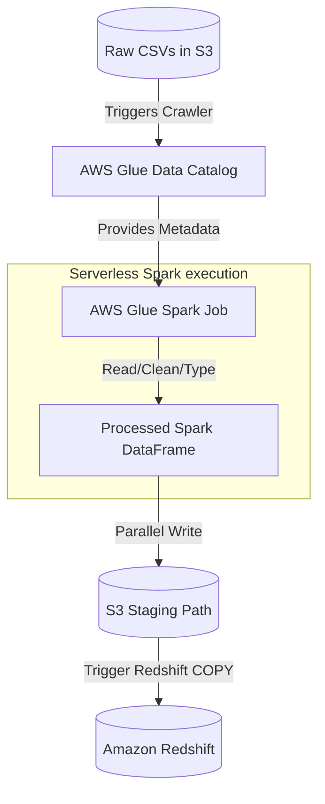

# Module 4.10: Spark + Cloud

Welcome to **Spark + Cloud**. In the real world, you will not host physical Hadoop clusters. You will run Spark on serverless or managed cloud compute engines. In this module, you will learn how to interface Spark with AWS, Azure, and GCP resources.

---

## 1. Detailed Theory

### Managed Cloud Spark Offerings
- **AWS EMR (Elastic MapReduce)**: The AWS standard for hosting managed Hadoop/Spark clusters. Can run on EC2 instances or containerized via EKS.
- **AWS Glue (Serverless Spark)**: Run Spark code without managing servers, instances, or scaling thresholds. Extremely popular for simple catalog integrations.
- **GCP Dataproc**: Google's managed Spark service. Known for fast cluster spin-up times (sub-90 seconds) and native integration with BigQuery.
- **Azure Synapse**: Microsoft's unified analytics platform featuring serverless Spark pools.

### Storage Interfacing
Spark does not store data on its executors permanently. It uses high-speed cloud object storage:
- **AWS**: S3 (Simple Storage Service) using the `s3a://` file connector.
- **GCP**: Google Cloud Storage using `gs://`.
- **Azure**: ADLS Gen2 (Azure Data Lake Storage) using `abfss://`.

### Warehouse Connectors
- **BigQuery / Redshift Connectors**: Specialized libraries that allow Spark to write data directly into cloud data warehouses at scale. Spark writes data in parallel to staging storage (like S3/GCS) first, then calls a fast COPY command inside the warehouse, rather than inserting row-by-row.

---

## 2. Architecture Diagram: Serverless Spark (AWS Glue) Ingestion



---

## 3. Production Use Cases

1. **Cloud-Native Data Platform**: Ingesting daily logs from AWS S3, launching a serverless Glue Spark job to run transformations, cataloging the data in Glue Data Catalog, and loading it into Amazon Redshift for BI queries.
2. **Ephemeral Dataproc Processing**: Spanning up a 10-node GCP Dataproc cluster to run a heavy 30-minute machine learning feature aggregation job, writing outputs directly to Google BigQuery, and immediately shutting down the cluster to save money.

---

## 4. Real Company Examples

- **Capital One**: Extensively uses AWS EMR clusters orchestrated by Airflow to process daily customer financial logs, writing Parquet data to highly secured S3 buckets.
- **Spotify**: Uses Google Cloud Dataproc to run heavy Spark pipelines that clean and summarize listening activity, writing directly to Google Cloud Storage.

---

## 5. Coding Examples

### PySpark Connecting to GCP BigQuery and Cloud Storage

```python
from pyspark.sql import SparkSession

# Initialize Session with BigQuery Connector support
spark = SparkSession.builder \
    .appName("GCPSparkShowcase") \
    .config("parentProject", "my-gcp-project") \
    .getOrCreate()

# 1. Read from Google Cloud Storage
df = spark.read.parquet("gs://my-enterprise-bucket/raw-events/")

# 2. Perform transformations
clean_df = df.filter("event_type = 'purchase'") \
             .select("user_id", "amount", "timestamp")

# 3. Write directly into BigQuery
# The connector writes in parallel to gs:// temporary directory first, 
# then issues a load job to BigQuery.
clean_df.write \
    .format("bigquery") \
    .option("temporaryGcsBucket", "my-gcs-temp-bucket") \
    .option("table", "my-gcp-project.sales_dataset.purchases") \
    .mode("append") \
    .save()
```

---

## 6. Hands-on Labs

**Lab: Configuring AWS S3 Connection**
**Objective**: Configure Spark to read from S3.
**Instructions**:
Write down the `SparkSession` configurations (`spark.hadoop.fs.s3a...`) required to connect PySpark running on a local machine to a secure AWS S3 bucket using an AWS Access Key and Secret Key.

---

## 7. Assignments

**Assignment: EMR vs. Glue**
Write a technical memo comparing **AWS EMR** and **AWS Glue**. Under what scenarios would you choose EMR (instance customization, long-running jobs) over Glue (serverless, quick batch ETL runs)?

---

## 8. Interview Questions

1. **What is the difference between AWS EMR and AWS Glue?**
   *Answer Hint: AWS EMR is a managed Hadoop/Spark service where you provision and manage the virtual servers (EC2 instances). AWS Glue is serverless Spark—you simply write the script and run it; AWS manages scaling, provisioning, and infrastructure automatically.*
2. **Why do cloud warehouses (like Redshift/BigQuery) use staging storage when loading data from Spark?**
   *Answer Hint: Inserting millions of rows row-by-row via JDBC is extremely slow and throttles databases. Connectors write Spark data partitions in parallel to cheap object storage (S3/GCS) first, then call a bulk-loading command inside the warehouse, which is orders of magnitude faster.*

---

## 9. Best Practices (FDE Standards)

- **Use Ephemeral EMR Clusters**: Do not keep EMR clusters running 24/7. Use your orchestrator (Airflow) to spin up clusters on-demand and terminate them immediately after the job finishes.
- **Leverage Spot Instances**: For non-critical batch jobs, configure EMR to use AWS Spot Instances for worker nodes to reduce server costs by up to 70%.

---

## 10. Common Mistakes

- **Forgetting Spark Catalog Sync**: Writing files directly to S3 but forgetting to run a Glue Crawler or `MSCK REPAIR TABLE` to update the Data Catalog, leading downstream queries to report empty datasets.
- **Exceeding Object Storage Rate Limits**: Writing data to S3 with thousands of partition sub-directories, causing S3 rate limiting errors (HTTP 503).
