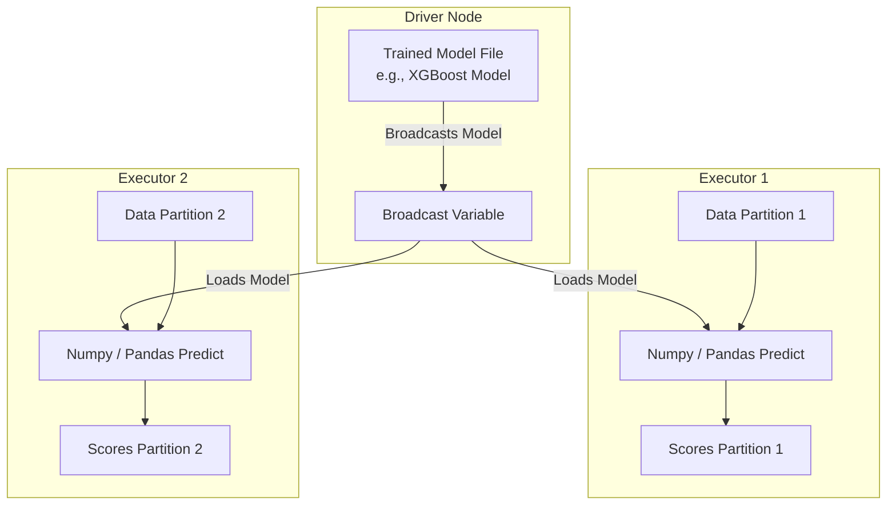

# Module 4.11: Spark for MLOps

Welcome to **Spark for MLOps**. Building ML models in Python (using libraries like Scikit-Learn or PyTorch) is standard, but these libraries struggle when processing terabytes of training data. In this module, you will learn how to build distributed feature engineering pipelines, aggregate historical features at scale, perform batch inference, and connect Spark with MLflow.

---

## 1. Detailed Theory

### Distributed Feature Engineering
Before training a model, raw logs must be converted into features:
- **Encoding**: Converting categorical variables into numerical vectors (e.g., One-Hot Encoding) at scale.
- **Aggregation**: Generating metrics over sliding windows (e.g., total spend over the last 30 days). Spark is highly optimized to do this in parallel across partitions.
- **Imputation**: Filling in missing feature values.

### Feature Store Integration
Once Spark processes features, they must be saved:
- **Offline Feature Store**: Spark writes features in parallel to a data lake/warehouse (Parquet/Delta) for model training.
- **Online Feature Store**: Spark streams feature updates in real-time (via Spark Structured Streaming) to low-latency key-value stores like Redis or DynamoDB for real-time model serving.

### Batch Inference
Once a model is trained, applying it to score millions of historical records (e.g., generating personalized recommendations for all users nightly) is done in parallel using Spark:
- The model is broadcasted to all executors.
- Executors run local Pandas UDFs to load the model and score their local partition of data without network shuffling.

---

## 2. Architecture Diagram: Parallel Batch Inference



---

## 3. Production Use Cases

1. **Recommendation System Pipeline**: Processing daily user clicks using PySpark to calculate rolling user-item preferences. The model is applied in batch via Pandas UDF to generate item scores for 50 million active users.
2. **Fraud Detection Training Pipeline**: Aggregating 1 year of financial transactions using Spark to generate model features (averages, counts, categories), and logging parameters back to an MLflow Tracking Server.

---

## 4. Real Company Examples

- **Stitch Fix**: Relies on Spark feature engineering pipelines to process customer survey data, sizing preferences, and inventory metrics, generating features that feed their automated styling algorithms.
- **Lyft**: Employs Spark feature pipelines to calculate real-time driver availability and passenger demand features, writing updates into their feature store.

---

## 5. Coding Examples

### Parallel Batch Inference using Broadcasted MLflow Model

```python
from pyspark.sql import SparkSession
import pyspark.sql.functions as F
from pyspark.sql.functions import pandas_udf
import pandas as pd
import mlflow.pyfunc

spark = SparkSession.builder.appName("MLOpsBatchInference").getOrCreate()

# 1. Load data to score
features_df = spark.read.parquet("s3://feature-store/user_features/")

# 2. Download and Broadcast Model from MLflow Model Registry
model_uri = "models:/churn_prediction_model/Production"
local_model_path = mlflow.pyfunc.download_artifacts(model_uri)
# Broadcast the model file path to all workers
broadcast_model_path = spark.sparkContext.broadcast(local_model_path)

# 3. Create Pandas UDF for vectorized inference on workers
@pandas_udf("double")
def predict_churn_udf(feature_col1: pd.Series, feature_col2: pd.Series) -> pd.Series:
    # Workers load the model from the broadcasted path once per executor process
    model = mlflow.pyfunc.load_model(broadcast_model_path.value)
    
    # Structure input features as a pandas DataFrame expected by the model
    input_data = pd.DataFrame({"feat1": feature_col1, "feat2": feature_col2})
    
    # Run vectorized inference
    predictions = model.predict(input_data)
    return pd.Series(predictions)

# 4. Apply UDF to generate scores in parallel
scored_df = features_df.withColumn(
    "churn_probability", 
    predict_churn_udf(F.col("feat1"), F.col("feat2"))
)

scored_df.write.parquet("s3://predictions/churn_scores/")
```

---

## 6. Hands-on Labs

**Lab: One-Hot Encoding**
**Objective**: Build a feature engineering step.
**Instructions**:
Write the PySpark ML pipeline code (`StringIndexer` and `OneHotEncoder`) to convert a categorical column `device_type` (containing values like "iOS", "Android", "Web") into numerical vector features.

---

## 7. Assignments

**Assignment: Training-Serving Skew**
Describe the concept of **Training-Serving Skew** in MLOps. How does using a unified Feature Store (where Spark handles the calculation of both offline training datasets and online streaming serving features) prevent this common machine learning failure mode?

---

## 8. Interview Questions

1. **Why do we use Broadcast variables during batch inference?**
   *Answer Hint: Broadcasting the model ensures that Spark only sends the model bytes to each physical worker node once. Without broadcasting, Spark would ship the model file with every single task partition execution, causing massive network congestion and driver crashes.*
2. **What is a Feature Store offline vs. online mapping?**
   *Answer Hint: The offline store holds historical feature values (written in batch by Spark to Parquet/Delta) used to train models. The online store holds only the latest feature values (written by streaming Spark queries to Redis/DynamoDB) for fast, low-latency lookups during live predictions.*

---

## 9. Best Practices (FDE Standards)

- **Use Vectorized UDFs for Inference**: Never run inference using standard Python row-by-row UDFs. Always use Pandas UDFs to load the model and predict in vectorized batches.
- **Log Data Versions**: When generating training datasets with Spark, save the Delta table version or timestamp in your MLflow tracking logs to ensure reproducibility.

---

## 10. Common Mistakes

- **Loading Model inside the UDF loop**: Loading the model inside the row loop of a UDF rather than loading it once at the process level, causing executors to crash due to CPU/memory exhaustion.
- **Driver OOM during Broadcast**: Attempting to broadcast a model that is larger than the Driver's RAM allocation, resulting in a master node crash.
