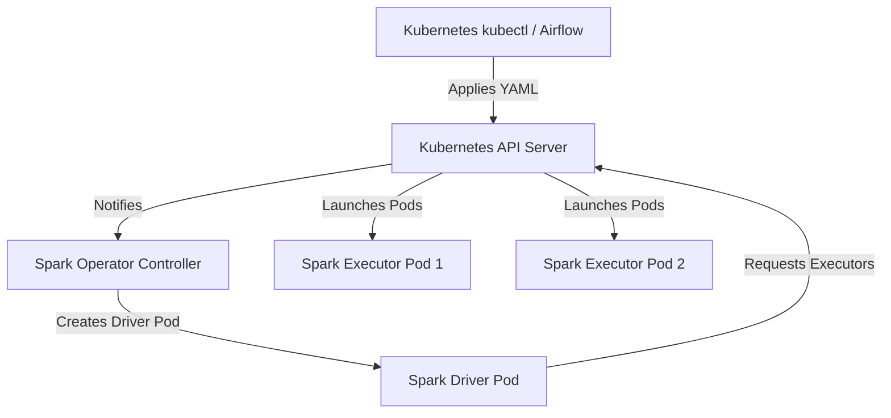

# Module 4.14: Spark on Kubernetes

Welcome to **Spark on Kubernetes**. Modern cloud-native infrastructure is standardizing on Kubernetes for container orchestration. Instead of running Spark on static virtual machine clusters (YARN), enterprises deploy Spark on Kubernetes (K8s). In this module, you will learn how to build Docker containers for Spark, manage Spark jobs using the Spark Operator, and configure dynamic resource allocation.

---

## 1. Detailed Theory

### Why Spark on Kubernetes?
- **Resource Sharing**: Kubernetes allows your Spark jobs to share the same physical server compute nodes with your FastAPI endpoints, databases, and LLM serving containers.
- **Docker Isolation**: Each Spark job runs in its own custom Docker container. Pipeline A can run Python 3.9 with PyTorch, while Pipeline B runs Python 3.11 with Scikit-learn on the same cluster without dependency clashes.
- **Fast Autoscaling**: Kubernetes can scale up pods in seconds, allowing Spark clusters to size dynamically.

### Spark Operator
To run a Spark job on Kubernetes, you can use the standard `spark-submit` command. However, the enterprise standard is using the **Spark Operator** (created by Google).
- The Spark Operator allows you to define a Spark application declaratively using a custom YAML file (YAML manifests), treating a Spark job as a native Kubernetes Resource (`SparkApplication`).

### Dynamic Resource Allocation (DRA)
- DRA on Kubernetes dynamically adjusts the number of executor pods running based on the workload queue. If tasks accumulate, the Spark Driver requests more executor pods from the Kubernetes API. If executors are idle, they are terminated.

---

## 2. Architecture Diagram: Spark on Kubernetes Orchestration



---

## 3. Production Use Cases

1. **Multi-Tenant Data Platform**: Hosting a shared Kubernetes cluster where the Marketing, Finance, and AI teams run Spark jobs. The Spark Operator deploys jobs into isolated namespaces (`marketing-jobs`, `finance-jobs`), applying resource quotas to prevent one team from hogging the cluster.
2. **Serverless batch job scaling**: Using Airflow to submit a `SparkApplication` manifest to a Kubernetes cluster. The cluster automatically provisions node capacity via autoscalers (like Karpenter on EKS), executes the Spark job, and scales down to zero.

--- / 
---

## 4. Real Company Examples

- **Lyft**: Migrated all their machine learning and data processing pipelines from YARN/EMR to EKS (Elastic Kubernetes Service), running thousands of daily Spark jobs using containerized executors.
- **GCP Dataproc Serverless**: Under the hood, Google's serverless Spark offering executes by deploying Spark jobs as containerized workloads on Kubernetes clusters.

---

## 5. Coding Examples

### Declaring a Spark Job on Kubernetes (YAML Manifest)

This YAML file is applied to a Kubernetes cluster to trigger a Spark job using the Spark Operator.

```yaml
# spark-application.yaml
apiVersion: "sparkoperator.k8s.io/v1beta2"
kind: SparkApplication
metadata:
  name: retail-demand-forecasting
  namespace: data-jobs
spec:
  type: Python
  mode: cluster
  image: "enterprise-registry.com/data/spark-py-job:v1.0"
  imagePullPolicy: Always
  mainApplicationFile: "local:///opt/spark/jobs/forecast.py"
  sparkVersion: "3.4.1"
  restartPolicy:
    type: OnFailure
    onFailureRetries: 3
    onFailureInterval: 10
  driver:
    cores: 1
    coreLimit: "1200m"
    memory: "512m"
    labels:
      version: 3.4.1
    serviceAccount: spark-service-account
  executor:
    cores: 1
    instances: 2
    memory: "1024m"
    labels:
      version: 3.4.1
```

---

## 6. Hands-on Labs

**Lab: Building a Spark Docker Image**
**Objective**: Build a containerized PySpark environment.
**Instructions**:
Write a simple `Dockerfile` that:
1. Starts from the official Apache Spark base image (`apache/spark:latest`).
2. Installs Python dependencies (`pandas`, `numpy`, `scikit-learn`) using pip.
3. Copies your PySpark scripts into the `/opt/spark/jobs/` directory.

---

## 7. Assignments

**Assignment: YARN vs. Kubernetes**
Write a short comparison analyze of the trade-offs between orchestrating Spark jobs on **YARN** (traditional Hadoop) vs. **Kubernetes** (cloud-native). Focus on deployment complexity, isolation, compute efficiency, and cold-start times.

---

## 8. Interview Questions

1. **What is the role of the Spark Operator on Kubernetes?**
   *Answer Hint: The Spark Operator is a controller that runs inside Kubernetes. It reads custom SparkApplication YAML definitions and translates them into the required Kubernetes API calls to deploy driver and executor pods, monitor their execution logs, and handle automatic retries.*
2. **Why is a Service Account required for the Spark Driver pod?**
   *Answer Hint: Unlike YARN, on Kubernetes, the Spark Driver must talk directly to the Kubernetes API server to request the creation and deletion of executor pods. The service account gives the driver the required Kubernetes RBAC permissions to do so.*

---

## 9. Best Practices (FDE Standards)

- **Use service accounts with least privilege**: Do not assign administrative roles to Spark service accounts. Ensure they can only create and delete pods within their specific namespace.
- **Tune image pull policy**: Use tags for Docker images (avoid `latest`) and configure `imagePullPolicy: IfNotPresent` in production to speed up container startup times on cached nodes.

---

## 10. Common Mistakes

- **Omitting Resource Limits**: Failing to set `coreLimit` and memory boundaries in the driver/executor pods, causing a memory leak to consume all node resources and crash unrelated services.
- **Incorrect Jar/Script Paths**: Using paths like `s3://` inside the manifest file without configuring Spark's S3 connectors inside the custom Docker image, resulting in file not found crashes.
