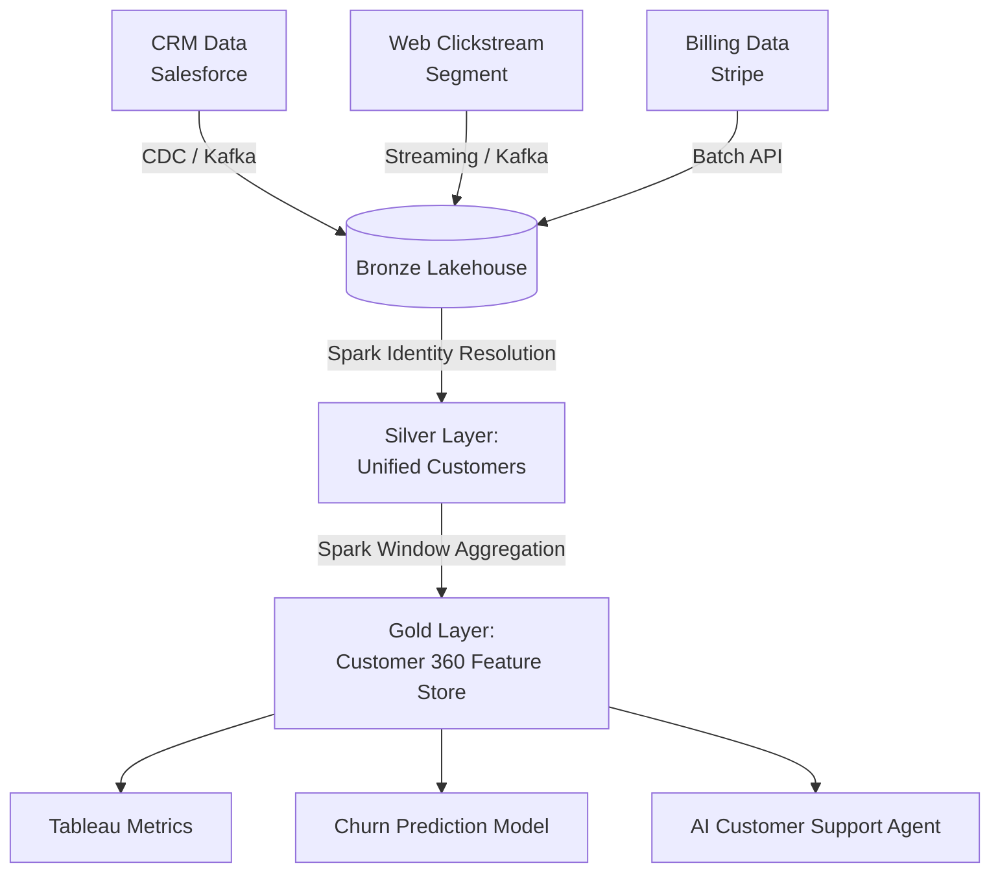

# Module 4.15: Enterprise Spark Architectures

Welcome to the final module of the Spark curriculum: **Enterprise Spark Architectures**. As a Forward Deployed Engineer, you will design architectures that process millions of records daily across multiple business segments. In this module, you will learn how to design the data flows and schemas for Customer 360 platforms, Retail forecasting, Insurance analytics, and Banking risk engines.

---

## 1. Detailed Theory

### Customer 360 Platform
A unified registry that integrates a client's data across multiple touchpoints (E-commerce clickstream, Support tickets, CRM sales) into a single, canonical record for each customer.
- **Identity Resolution**: The critical step of joining records from different systems that might not share a clean identifier (e.g., matching a Stripe email `john@email.com` with a Salesforce record for `John Smith` at `john@work.com` using fuzzy matching or deterministic rules).

### Retail Analytics (Demand Forecasting)
- Spark processes historical daily point-of-sale transaction facts, joins them with Store and Product dimensions, aggregates them into weekly metrics, and feeds features into forecasting models to predict inventory replenishment schedules.

### Insurance and Banking (Risk & Fraud)
- **Claims Analytics**: Aggregating historical claims to evaluate underwriters' risk exposure.
- **Fraud Detection**: Using Spark Structured Streaming to aggregate credit card transaction velocities (e.g., transactions in the last 10 minutes) and comparing them against user history in milliseconds.

---

## 2. Architecture Diagram: Enterprise Customer 360 Flow



---

## 3. Production Use Cases

1. **Enterprise Identity Resolution**: A bank wants to merge credit card, checking account, and loan records. You design a PySpark job that runs a deterministic rule-based join on name, date of birth, and phone number to generate a single `global_customer_id` mapping.
2. **Retail Demand Forecasting**: A global supermarket chain schedules a Spark job to aggregate 1,000 stores' sales data daily. The resulting features (moving averages, month-over-month trends) are saved into a feature store for next-day replenishment forecasting.

---

## 4. Real Company Examples

- **Capital One**: Uses a massive, real-time Banking Risk platform built on Spark Streaming and Delta Lake to process and evaluate credit card purchases globally for immediate fraud prevention.
- **Walmart**: Orchestrates heavy Retail Analytics pipelines using Databricks Spark to manage shelf-space allocation and inventory logistics for millions of products across their global supply chain.

---

## 5. Coding Examples

### Spark Identity Resolution (Fuzzy & Exact Rules)

```python
from pyspark.sql import SparkSession
import pyspark.sql.functions as F

spark = SparkSession.builder.appName("IdentityResolution").getOrCreate()

# 1. Load CRM and Billing datasets
crm_df = spark.read.parquet("s3://lakehouse/crm_users/")
billing_df = spark.read.parquet("s3://lakehouse/billing_users/")

# Clean and standardize names
clean_crm = crm_df.select(
    F.col("id").alias("crm_id"),
    F.lower(F.trim(F.col("email"))).alias("crm_email"),
    F.lower(F.trim(F.col("name"))).alias("crm_name")
)

clean_billing = billing_df.select(
    F.col("id").alias("billing_id"),
    F.lower(F.trim(F.col("email"))).alias("billing_email"),
    F.lower(F.trim(F.col("name"))).alias("billing_name")
)

# 2. Rule 1: Exact email match
email_matches = clean_crm.join(
    clean_billing, 
    clean_crm.crm_email == clean_billing.billing_email, 
    how="inner"
).select("crm_id", "billing_id").withColumn("match_type", F.lit("EXACT_EMAIL"))

# 3. Rule 2: Name match on cleaned values (where email didn't match)
non_matched_crm = clean_crm.join(email_matches, on="crm_id", how="left_anti")
non_matched_billing = clean_billing.join(email_matches, on="billing_id", how="left_anti")

name_matches = non_matched_crm.join(
    non_matched_billing,
    non_matched_crm.crm_name == non_matched_billing.billing_name,
    how="inner"
).select("crm_id", "billing_id").withColumn("match_type", F.lit("EXACT_NAME"))

# 4. Combine all matches to create a unified customer registry
unified_registry = email_matches.union(name_matches)

# Assign a new surrogate Global ID using UUID generation
unified_registry = unified_registry.withColumn("global_customer_id", F.expr("uuid()"))
unified_registry.write.format("delta").mode("overwrite").save("s3://lakehouse/customer_registry")
```

---

## 6. Hands-on Labs

**Lab: Identity Resolution Mapping**
**Objective**: Build a mapping pipeline.
**Instructions**:
Given the `customer_registry` output from the coding example above, write the SQL query or PySpark logic to resolve a billing transaction's `billing_id` back to the customer's corresponding `crm_id` to evaluate their support plan level.

---

## 7. Assignments

**Assignment: Real-Time Fraud Schema Design**
Design the architecture and schema for a real-time banking fraud system.
Identify:
1. The incoming streaming sources (Kafka).
2. The Spark Structured Streaming transformations required (window size, features).
3. The offline analytics target (Delta Lake).
Explain how the system ensures sub-second evaluation of transactions.

---

## 8. Interview Questions

1. **What is Identity Resolution in a Customer 360 platform?**
   *Answer Hint: The process of matching and linking customer records from disparate transactional systems (e.g., Sales CRM, Stripe, web clickstream) into a single, canonical profile representing a unique individual, using deterministic rules or probabilistic matching.*
2. **Why is Delta Lake or another table format preferred for saving customer registry tables compared to raw CSVs?**
   *Answer Hint: Registry data evolves constantly. Delta Lake supports ACID transactions (preventing corrupted reads during runs), versioning/time travel (crucial for auditing matches), schema evolution, and fast `MERGE` operations to insert/update matches.*

---

## 9. Best Practices (FDE Standards)

- **Standardize input columns**: Before running matching rules, clean and normalize all joining columns (e.g., lowercasing emails, removing phone formatting, stripping whitespace).
- **Run Match Runs as Incremental Batches**: Do not run matching rules on the entire database daily. Build pipelines that only process *newly modified* records and merge them into the master matching database.

---

## 10. Common Mistakes

- **Incorrect Fuzzy Joins**: Creating fuzzy matching thresholds that are too low (e.g., matching "John Smith" with "John Smythe" without validating address/phone data), leading to catastrophic data pollution.
- **Forgetting soft-delete updates**: Failing to update the matching registry when a customer deletes their billing account, resulting in orphaned records in downstream dashboards.
