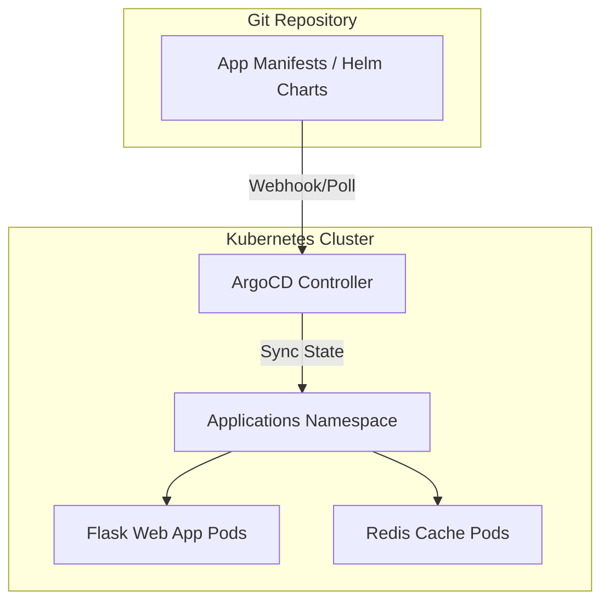
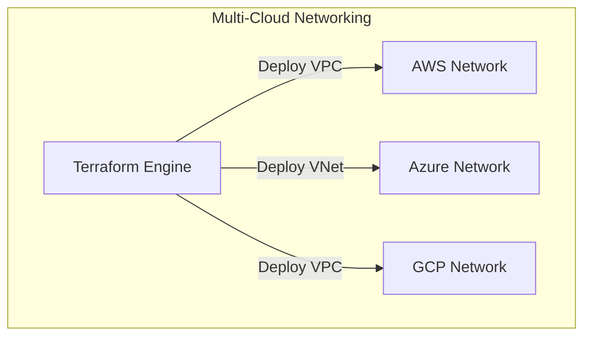
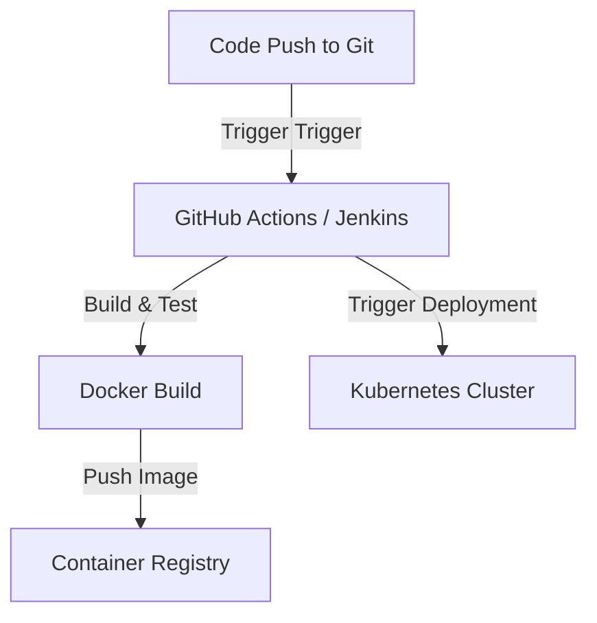
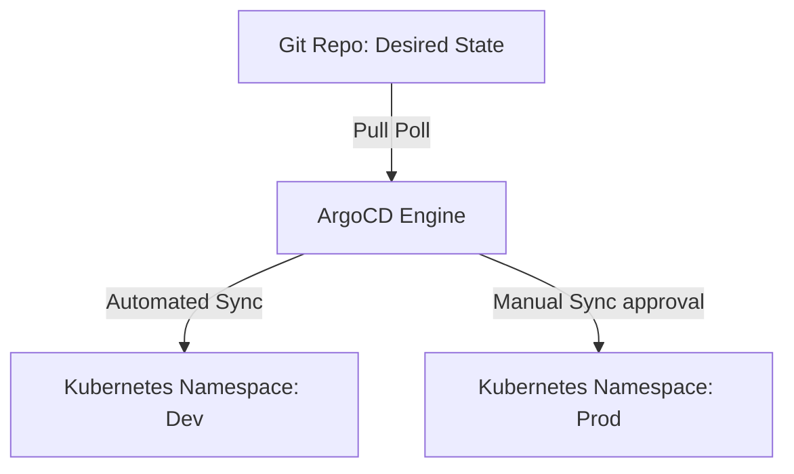
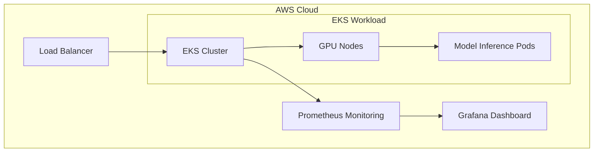

# Module 13: Enterprise Capstone Projects

This module outlines the architectures, requirements, and deployment steps for the five enterprise capstone projects.

---

## Project 1: Enterprise Kubernetes Platform

### Overview
Build a production-ready, multi-tenant Kubernetes platform with automated application deployment using GitOps.

### Technology Stack
*   **Containerization**: Docker
*   **Orchestration**: Kubernetes (Minikube or Kind for local testing)
*   **Packaging**: Helm
*   **GitOps Delivery**: ArgoCD

### Architecture Diagram


### Key Deliverables
1.  **Containerized Application**: A Python Flask application configured with multi-stage Docker builds.
2.  **Helm Chart**: A parameterized Helm chart containing Deployment, Service, and Ingress templates.
3.  **GitOps Repository**: A Git repository containing the application manifests and ArgoCD application definitions.
4.  **Security Configurations**: Network policies restricting access to the cache database, and non-root execution configurations.

### Step-by-Step Implementation Guide
1.  **Containerize Application**:
    Write a multi-stage Dockerfile to build and package a Python Flask application, using a non-root user for security.
2.  **Package with Helm**:
    Generate a Helm chart template structure:
    ```bash
    helm create my-flask-app
    ```
    Configure `values.yaml` to define replica counts, image tags, and resource limits.
3.  **Deploy ArgoCD**:
    Install ArgoCD in the Kubernetes cluster:
    ```bash
    kubectl create namespace argocd
    kubectl apply -n argocd -f https://raw.githubusercontent.com/argoproj/argo-cd/stable/manifests/install.yaml
    ```
4.  **Configure GitOps Application**:
    Define an ArgoCD Application manifest (`application.yaml`) that points to the Git repository containing the Helm chart.
5.  **Verify Synchronization**:
    Apply the application manifest and verify that resources are synced and running healthy in the cluster:
    ```bash
    kubectl apply -f application.yaml
    kubectl get pods -n target-namespace
    ```

---

## Project 2: Cloud Infrastructure Platform

### Overview
Design and deploy a multi-cloud network infrastructure across AWS, Azure, and GCP using Terraform.

### Technology Stack
*   **IaC**: Terraform
*   **Cloud Providers**: AWS, Microsoft Azure, Google Cloud Platform

### Architecture Diagram


### Key Deliverables
1.  **AWS Vpc Network**: A VPC containing public and private subnets, NAT Gateways, and route tables.
2.  **Azure VNet Network**: A VNet containing subnets, Network Security Groups, and Azure Bastion configuration.
3.  **GCP Custom VPC**: A Custom mode VPC containing subnets, firewall rules, and Cloud NAT.
4.  **State Management**: Configured S3 remote backend with DynamoDB locking.

### Step-by-Step Implementation Guide
1.  **Initialize Provider Configurations**:
    Configure AWS, Azure, and GCP providers in a root `providers.tf` file.
2.  **Define Remote Backend**:
    Configure S3 backend for remote state storage:
    ```hcl
    terraform {
      backend "s3" {
        bucket         = "my-multi-cloud-tfstate"
        key            = "global/s3/terraform.tfstate"
        region         = "us-east-1"
        dynamodb_table = "terraform-locks"
        encrypt        = true
      }
    }
    ```
3.  **Develop Network Modules**:
    Write reusable modules for VPCs/VNets across the three cloud providers.
4.  **Run Plan and Validation**:
    Verify the infrastructure plan:
    ```bash
    terraform init
    terraform plan -out=tfplan
    ```
5.  **Deploy and Verify**:
    Deploy the infrastructure and verify routing tables, firewall rules, and network connectivity.

---

## Project 3: Enterprise CI/CD Platform

### Overview
Build an automated CI/CD pipeline using Jenkins and GitHub Actions to build, test, and deploy applications to Kubernetes.

### Technology Stack
*   **CI Tools**: Jenkins, GitHub Actions
*   **Containerization**: Docker
*   **Orchestration**: Kubernetes

### Architecture Diagram


### Key Deliverables
1.  **CI Pipeline**: Running linting, unit tests, and security scans on every commit.
2.  **CD Pipeline**: Building a Docker image, tagging it with a Git SHA, and pushing it to a container registry.
3.  **Deployment Job**: Authenticating with Kubernetes and updating deployment manifests.

### Step-by-Step Implementation Guide
1.  **Configure CI Workflow**:
    Create a GitHub Actions workflow (`.github/workflows/ci.yml`) to run code format checks and unit tests.
2.  **Build and Push**:
    Add steps to build the container image and push it to GitHub Container Registry (GHCR):
    ```yaml
    - name: Build and push
      uses: docker/build-push-action@v5
      with:
        context: .
        push: true
        tags: ghcr.io/${{ github.repository }}:${{ github.sha }}
    ```
3.  **Deploy to Cluster**:
    Configure deployment steps to apply the new image tag to Kubernetes manifests:
    ```bash
    kubectl set image deployment/my-app my-app=ghcr.io/${{ github.repository }}:${{ github.sha }}
    ```
4.  **Verify Execution**:
    Commit changes to Git and monitor the pipeline execution in the GitHub Actions dashboard.

---

## Project 4: GitOps Platform

### Overview
Implement an automated GitOps platform using Helm and ArgoCD to manage multi-environment application releases.

### Technology Stack
*   **Delivery**: ArgoCD
*   **Packaging**: Helm
*   **Orchestration**: Kubernetes

### Architecture Diagram


### Key Deliverables
1.  **Multi-Environment Repository**: Storing configuration values for development, staging, and production environments in separate files.
2.  **ArgoCD Configurations**: Automated sync policies with self-heal and pruning enabled for development, and manual sync checks for production.
3.  **Helm Chart Dependency Management**: Application packages with sub-chart dependencies (like database and cache engines).

### Step-by-Step Implementation Guide
1.  **Define Git Directory Layout**:
    Organize configuration directories in Git:
    ```
    gitops-platform/
    ├── apps/
    │   ├── dev-app.yaml
    │   └── prod-app.yaml
    └── charts/
        └── my-application/
    ```
2.  **Configure Environment Values**:
    Create environment-specific value files (`values-dev.yaml`, `values-prod.yaml`).
3.  **Deploy App-of-Apps**:
    Create and apply a root Application manifest to manage all environment applications:
    ```bash
    kubectl apply -f apps/root-app.yaml
    ```
4.  **Verify Sync Behaviors**:
    Verify that the development application auto-syncs on Git changes, and the production application requires manual approval in the ArgoCD UI.

---

## Project 5: AI Infrastructure Platform

### Overview
Design and deploy a highly available AI infrastructure platform on AWS to host machine learning models with automated scaling and monitoring.

### Technology Stack
*   **Cloud Provider**: AWS (EC2, S3, IAM)
*   **Orchestration**: Amazon EKS (with GPU-enabled nodes)
*   **IaC**: Terraform
*   **CI/CD**: GitHub Actions
*   **Monitoring**: Prometheus & Grafana

### Architecture Diagram


### Key Deliverables
1.  **Terraform Manifests**: EKS cluster provisioning with GPU-enabled node groups (e.g., G5 instance types).
2.  **Model serving Deployment**: PyTorch or Triton Inference Server configured with GPU limits.
3.  **CI/CD Pipeline**: Building ML container images and deploying them to EKS.
4.  **Monitoring Suite**: Prometheus and Grafana dashboards tracking CPU, Memory, and GPU utilization metrics.

### Step-by-Step Implementation Guide
1.  **Provision Infrastructure via Terraform**:
    Define EKS node groups with GPU instance types:
    ```hcl
    resource "aws_eks_node_group" "gpu_nodes" {
      cluster_name    = aws_eks_cluster.main.name
      node_group_name = "gpu-nodes"
      node_role_arn   = aws_iam_role.node_role.arn
      subnet_ids      = aws_subnet.private[*].id
      instance_types  = ["g5.xlarge"]
    }
    ```
2.  **Deploy Model Serving**:
    Apply deployment manifests requesting GPU limits and mounting model caches:
    ```yaml
    resources:
      limits:
        nvidia.com/gpu: 1
    ```
3.  **Setup Prometheus & Grafana**:
    Install the Prometheus monitoring stack:
    ```bash
    helm repo add prometheus-community https://prometheus-community.github.io/helm-charts
    helm install prometheus-stack prometheus-community/kube-prometheus-stack -n monitoring --create-namespace
    ```
4.  **Configure CI/CD Integration**:
    Create a GitHub Actions workflow to build and push container images to Amazon ECR, and execute rolling updates on the EKS cluster.
5.  **Verify Metrics Dashboards**:
    Verify that model serving APIs are running healthy and GPU metrics are reporting correctly in the Grafana dashboard.
