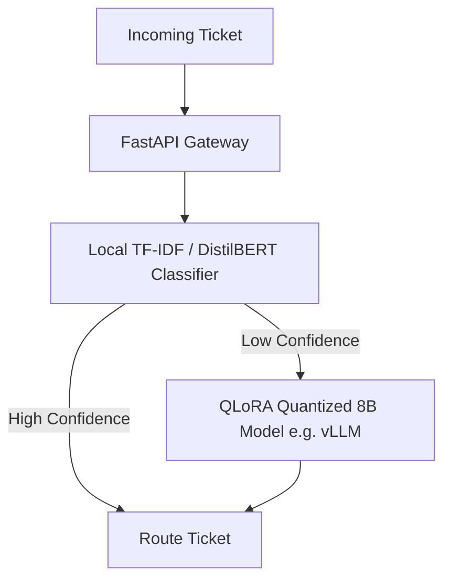

# Enterprise Generative AI & LLMs Interview Preparation

This guide compiles advanced interview questions, architectural case studies, and scenarios covering the entire spectrum of generative AI engineering, RAG pipelines, fine-tuning optimizations, agentic systems, and LLMOps.

---

## 1. LLM Fundamentals & Tokenization

### Q1: Explain how Byte-Pair Encoding (BPE) tokenization impacts mathematical computations and key metrics (like IDs or phone numbers) in model queries.
**Answer:**
- **Fragmented Representations:** BPE splits numbers and unique strings into fragments depending on frequency (e.g., `109,240.50` might tokenized as `["109", ",", "24", "0.50"]`). This prevents the model from representing the value as a single mathematical entity.
- **Arithmetic Degradation:** Because the model generates text token-by-token based on probability, it cannot compute math operations over these fragmented tokens.
- **Enterprise Defenses:** Extract numeric attributes via JSON Schemas and run calculations in deterministic code (e.g. Python scripts) rather than asking the LLM to compute math directly.

---

## 2. Embeddings & Semantic Search

### Q2: What is Matryoshka Representation Learning (MRL), and how does it optimize enterprise vector databases?
**Answer:**
- **MRL Concept:** Standard embedding models train vectors such that semantic information is concentrated in the first few dimensions.
- **Dimensionality Reduction:** MRL allows you to truncate vectors (e.g., from `1536` dimensions to `256` dimensions) by keeping only the first $N$ numbers.
- **Optimization Impact:** Truncated vectors reduce storage costs and speed up vector similarity searches (using cosine or dot product calculations) by up to 80% while preserving over 95% of retrieval accuracy.

---

## 3. Retrieval-Augmented Generation (RAG)

### Q3: How do you address the "Lost in the Middle" problem when injecting long retrieved contexts into RAG prompts?
**Answer:**
- **Attention Bias:** Decoder-only models focus their attention on tokens at the very beginning and very end of prompts, often ignoring data in the middle.
- **Defensive Strategies:**
  1. **Reranking:** Use a cross-encoder model (like Cohere Rerank) to select the top 3-5 most relevant chunks.
  2. **Strategic Placement:** Place the most relevant documents at the top and bottom of the context section.
  3. **Context Caching:** Place static instructions at the top and dynamically retrieve chunks at the bottom, close to the model generation trigger.

---

## 4. Fine-Tuning, LoRA, and QLoRA

### Q4: Explain the mathematical differences between LoRA and QLoRA, and how they optimize GPU memory requirements.
**Answer:**
- **LoRA (PEFT):** Freezes base model weights $W \in \mathbb{R}^{d \times k}$ and injects two low-rank matrices $A \in \mathbb{R}^{d \times r}$ and $B \in \mathbb{R}^{r \times k}$ (where rank $r \ll d, k$). Only matrices $A$ and $B$ are updated, reducing trainable parameters and optimizer memory states.
- **QLoRA:** Quantizes the frozen base weights $W$ to 4-bit NormalFloat (NF4) precision, which is optimized for the normal distribution of neural weights. Double Quantization (DQ) is applied to scale factors to save more memory, and CPU paging is enabled to prevent Out-Of-Memory (OOM) errors.

---

## 5. Tool Calling & Structured Outputs

### Q5: How do you guarantee that an LLM outputs syntactically valid JSON matching a strict schema in a high-speed production pipeline?
**Answer:**
- **Guided Generation (Grammar Constraints):** Use inference-level libraries (like `Outlines` or `Instructor`) that constrain the model's token selection at the probability level, forcing it to choose only tokens that match the JSON schema.
- **JSON Schema API Modes:** Enable provider-level JSON modes (e.g. OpenAI's structured outputs) to force schema compliance.
- **Automated Validation & Retry Loops:** Parse outputs with validation schemas (like Pydantic). If validation fails, return the error log to the model and request a corrected format.

---

## 6. AI Agent Orchestration

### Q6: How do you build state management systems that prevent agents from losing track of their goals during multi-step runs?
**Answer:**
- **State Chart Orchestrators (LangGraph):** Define workflows as structured graphs where states are explicitly maintained in a central database, preventing state loss if the server restarts.
- **Dynamic Context Summarization:** Summarize older tool logs and keep only the latest actions in the active context window, preventing token limits from cutting off the original instructions.

---

## 7. System Design & LLMOps

### Case Study: High-Throughput Customer Ticket Router
**Scenario:** Design a system to route 1,000,000 daily tickets into 5 categories, with latency under 200ms and minimal cost.

**Architecture:**

1. **First-Stage Filtering:** Use a fast, low-cost classifier (like DistilBERT) to handle simple queries, achieving 80% routing with sub-50ms latency.
2. **Second-Stage Processing:** Route complex or low-confidence queries to a 4-bit quantized 8B model (like Llama-3 running on vLLM) using continuous batching to keep latencies low.
