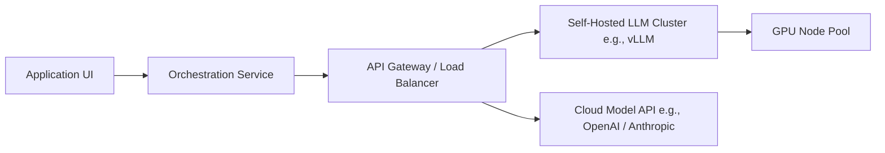

# Module 1: LLM Fundamentals

## 1. Industry Explanation
Large Language Models (LLMs) are deep learning models based on the Transformer architecture (specifically decoder-only layouts in modern generative models) trained to predict the next token in a sequence. LLMs compress massive amounts of public and structured web data into billions of neural parameters. 

In the enterprise space, LLMs serve as foundational cognitive engines. Organizations use these models to perform natural language processing tasks (like translation, summarization, extraction, and generation) at a scale and quality that was previously impossible.

## 2. Enterprise Architecture
An enterprise LLM architecture separates the cognitive engine from application logic:

## 3. Business Use Cases
- **Customer Support Automation**: Deploying virtual assistants that understand complex customer inquiries, policy details, and account histories.
- **Enterprise Search and Retrieval**: Finding and summarizing facts from millions of internal documents, databases, and emails.
- **Dynamic Content Generation**: Drafting customized sales collateral, email replies, and technical documentation based on CRM data.

## 4. Production Architecture
Production deployments require high throughput and low latency. This is achieved by using:
- **Inference Servers (vLLM, Triton)**: Tools that feature continuous batching, PagedAttention (to optimize memory usage for tokens), and model quantization (FP8/INT4).
- **Redundant Routing**: Gateways that load balance traffic across multiple GPU nodes or fallback APIs.

## 5. Common Failure Modes
- **Hallucinations**: The model generating plausible-sounding but factually incorrect claims due to training data gaps or probability distributions.
- **Context Recency Degradation**: The model ignoring instructions or details placed in the middle of long prompts.
- **Stochastic Drift**: Changes in output formatting or quality when model providers roll out minor updates to their API endpoints.

## 6. Optimization Strategies
- **Prompt Pruning**: Reducing prompt lengths to speed up processing and lower API costs.
- **vLLM PagedAttention**: Optimizing GPU memory allocation to handle larger batch sizes and long context windows.
- **Quantization (FP8, INT8)**: Running models in lower precision to double throughput and halve GPU memory requirements.

## 7. Security Considerations
- **PII Leakage**: The model repeating sensitive training data (like API keys, personal IDs) in its responses.
- **Jailbreak Vulnerabilities**: Attackers using adversarial prompts to bypass safety guidelines.

## 8. Governance Considerations
- **License Compliance**: Auditing if self-hosted models are licensed for commercial use (e.g., Llama 3 license limitations for large enterprises).
- **Audit Trails**: Saving all prompt-response pairs to monitor compliance, track biases, and audit model behavior.

## 9. Best Practices
- **Explicit Version Pinning**: Always reference specific, hashed model releases in configuration files.
- **System-User Role Division**: Enforce strict separation between system rules and untrusted user inputs using clear delimiters.
- **Fallback Configurations**: Implement automated fallback routing to secondary model providers if the primary API fails.

## 10. AI FDE Perspective
An FDE must design architectures that prioritize reliability and cost-efficiency. This means using smaller, task-specific models for simple tasks (like classification), and routing complex reasoning tasks (like multi-document synthesis) to larger models, ensuring the solution is both reliable and scalable.
