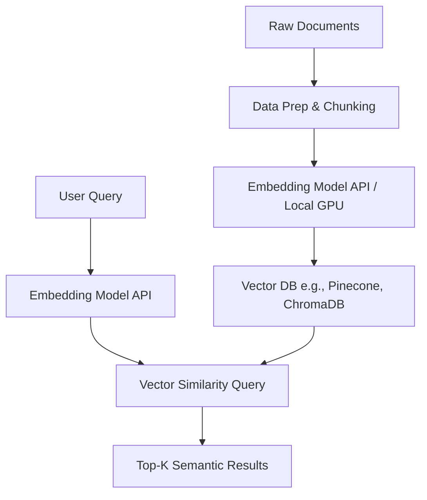

# Module 2: Embeddings

## 1. Industry Explanation
An embedding is a vector representation of text (words, sentences, or documents) in a high-dimensional mathematical space. Deep learning models convert unstructured text into these vectors, ensuring that texts with similar semantic meanings are placed close to each other in the vector space, regardless of the specific words used.

In enterprise systems, embeddings are the foundation of semantic understanding. They allow machines to search, compare, and cluster unstructured data based on meaning, enabling intelligent search, recommendation engines, and RAG architectures.

## 2. Enterprise Architecture
Enterprise embedding pipelines handle document ingestion, index generation, and vector retrieval:

## 3. Business Use Cases
- **Semantic Search Engine**: Replacing keyword matching with search tools that understand user intent (e.g., matching "auto insurance cost" to policy pricing documents).
- **Recommendation Systems**: Suggesting relevant documents, products, or support tickets based on semantic similarity to the user's active file.
- **Duplicate Support Finder**: Automatically identifying and grouping duplicate customer support issues.

## 4. Production Architecture
At scale, embedding systems must handle high-throughput document ingestion. Production setups include:
- **Asynchronous Processing Queues (Celery, Kafka)**: Decoupling document ingestion from the embedding generation steps.
- **Local Embedding Microservices (TEI - Text Embeddings Inference)**: Running local embedding models on dedicated GPUs to keep latencies under 10ms.

## 5. Common Failure Modes
- **Out-of-Vocabulary (OOV) Terms**: The embedding model failing to capture the meaning of highly specialized industry terms, acronyms, or product IDs.
- **Diluted Context in Large Chunks**: Embedding large, multi-topic document chunks, which compresses conflicting concepts into a single vector and reduces search accuracy.
- **Asymmetric Search Inefficiencies**: Comparing short user queries to long document chunks directly. Since they have different formats, the semantic comparison can yield poor results.

## 6. Optimization Strategies
- **Matryoshka Representation Learning (MRL)**: Compressing embedding dimensions (e.g., from 1536 to 256) to reduce storage costs and speed up vector searches with minimal loss in accuracy.
- **Hybrid Search Configurations**: Combining BM25 keyword matching with dense vector searches to get the best of both keyword precision and semantic understanding.

## 7. Security Considerations
- **Vector Reconstruction Risks**: Attackers reconstructing the original sensitive documents by analyzing public embedding vectors.
- **Data Boundary Leakage**: Storing documents with different access permissions in a shared vector database index, which can expose private data during search queries.

## 8. Governance Considerations
- **Permissions Metadata**: Every vector in the database must include metadata tags detailing access permissions, ensuring queries filter out restricted documents.
- **Model Migration Versioning**: Updating embedding models requires re-embedding the entire document database, as vectors generated by different models cannot be compared.

## 9. Best Practices
- **Implement Cross-Encoders**: Use fast embedding models for the initial search, and apply a Cross-Encoder reranking model (like Cohere Rerank) to the top results to maximize relevance.
- **Normalize Vectors**: Store normalized vectors to simplify calculations, allowing you to use fast dot-product operations instead of slower cosine similarity checks.
- **Add Query Prefix Styling**: Add query prefixes (like `"query: "` or `"passage: "`) if required by the embedding model to optimize similarity scores.

## 10. AI FDE Perspective
An FDE must design search pipelines that meet business requirements. When vector searches fail to find exact terms (like part numbers or product codes), the FDE should implement a hybrid search architecture, combining BM25 keyword indexes with semantic vector databases to deliver precise and context-aware search results.
