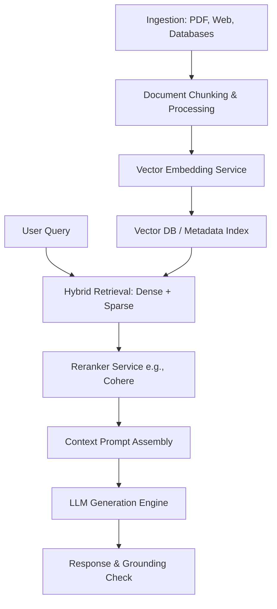

# Module 3: Retrieval-Augmented Generation (RAG)

## 1. Industry Explanation
Retrieval-Augmented Generation (RAG) is an architectural pattern that retrieves relevant information from external data sources and injects it into the prompt context before sending the request to the LLM. 

RAG solves three key limitations of pre-trained LLMs: it prevents hallucinations by grounding responses in verified facts, it provides access to real-time information without requiring constant model updates, and it protects data privacy by using secure retrieval layers instead of training models on confidential data.

## 2. Enterprise Architecture
An enterprise RAG system coordinates data ingestion, indexing, retrieval, and generation:

## 3. Business Use Cases
- **Internal Knowledge Assistant**: Helping employees query complex HR manuals, compliance guides, and training documents.
- **Underwriting Support**: Analyzing insurance applications against policy documents and flagging deviations.
- **Financial Research Assistant**: Summarizing quarterly financial filings, calculating metrics, and citing sources.

## 4. Production Architecture
Production-grade RAG platforms use a layered retrieval design:
- **Two-Stage Retrieval**: A vector database performs a fast search to find the top 50 relevant chunks, and a Cross-Encoder reranker identifies the top 5 most relevant documents to inject into the prompt.
- **Metadata Filtering**: Indexing documents with metadata (e.g., department, folder, date) to restrict searches and prevent information leaks.

## 5. Common Failure Modes
- **Bad Chunking Boundaries**: Splitting paragraphs mid-sentence, which splits context across chunks and reduces search accuracy.
- **Context Poisoning**: Retrieved documents containing conflicting information, which confuses the model and leads to inconsistent answers.
- **Citation Hallucinations**: The model citing page numbers, document names, or source links that do not exist in the retrieved context.

## 6. Optimization Strategies
- **Parent-Child Chunking**: Storing small, detailed chunks for vector search, but returning the larger parent paragraphs to the LLM to preserve context.
- **Query Rewriting**: Using a fast LLM to rewrite vague queries into search-optimized terms before querying the vector database.

## 7. Security Considerations
- **Indirect Prompt Injection**: Attackers placing malicious instructions inside documents. When these documents are retrieved, they overwrite system rules and hijack the model.
- **Data Permission Leaks**: Failing to filter search results by user roles, allowing employees to access documents they are not authorized to view.

## 8. Governance Considerations
- **Source Verification**: Implementing automated checks to ensure all generated claims can be traced back to verified source files.
- **Stale Content Pruning**: Regularly updating the vector database index to remove outdated policies, brochures, or guidelines.

## 9. Best Practices
- **Implement Strict Grounding Rules**: Instruct the LLM to output a default statement (e.g., "I cannot answer based on the documents") if the retrieved context is insufficient.
- **Prune Content Chunks**: Strip out code comments, HTML tags, and page footers to keep prompts clean and save token costs.
- **Use Hybrid Search**: Combine semantic search with keyword search (BM25) to retrieve both conceptual answers and exact matching terms (like model codes or names).

## 10. AI FDE Perspective
An FDE must look beyond prompt writing to improve RAG systems. If responses are inaccurate, the FDE should audit the entire pipeline: refining document chunking strategies, improving indexing with hybrid search, and using reranking to ensure only the most relevant context is passed to the model.
