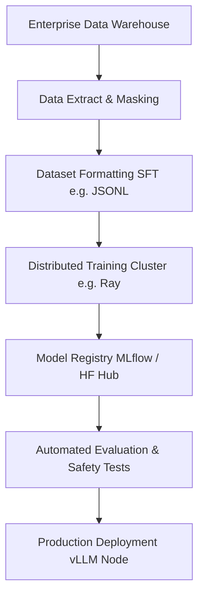

# Module 4: Fine-Tuning

## 1. Industry Explanation
Fine-Tuning is the process of training a pre-trained foundation model on a curated, task-specific dataset to adapt its behavior. While pre-training teaches the model language and general facts, fine-tuning adjusts the model's tone, formatting style, domain vocabulary, and adherence to specific instructions.

In enterprise environments, fine-tuning is used when prompt engineering and RAG are insufficient. It is ideal for training models on specialized domain terminology (like medical or legal guidelines), enforcing strict output styles, or preparing models to run on smaller, cost-effective hardware.

## 2. Enterprise Architecture
Enterprise fine-tuning setups combine data pipelines, distributed training, and model evaluations:

## 3. Business Use Cases
- **Medical Report Generator**: Training models on clinical vocabularies to translate doctor transcripts into structured medical reports.
- **Legal Compliance Auditor**: Training models on specific state laws to review commercial contracts and identify compliance risks.
- **Customer Query Classifier**: Fine-tuning small models (like Llama 8B) to run high-speed, cost-effective support ticket routing.

## 4. Production Architecture
Production fine-tuning pipelines are built on distributed infrastructure:
- **Distributed Training Engine (Ray Train, PyTorch FSDP)**: Splitting models and datasets across multiple GPUs (e.g., A100s or H100s) to speed up training.
- **Strict Data Pipelines**: Implementing automated data extraction and cleaning routines that format training examples into consistent JSONL structures.

## 5. Common Failure Modes
- **Catastrophic Forgetting**: The model losing its general capabilities and reasoning skills because it was trained too long on a single dataset.
- **Overfitting to Training Data**: The model memorizing training examples and failing to handle new, real-world inputs.
- **Data Contamination**: Accidentally including evaluation data in the training set, resulting in artificially high evaluation scores during testing.

## 6. Optimization Strategies
- **Distributed Optimizers (ZeRO)**: Running optimization states across multiple GPUs to reduce memory overhead.
- **Mixed Precision (BF16, FP16)**: Training models in 16-bit precision to cut training times and memory usage by 50% compared to 32-bit precision.
- **Data Augmentation**: Using synthetic data generated by larger models (like Claude 3.5 Sonnet) to expand training datasets.

## 7. Security Considerations
- **PII Leakage in Outputs**: The fine-tuned model memorizing and repeating confidential database records or customer details from the training set.
- **Data Poisoning**: Attackers injecting malicious examples into training sets to create backdoors or bypass safety rules.

## 8. Governance Considerations
- **Data Anonymization**: Cleaning training datasets to remove PII before training begins.
- **Regulatory Audits**: Documenting the datasets, hyperparameters, and model versions used in training to support compliance audits.

## 9. Best Practices
- **Implement Strict Validation Splits**: Separate training datasets into distinct train, validation, and test splits (e.g., 80% train, 10% validation, 10% test).
- **Monitor Loss Curves**: Stop training if the validation loss starts to increase while the training loss decreases (overfitting).
- **Pin Base Model Versions**: Always fine-tune on a specific, fixed base model release to ensure training is reproducible.

## 10. AI FDE Perspective
An FDE should treat fine-tuning as a last resort. Before fine-tuning, the FDE should prototype solutions using prompt engineering and RAG. If these approaches fail to meet performance, latency, or cost goals, the FDE should design a targeted fine-tuning project: establishing clean data prep scripts, setting up validation metrics, and deploying the resulting model on cost-effective hardware.
