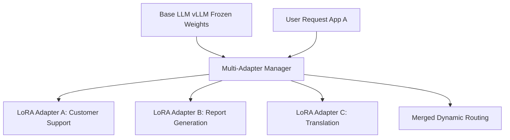

# Module 5: LoRA (Low-Rank Adaptation)

## 1. Industry Explanation
Low-Rank Adaptation (LoRA) is a Parameter-Efficient Fine-Tuning (PEFT) technique that reduces the memory and computation required to train large models. During full fine-tuning, all model weights are updated, which requires high GPU memory and storage. LoRA keeps the pre-trained model weights frozen and injects trainable rank decomposition matrices into the model's layers.

This approach significantly reduces the number of trainable parameters (often by 99%), making it possible to fine-tune large models on consumer-grade GPUs and store adapters as lightweight files (megabytes instead of gigabytes).

## 2. Enterprise Architecture
LoRA allows organizations to serve multiple task-specific applications from a single base model:

## 3. Business Use Cases
- **Multi-Tenant SaaS Systems**: Serving custom fine-tuned models for thousands of clients by swapping lightweight LoRA adapters on a single shared base model.
- **Cost-effective Fine-Tuning**: Training specialized models on smaller GPU cluster setups, cutting development costs.
- **Dynamic Skill Switching**: Adjusting model behavior in real time by loading different adapters based on user queries.

## 4. Production Architecture
Production LoRA architectures use dynamic adapter loading:
- **Adapter Hosting (vLLM, Hugging Face PEFT)**: Serving a single base model instance and dynamically applying adapters at runtime, avoiding the cost of running separate GPU clusters for every model variant.
- **Adapter Decoupling**: Storing adapters in object storage (like S3) and loading them into GPU memory on demand.

## 5. Common Failure Modes
- **Incompatible Base Model Weights**: Attempting to load a LoRA adapter trained on one base model version onto a different base model, causing corrupted outputs.
- **Incorrect Rank (r) Configurations**: Selecting a rank that is too low (resulting in poor task adaptation) or too high (increasing memory usage and overfitting risks).
- **Latency Spikes during Loading**: Experiences delays when dynamically loading new adapters into GPU memory for the first time.

## 6. Optimization Strategies
- **Dynamic Adapter Caching**: Caching frequently used adapters in GPU memory to eliminate loading latencies.
- **Fused Adapter Inferences**: Merging LoRA weights directly into the base model parameters before deployment for high-performance, single-task applications.

## 7. Security Considerations
- **Adapter Hijacking**: Attackers replacing adapter files in object storage with malicious adapters designed to leak data.
- **Memory Poisoning**: Issues where dynamic adapter loading code fails to isolate model memory, allowing data to leak across different client tenants.

## 8. Governance Considerations
- **Adapter Provenance**: Tracking which datasets and permissions were used to train each adapter to prevent compliance risks.
- **Model Registry Access**: Restricting who can write to model registries, ensuring only approved adapters are deployed.

## 9. Best Practices
- **Standardize Adapter Configs**: Define consistent parameters for training:
  - **Rank (r)**: Use `8` or `16` for standard classification and styling tasks; use `32` or `64` for complex domain-specific tasks.
  - **Target Modules**: Apply adapters to query (`q_proj`) and value (`v_proj`) projection matrices in the attention layers.
- **Implement Sanity Check Evaluators**: Verify that the base model's general reasoning skills remain intact after loading adapters.

## 10. AI FDE Perspective
An FDE must design architectures that scale efficiently. When building multi-client enterprise platforms, the FDE should advise against running dedicated GPU instances for every client. Instead, the FDE should deploy a single, shared base model instance and swap lightweight LoRA adapters dynamically, reducing infrastructure costs by up to 90%.
