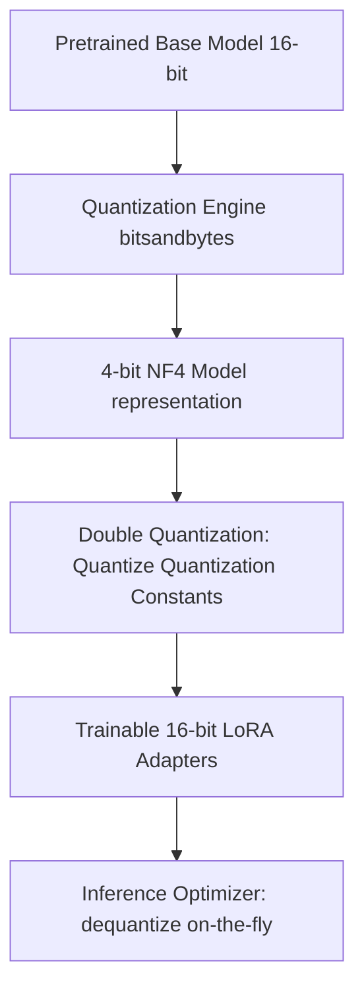

# Module 6: QLoRA (Quantized Low-Rank Adaptation)

## 1. Industry Explanation
Quantized Low-Rank Adaptation (QLoRA) is an optimization technique that makes it possible to fine-tune large models on a single GPU. QLoRA works by quantizing the base model's weights to 4-bit precision using a specialized data type called NormalFloat 4 (NF4), while running the trainable LoRA adapters in 16-bit precision.

This combination reduces GPU memory requirements by up to 75% without sacrificing fine-tuning accuracy, allowing developers to train 70B parameter models on single, cost-effective GPU setups.

## 2. Enterprise Architecture
QLoRA pipelines leverage quantization and double quantization to maximize hardware efficiency:

## 3. Business Use Cases
- **On-Premise Model Customization**: Fine-tuning models on local, restricted hardware to comply with strict data privacy regulations.
- **Budget-Conscious Training**: Running model updates on cheaper GPU clusters, reducing compute costs.
- **High-capacity Model Customization**: Updating large models (like Llama-3-70B) on standard enterprise GPUs instead of expensive multi-node systems.

## 4. Production Architecture
Production QLoRA architectures focus on memory optimization:
- **Bitsandbytes Integrations**: Using libraries like `bitsandbytes` to load base models in NF4 format, and applying PyTorch tools to handle 16-bit gradients.
- **Dynamic Dequantization Loops**: On-the-fly dequantization during the forward pass, keeping memory usage low.

## 5. Common Failure Modes
- **Dequantization Latency Overhead**: The conversion process between 4-bit and 16-bit precision during training steps causing slow training speeds.
- **Quantization Degradation**: Loss of performance if the base model weights contain outlier parameters that do not fit the NF4 data distribution.
- **Incompatible GPU Runtimes**: Running 4-bit NF4 operations on older GPUs that do not support hardware-accelerated quantization libraries.

## 6. Optimization Strategies
- **Double Quantization (DQ)**: Quantizing the scale factors used in the primary quantization process, saving an average of 0.37 bits per parameter.
- **Paged Optimizers**: Offloading optimizer states to CPU memory when GPU memory limits are reached to prevent Out-Of-Memory (OOM) crashes.

## 7. Security Considerations
- **Quantization Side-Channels**: Attackers extracting model details by analyzing memory and timing variations during dequantization steps.
- **Adapter Validation Vulnerabilities**: Using quantized models that are more susceptible to adversarial inputs due to precision losses.

## 8. Governance Considerations
- **Performance Parity Verifications**: Running evaluations to ensure the quantized model performs as well as the full-precision version.
- **Hardware Limitations**: Ensuring training runs only on approved, secure enterprise GPU systems.

## 9. Best Practices
- **Use NF4 Over FP4**: NormalFloat 4 (NF4) is optimized for the normal distribution of neural weights, yielding higher accuracy than standard Float 4 (FP4).
- **Enable Double Quantization**: Always enable DQ to maximize memory savings without degrading model performance.
- **Target All Linear Layers**: Apply LoRA adapters to all linear layers (not just attention projection matrices) to close the performance gap between quantized and full-precision models.

## 10. AI FDE Perspective
An FDE must design cost-effective architectures. When client stakeholders request custom 70B parameter models but have limited budgets, the FDE should implement QLoRA. This allows training on single-node GPU instances, avoiding the high cost of multi-node setups while delivering high-quality, domain-specific models.
