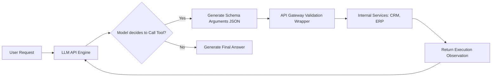

# Module 7: Function Calling

## 1. Industry Explanation
Function Calling (also called Tool Calling) is the process where an LLM detects when a query requires external data or actions, and outputs a structured JSON object containing the name of a tool and its arguments. The host application parses this JSON, runs the requested function or API, and feeds the result back to the model.

This bridge enables LLMs to interact with databases, compute mathematical calculations, and trigger real-world actions, transforming static text generators into active integration engines.

## 2. Enterprise Architecture
Enterprise tool integration layers connect models to internal systems:

## 3. Business Use Cases
- **Real-Time CRM Integrations**: Allowing sales reps to query client status: the LLM detects the request, calls `get_customer_record(id)`, retrieves the data, and drafts a reply.
- **Automated ERP Operations**: Creating and updating inventory records, shipping forms, or order details via natural language inputs.
- **IT System Diagnostics**: Automating server troubleshooting: the model runs diagnostics, checks disk space, and restarts services based on alerts.

## 4. Production Architecture
Production-grade systems separate tool execution from the model:
- **Sandbox execution**: Running tool functions in secure, isolated containers (e.g., Docker or AWS Lambda) to protect internal infrastructure.
- **API Gateways**: Routing all tool calls through secure gateways that handle authentication, request validation, and rate limiting.

## 5. Common Failure Modes
- **Invalid JSON Arguments**: The model generating argument values that do not match the expected schema or fail JSON parsing checks.
- **Hallucinated Tool Names**: The model attempting to call functions that were not defined in the system prompt or API options.
- **Infinite Execution Loops**: The agent repeatedly calling a failing tool with the exact same parameters, resulting in high costs and latency.

## 6. Optimization Strategies
- **Parallel Tool Execution**: Running independent tool calls concurrently to speed up response times.
- **Context Injection Pruning**: Pruning past tool execution logs from the context window once the task is complete to save on token costs.

## 7. Security Considerations
- **Indirect Prompt Injection**: Malicious instructions embedded in retrieved data that trick the model into executing unauthorized commands.
- **Privilege Escalation**: Users using natural language to trick the model into running tool calls they do not have permissions to execute.

## 8. Governance Considerations
- **Explicit Consent Prompts**: Implementing mandatory human approvals for high-risk actions (e.g., sending emails, deleting data, making transfers).
- **Execution Audit Trails**: Logging all tool inputs, parameters, and responses to support troubleshooting and compliance.

## 9. Best Practices
- **Write Detailed Tool Descriptions**: Describe what each tool does and when to use it, as the model uses these descriptions to select the right tool.
- **Enforce Low Temperatures**: Set the model temperature to `0` to make tool selection and parameter generation more predictable.
- **Implement Robust Parsing Rules**: Wrap tool calling loops in try-catch blocks to catch and handle JSON formatting errors gracefully.

## 10. AI FDE Perspective
An FDE must design secure, reliable integration architectures. FDEs should ensure that agents do not have direct, unmonitored write access to databases. Instead, they should build validation layers that verify tool arguments, enforce user access controls, and require explicit human approval for actions that change system states.
