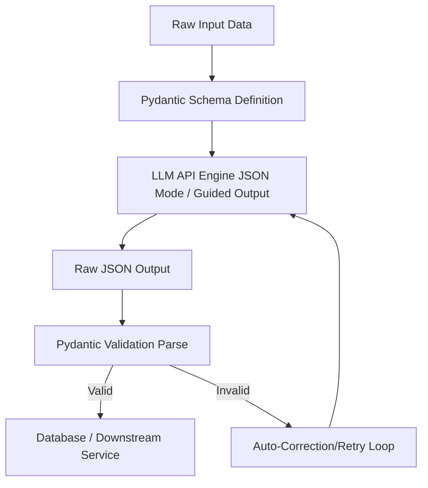

# Module 8: Structured Output

## 1. Industry Explanation
Structured Output is the process of forcing an LLM to return data in a predefined, machine-readable format (such as JSON matching a specific schema) instead of free-form text. In software development, downstream applications cannot reliably parse natural language.

By enforcing structured outputs, developers can integrate LLMs directly into traditional software pipelines, ensuring that the model's responses can be parsed, validated, and processed by database adapters and API endpoints.

## 2. Enterprise Architecture
Enterprise structured output pipelines integrate schemas, model parsing, and validation checks:


## 3. Business Use Cases
- **Invoice Information Extraction**: Extracting billing data (vendor name, date, line items, taxes) from invoices into structured database rows.
- **Support Ticket Classification**: Categorizing incoming emails into categories (billing, technical, account) with priority scores (1-5).
- **Medical Records Processing**: Parsing doctor notes to extract diagnoses, symptoms, and prescriptions into patient databases.

## 4. Production Architecture
Production-grade systems use advanced techniques to ensure schema adherence:
- **API Schema Constraints (JSON Schema)**: Using API features (like OpenAI's structured outputs or Gemini's schema mode) to force the model's token prediction layer to conform to a specific format.
- **Parsing Libraries (Outlines, Instructor)**: Using libraries that guide model token generation at the inference level, ensuring the output is always syntactically valid JSON.

## 5. Common Failure Modes
- **Schema Key Drift**: The model generating slightly different keys (e.g., using `deliveryDate` instead of the expected `shipping_date`).
- **Null Value Formatting Errors**: The model omitting required keys or returning `"N/A"` strings instead of expected `null` values.
- **Unparseable Markdown Envelopes**: The model wrapping its JSON output in markdown code blocks (e.g., ` ```json ... ``` `), which crashes simple JSON parsers.

## 6. Optimization Strategies
- **Minimize Schema Complexity**: Keep target schemas as simple as possible, avoiding deeply nested objects to reduce model confusion and generation times.
- **Few-Shot Format Examples**: Include examples of the target JSON structure in the prompt to guide the model's generation pattern.

## 7. Security Considerations
- **JSON Injection Attacks**: Attackers inserting special control characters or nested JSON structures into input fields to bypass schema validation checks.
- **Data Validation Failures**: The model outputting syntactically valid JSON that contains incorrect or harmful data values (e.g., setting price attributes to negative values).

## 8. Governance Considerations
- **Schema Version Control**: Managing changes to schemas using version control, ensuring downstream applications remain compatible.
- **Factual Verification Checks**: Running validation rules on extracted fields to verify the data is factually correct.

## 9. Best Practices
- **Define Schemas using Pydantic**: Use Python's `pydantic` library to define schemas, allowing you to handle validation, type casting, and default values automatically.
- **Use API-Level JSON Modes**: Always enable provider-level JSON or schema modes to force the model to output valid JSON.
- **Implement Automated Retry Logic**: Set up a retry loop that feeds validation errors back to the model, allowing it to correct formatting mistakes automatically.

## 10. AI FDE Perspective
An FDE must design reliable integration pipelines. FDEs should implement strict schema validation using tools like Pydantic, and build automated correction loops that catch parsing errors, format the error messages, and prompt the model to correct its output, ensuring the application remains robust.
