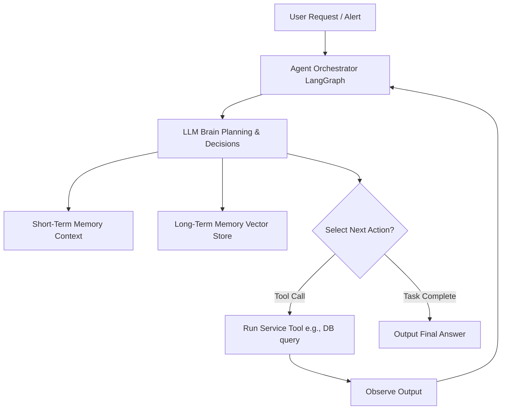

# Module 9: AI Agents

## 1. Industry Explanation
An AI Agent is an autonomous system that uses a Large Language Model (LLM) as its central brain to plan tasks, make decisions, interact with external tools, and manage its execution path. Unlike traditional software that follows rigid paths, agents adapt their actions dynamically based on inputs and feedback.

In enterprise environments, agents automate complex, multi-step business workflows. They coordinate actions across multiple systems, handle edge cases, and learn from experience, transforming simple chatbot interfaces into active digital workers.

## 2. Enterprise Architecture
Enterprise agent architectures coordinate planning, tools, memory, and orchestration layers:

## 3. Business Use Cases
- **Autonomous Support Representative**: Resolving customer issues end-to-end: looking up orders, validating refund policies, processing returns, and sending confirmation emails.
- **IT Operations Assistant**: Monitoring server performance, running diagnostic tools, restarting services, and notifying team members during alerts.
- **Sales Intelligence Research Agent**: Researching leads online, verifying contact details, compiling summaries, and drafting personalized outreach emails.

## 4. Production Architecture
Production-grade agent platforms use advanced orchestrators:
- **State Chart Orchestrators (LangGraph)**: Defining agent workflows as structured graphs with explicit states, transitions, and loops, ensuring execution remains reliable.
- **Isolated Tool Runtimes**: Running tools in secure, sandboxed environments to protect enterprise networks from unauthorized access.

## 5. Common Failure Modes
- **Infinite Execution Loops**: The agent repeatedly calling a failing tool with the same arguments, resulting in runaway API costs.
- **State Deviation**: The agent losing track of its original goal during long-running tasks as its context window fills up with intermediate tool logs.
- **Tool Hallucinations**: The agent attempting to call non-existent functions or passing incorrect parameter types to APIs.

## 6. Optimization Strategies
- **Dynamic Context Pruning**: Summarizing and compressing past tool logs to prevent context window saturation and reduce token costs.
- **Parallel Task Execution**: Running independent tool operations concurrently to speed up response times.

## 7. Security Considerations
- **Indirect Prompt Injection**: The agent reading untrusted documents or emails that contain hidden instructions designed to hijack its behavior and trigger unauthorized tool calls.
- **Privilege Escalation**: Users tricking the agent into running tool calls they do not have permissions to execute.

## 8. Governance Considerations
- **Human-in-the-Loop (HITL)**: Implementing mandatory human approvals for high-risk actions (e.g., executing financial transactions or modifying system data).
- **Execution Trajectory Auditing**: Logging every step of an agent's run (thoughts, actions, and observations) to support troubleshooting and compliance reviews.

## 9. Best Practices
- **Implement Strict Loop Limits**: Set a maximum step count (e.g., 5 or 10 steps) in the orchestrator to prevent infinite loops and control API costs.
- **Write Detailed Tool Descriptions**: The model uses tool names and descriptions to select the right action. Ensure descriptions are precise and outline when to use each tool.
- **Build Structured State Models**: Use explicit state objects (like LangGraph schemas) to pass data between agent nodes, rather than relying on unstructured text chains.

## 10. AI FDE Perspective
An FDE must design secure, reliable agent architectures. FDEs should implement state chart orchestrators to keep agent runs predictable, deploy tools in secure sandbox environments, and establish mandatory human approvals for actions that change system states, ensuring applications are safe for enterprise deployment.
