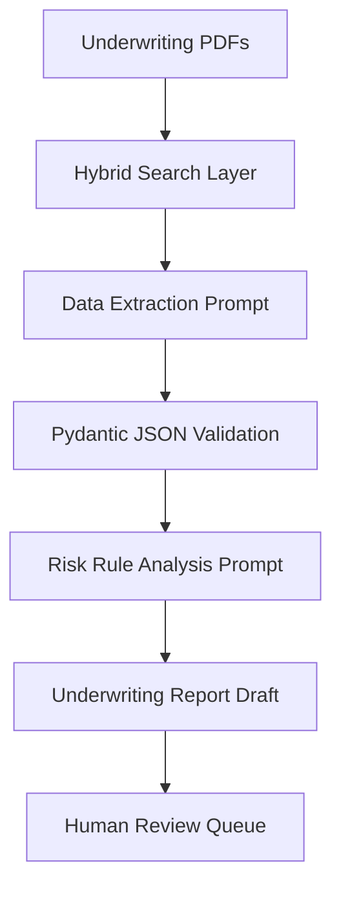

# Enterprise Prompt Engineering Interview Preparation

This guide compiles high-level interview questions and architectural scenarios designed to evaluate a candidate's understanding of production Prompt Engineering, RAG prompting, agentic loops, LLM product design, and FDE customer discovery.

---

## 1. Technical Prompt Engineering Questions

### Q1: How do you prevent model drift when a cloud provider updates their underlying LLM endpoint (e.g., transitioning from Claude 3 to Claude 3.5)?
**Answer:**
1. **Model Lock-In Mitigation:** Always specify exact model version hashes rather than generic aliases (e.g., use `claude-3-5-sonnet-20241022` instead of `claude-3-5-sonnet`).
2. **Regression Suites:** Maintain a Golden Dataset of 100+ standardized inputs. Run automated evaluation scripts (comparing new outputs against established ground-truths using semantic distance or LLM-as-a-Judge) in the CI/CD pipeline before switching model endpoints in production.
3. **Decoupled Prompt Configuration:** Maintain prompts in a version-controlled registry (like Langfuse) so prompt templates can be customized per model type, allowing model-specific optimizations.

### Q2: Why is XML framing generally preferred over simple Markdown or quotes for separating input blocks in enterprise system prompts?
**Answer:**
- **Parsing Predictability:** LLMs are trained heavily on HTML and XML, making tags like `<context>` and `</context>` highly recognizable.
- **Escape Character Resilience:** XML tags are less likely to collide with customer data. If a customer inputs markdown text (like headers or bullets), markdown dividers like `---` or `#` can easily blend in, causing the model to confuse customer inputs with system rules. XML tags define clear, non-overlapping boundaries.
- **System-User Boundary Isolation:** XML tags let you easily sanitize user input by stripping or encoding any matching tags (e.g., removing `<user_input>` from user text) before inserting it into the prompt.

---

## 2. RAG Prompting Questions

### Q3: A RAG system experiences "Context Poisoning" where retrieved documents contain conflicting facts, causing the model to hallucinate or output inconsistent answers. How do you design the prompt to handle this?
**Answer:**
- **Relevance & Source Grading:** Instruct the model to analyze documents and grade their relevance or date parameters first:
  ```text
  Verify the source date on all provided documents. If facts conflict, prioritize the document with the most recent timestamp.
  ```
- **Explicit Conflict Flagging:** Instruct the model to explicitly state when information is contradictory rather than attempting to merge it:
  ```text
  If document [Doc-A] and [Doc-B] present conflicting figures, explain the discrepancy, cite both documents, and output: [CONFLICT_DETECTED].
  ```
- **Fallback Schemas:** Design the output JSON structure to require a `source_resolution_logic` field, forcing the model to explain how it resolved any conflicting data.

---

## 3. AI Agent Questions

### Q4: An autonomous database agent gets stuck in an infinite loop, calling the same query tool repeatedly with the same parameters when no records are returned. How do you resolve this at both the prompt and system level?
**Answer:**
- **Prompt-Level (ReAct Guidelines):** Add rules to the agent's system instructions:
  ```text
  If a tool call returns an empty observation or error:
  1. Do not repeat the same tool call with the same arguments.
  2. Attempt to broaden your search criteria or use an alternative tool.
  3. If all attempts fail, output a final answer stating that no records were found.
  ```
- **System-Level (Orchestrator Guard):** Set a maximum loop limit (e.g., `max_iterations = 5`) in the orchestration runner (e.g., LangGraph or custom code). If the agent exceeds this limit, the system should stop execution and return a human-readable error or flag a supervisor.

---

## 4. Enterprise AI Questions

### Q5: How do you structure prompt evaluations to comply with strict audits in regulated industries like banking or healthcare?
**Answer:**
- **Factual Grounding Checks:** Use frameworks like G-Eval or RAGAS to verify that every claim in the output is supported by retrieved context.
- **Audit Logging:** Save the complete execution history for every request:
  - The exact prompt version used (from the registry).
  - The raw retrieved documents.
  - The step-by-step reasoning (Chain-of-Thought) of the model.
  - The final output and the results of any automated evaluations.
- **PII Compliance Filters:** Implement pre-execution and post-execution checks (like Microsoft Presidio) to scan and redact PII from inputs and outputs before they hit the LLM.

---

## 5. LLM Product Design Case Studies

### Case Study: Designing an Underwriting Copilot
**Scenario:** A commercial property insurance firm wants to build an AI assistant that analyzes underwriting PDFs and flags high-risk accounts.

**Architectural Approach:**


1. **Extraction Step:** Build a prompt to extract structured metrics (building age, roof type, fire protection class) into a verified JSON format.
2. **Analysis Step:** Design a second prompt that takes the verified JSON data and evaluates it against underwriting guidelines, scoring risk levels.
3. **Drafting Step:** Generate a summary report that details the risk flags, references the source document page numbers, and routes low-confidence files to senior underwriters.

---

## 6. AI FDE Discovery Scenario

### Scenario: Customer Discovery Workshop
**Scenario:** A retail client wants a customer support agent. During workshops, they demand: *"The bot must answer any customer question with 100% accuracy and should never make a mistake."*

**FDE Discovery Protocol:**
1. **Manage Expectations:** Explain that LLMs are probabilistic systems, making 100% accuracy impossible.
2. **Define Boundaries:** Propose dividing customer queries into clear categories:
   - **Deterministic Tasks:** Use traditional APIs for transactional queries (like order statuses or tracking numbers).
   - **Generative Tasks:** Use the LLM to answer general questions (like return policies) based on verified safety manuals.
3. **Design Safeguards:** Propose implementing guardrails and confidence scoring to block out-of-scope inputs, and automatically routing complex or angry queries to human agents to protect the customer experience.
