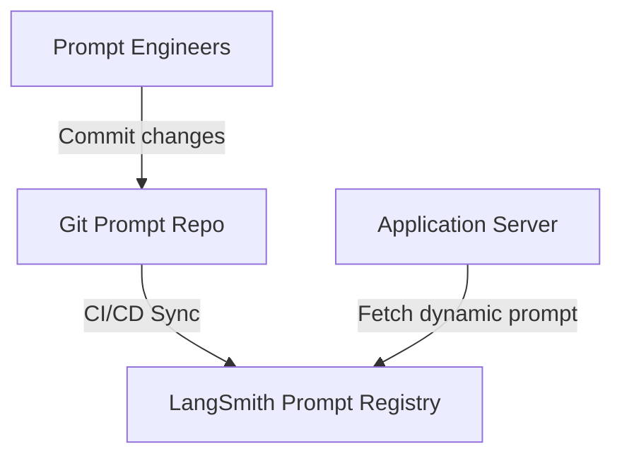
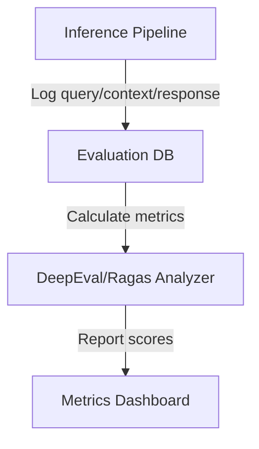
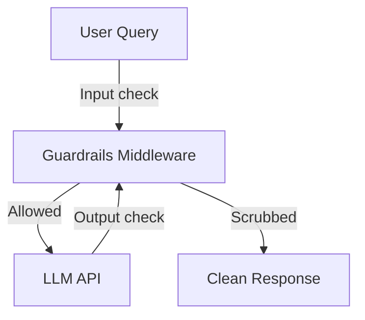
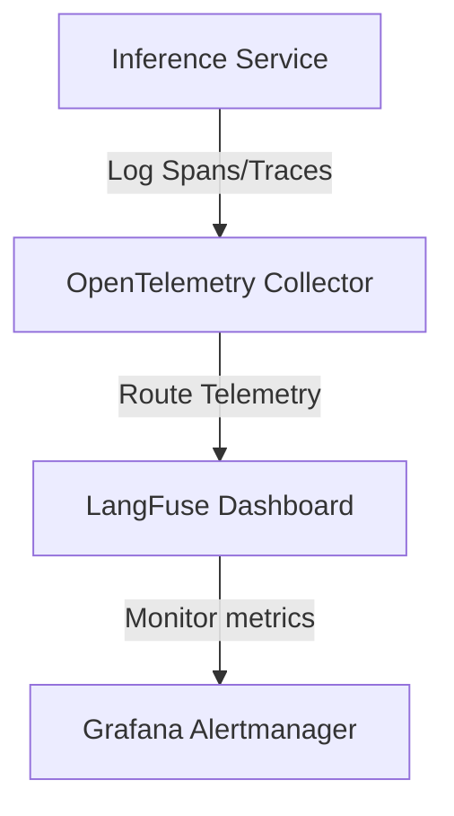
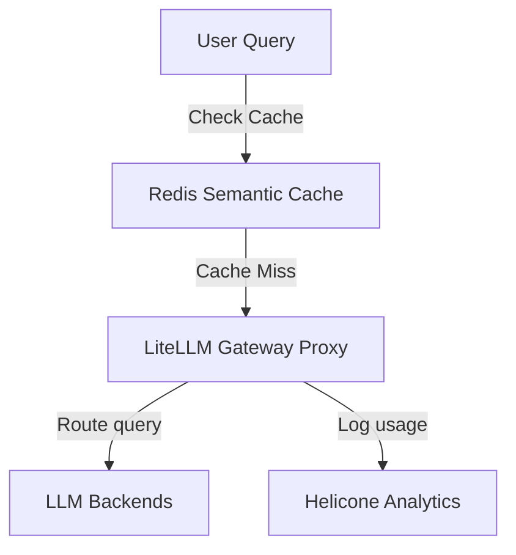
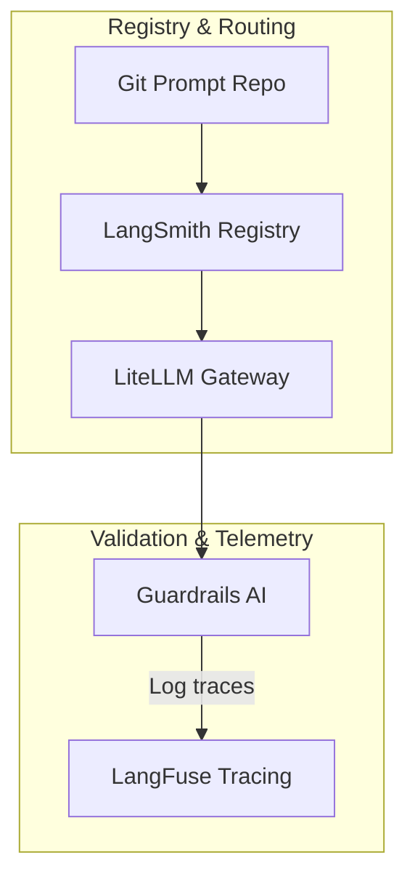

# Module 11: Enterprise LLMOps Capstone Projects

This module outlines the architectures, requirements, and deployment steps for the six enterprise capstone projects.

---

## Project 1: Prompt Management Platform

### Overview
Build a centralized prompt registry platform using LangSmith and PromptLayer to manage, test, and deploy prompt templates.

### Technology Stack
*   **Prompt Registry**: LangSmith, PromptLayer
*   **Code Repository**: Git-integrated prompt repo

### Architecture Diagram

### Key Deliverables
1.  **Git Prompt Repository**: Structuring templates as YAML/JSON configuration files.
2.  **Sync Pipeline**: GitHub Actions workflow deploying templates to the registry.
3.  **Client Fetch SDK**: Python wrapper retrieving prompts based on environment tags.

---

## Project 2: Enterprise RAG Evaluation Platform

### Overview
Build an automated RAG evaluation pipeline using Ragas, DeepEval, and TruLens to measure faithfulness and answer relevance.

### Technology Stack
*   **Evaluation Frameworks**: Ragas, DeepEval, TruLens-Eval
*   **Database**: PostgreSQL for logging metrics

### Architecture Diagram

### Key Deliverables
1.  **Evaluation Dataset**: A hand-curated "Golden Set" of 50 query-context-response examples.
2.  **Evaluator Script**: Python script computing RAG triad metrics.
3.  **CI Validation Gate**: Pytest workflow blocking deployments if scores drop below 0.8.

---

## Project 3: AI Safety Platform

### Overview
Implement input and output guardrails using Guardrails AI and NeMo Guardrails to block prompt injections and scrub PII.

### Technology Stack
*   **Guardrails Engine**: Guardrails AI, NeMo Guardrails
*   **Validation Rules**: Pydantic schemas, Colang policies

### Architecture Diagram

### Key Deliverables
1.  **Input Policy Config**: Colang files blocking restricted topics and injections.
2.  **Output Validation Schema**: Pydantic classes verifying JSON structure and scrubbing PII.
3.  **Inference Middleware**: Python wrapper executing validation checks.

---

## Project 4: Enterprise AI Observability Platform

### Overview
Deploy an AI observability system using LangFuse, Arize Phoenix, and OpenTelemetry to trace execution steps and monitor latency.

### Technology Stack
*   **Tracing Engine**: LangFuse, Arize Phoenix
*   **Instrumentation**: OpenTelemetry SDK

### Architecture Diagram

### Key Deliverables
1.  **OpenTelemetry Instrumentation**: Python application decorated to export execution spans.
2.  **Observability Dashboard**: LangFuse configuration displaying trace hierarchies.
3.  **Alert Rules**: Prometheus/Grafana rules triggering on high latency or error rates.

---

## Project 5: AI Cost Optimization Platform

### Overview
Build an LLM cost management gateway using LiteLLM and Helicone to run semantic caching and model routing.

### Technology Stack
*   **Gateway Proxy**: LiteLLM
*   **Analytics**: Helicone
*   **Caching DB**: Redis for semantic caching

### Architecture Diagram

### Key Deliverables
1.  **LiteLLM Configuration**: Routing rules defining model weights and fallbacks.
2.  **Semantic Caching Script**: Python script querying Redis before calling the gateway.
3.  **Cost Dashboard**: Unified logging reports displaying token count and cost statistics.

---

## Project 6: Enterprise LLMOps Platform

### Overview
Integrate all subsystems (prompt management, evaluation, guardrails, observability, cost control) into a unified enterprise LLMOps platform.

### Technology Stack
*   **Registry**: LangSmith / LangFuse
*   **Gateway**: LiteLLM
*   **Guardrails**: Guardrails AI
*   **Orchestration**: Kubernetes / Docker

### Architecture Diagram

### Key Deliverables
1.  **Unified Infrastructure Setup**: Docker Compose manifests starting LiteLLM, Redis, and LangFuse local instances.
2.  **E2E Validation Pipeline**: Python script executing the full query-verification-routing-tracing workflow.
3.  **Platform Health Suite**: Script verifying connection status across all integrated tools.
