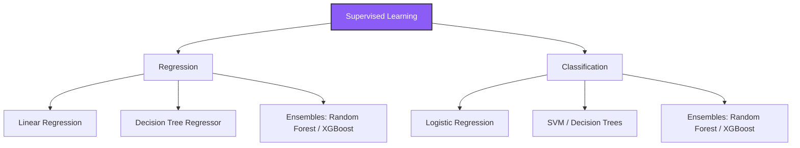

# ML Module 2: Supervised Learning (Practical ML Focus)

Supervised learning is the machine learning task of learning a function that maps an input to an output based on example input-output pairs. It is divided into two areas: **Regression** (predicting continuous outputs) and **Classification** (predicting discrete class labels).

---

## 1. Concept Explanation

Supervised learning relies on feeding labeled training examples to algorithms to minimize a loss function.



### A. Regression Algorithms
- **Linear Regression (OLS)**: Fits a linear equation to model the relationship between features and target. Highly explainable, assuming linear boundaries.
  $$\hat{y} = \beta_0 + \beta_1 x_1 + \beta_2 x_2 + \dots + \beta_n x_n$$
- **Decision Tree Regressor**: Splits the feature space into hierarchical rectangular regions, predicting the average value of training points in each leaf node. Handles non-linearities but is prone to high variance (overfitting).
- **Random Forest Regressor**: An ensemble bagging algorithm. Trains multiple decision trees in parallel on bootstrap samples of the data, averaging their outputs to reduce variance.
- **XGBoost (Extreme Gradient Boosting)**: A boosting algorithm. Trains trees sequentially. Each new tree is trained to predict the residual errors (gradients) of the previous trees combined, minimizing loss step-by-step.

### B. Classification Algorithms
- **Logistic Regression**: A linear model that maps raw output weights to probabilities using the sigmoid function, predicting binary classes.
  $$P(Y = 1 \mid X) = \frac{1}{1 + e^{-(\beta^T X)}}$$
- **Decision Tree Classifier**: Hierarchical splits based on impurity metrics (Gini Impurity or Entropy) to segment classes.
- **Random Forest Classifier**: Combines predictions from multiple decision trees using majority voting.
- **XGBoost Classifier**: Sequential tree boosting that minimizes classification loss (e.g. log loss).
- **Support Vector Machine (SVM)**: Finds the optimal hyperplane that maximizes the margin (distance) between different classes. Uses the "kernel trick" to map non-linear data into higher dimensions.

---

## 2. Why It Matters

1. **Algorithm Selection**: Different business problems require different algorithms. Linear models excel when explainability and speed are critical. Tree-based ensembles (Random Forest, XGBoost) excel at capturing complex, non-linear relationships without scaling requirements.
2. **Handling Non-linearity**: Many real-world systems are non-linear (e.g. conversion rates are not linear with advertising spend). Choosing trees or kernels is necessary to capture these curves.
3. **Overfitting Control**: Tree models will grow infinitely until they memorize the dataset. Understanding parameters like max depth, min samples leaf, and regularizations prevents models from failing on test sets.

---

## 3. Business Example

**Scenario**: A commercial bank wants to automate credit loan underwriting.
* **The Classification Problem**: Predict if an applicant will default on their loan ($Y=1$).
  * *Approach*: Train a **Logistic Regression** model. Because credit audits require explanation, the model's coefficients are mapped to credit weightings (e.g., "having a bankruptcy decreases score by $X$ points").
* **The Regression Problem**: Predict the maximum credit limit amount to offer approved applicants.
  * *Approach*: Train an **XGBoost Regressor** on historical incomes and spending patterns. Since limits are non-linear, XGBoost captures threshold boundaries (e.g., income over \$100k increases limit exponentially).

---

## 4. Dataset Example

Underwriting classification inputs:

| Applicant ID | Income ($) | Credit Score | Debt-to-Income | Default (Target) |
|---|---|---|---|---|
| A_801 | 85,000 | 720 | 0.22 | 0 |
| A_802 | 45,000 | 580 | 0.45 | 1 |
| A_803 | 120,000 | 690 | 0.15 | 0 |

---

## 5. Python Example

```python
import numpy as np
import pandas as pd
from sklearn.model_selection import train_test_split
from sklearn.ensemble import RandomForestClassifier
from sklearn.linear_model import LinearRegression
from sklearn.metrics import accuracy_score, r2_score

# 1. Classification: Predict Lead Conversion
np.random.seed(42)
n_leads = 200
call_duration = np.random.normal(5, 2, n_leads) # minutes
lead_age = np.random.randint(18, 70, n_leads)
converted = np.where(call_duration * 0.4 - 0.01 * lead_age + np.random.normal(0, 0.5, n_leads) > 0.5, 1, 0)

clf_df = pd.DataFrame({"call_duration": call_duration, "lead_age": lead_age, "converted": converted})
X_clf = clf_df[["call_duration", "lead_age"]]
y_clf = clf_df["converted"]

X_train, X_test, y_train, y_test = train_test_split(X_clf, y_clf, test_size=0.25, random_state=42)

clf = RandomForestClassifier(max_depth=3, random_state=42)
clf.fit(X_train, y_train)
y_pred_clf = clf.predict(X_test)
print(f"Classification Accuracy: {accuracy_score(y_test, y_pred_clf)*100:.2f}%")

# 2. Regression: Predict Home Prices
living_area = np.random.normal(2000, 500, 200)
price = 50000 + 150 * living_area + np.random.normal(0, 15000, 200)

reg_df = pd.DataFrame({"living_area": living_area, "price": price})
X_reg = reg_df[["living_area"]]
y_reg = reg_df["price"]

X_train_r, X_test_r, y_train_r, y_test_r = train_test_split(X_reg, y_reg, test_size=0.25, random_state=42)

reg = LinearRegression()
reg.fit(X_train_r, y_train_r)
y_pred_reg = reg.predict(X_test_r)
print(f"Regression R2 Score: {r2_score(y_test_r, y_pred_reg):.4f}")
```

---

## 6. Capstone Project Context: End-to-End Customer Churn Prediction

In **Capstone Project 1** (`capstones/capstone1_churn/`) and **Project 2** (`capstones/capstone2_house_prices/`), you will:
1. Ingest customer and house records.
2. Train multiple model architectures (Linear Models, Decision Trees, Random Forests, XGBoost).
3. Evaluate classification and regression matrices.
4. Export learning curves to diagnose model variance.

---

## 7. Interview Questions

1. **How does a Random Forest model differ from an XGBoost model in terms of training?**
   *Answer*: Random Forest is a **bagging** ensemble method; it trains many deep decision trees independently in parallel on bootstrap samples. The final prediction is a simple average (regression) or majority vote (classification). XGBoost is a **boosting** ensemble method; it trains shallow trees sequentially. Each tree is trained to predict the residual errors (gradients) of the cumulative ensemble, slowly refining boundaries.
2. **What is the Bias-Variance tradeoff? How do you diagnose it?**
   *Answer*: 
   - **Bias** is error introduced by simplifying assumptions (e.g. modeling non-linear curves with linear equations), causing **underfitting**.
   - **Variance** is error introduced by fitting the model too closely to training noise, causing **overfitting**.
   - *Diagnosis*: Chart training vs validation loss curves. If training loss is high and validation loss is high, the model has high bias (underfit). If training loss is very low but validation loss is high, the model has high variance (overfit).
3. **Why do we need SVM kernels? What is the kernel trick?**
   *Answer*: In many datasets, classes are not linearly separable in their raw feature space. The kernel trick maps the raw features into a higher-dimensional space where a linear boundary *can* separate the classes, doing so without computing the coordinates in that high-dimensional space, saving massive computational overhead.

---

## 8. Common Mistakes

- **Using XGBoost on tabular data without tuning depth**: Leaving max depth set to high levels. Gradient boosting trees should be shallow (depth 3-6) because they are designed to correct errors incrementally; deep trees overfit immediately.
- **Interpreting Logistic Regression coefficients without scaling features**: If "Income" is in dollars and "Age" is in years, their scales differ by 1,000x. The regression coefficients will scale inversely, making "Age" coefficients look artificially massive compared to "Income." You *must* scale features before comparing coefficient weights.
- **Ignoring class imbalance in classification**: Training a classifier on a dataset with 99% legitimate transactions and 1% fraud. A dummy model that predicts "Legitimate" for everyone gets 99% accuracy but fails the business.

---

## 9. Production Usage

In real deployments:
* **Batch Scoring**: Models are run nightly to score millions of rows in a database (e.g., updating churn scores). Random Forest or XGBoost models run quickly in batch setups.
* **Real-time API Scoring**: Inference queries are served via low-latency FastAPI endpoints. Linear Models or small XGBoost structures are preferred to keep response times under 50 milliseconds.

---

## 10. AI FDE Perspective

When presenting solutions to enterprise clients, don't default to the most complex algorithm (e.g., XGBoost or deep learning) right away. 

Always start by training a simple **baseline model** (like Logistic or Linear Regression). A baseline model acts as a benchmark. If XGBoost yields a 1% performance improvement over a linear model but takes 10x more computing resources and is a black box, the client's engineering team will prefer the linear model. Stand in the shoes of the client's operations and budget teams.
