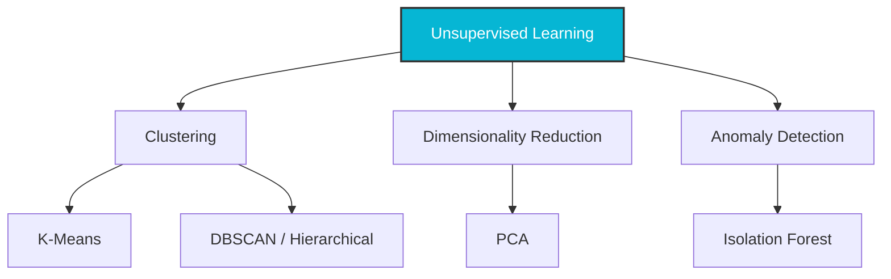

# ML Module 3: Unsupervised Learning (Practical ML Focus)

Unsupervised learning is the training of machine learning algorithms on datasets without pre-existing labels. The goal is to discover hidden patterns, groupings, or structures within the data.

---

## 1. Concept Explanation

Unsupervised learning is divided into three core categories: **Clustering** (grouping similar points), **Dimensionality Reduction** (compressing features), and **Anomaly Detection** (finding unusual points).



### A. Clustering
- **K-Means**: Iterative algorithm that partitions data into $K$ distinct clusters. Points are assigned to the nearest cluster centroid, and centroids are recalculated as the mean of assigned points.
  * *Metrics*: **Elbow Method** (Inertia) and **Silhouette Score** are used to find the optimal $K$.
- **Hierarchical Clustering**: Builds a tree-like hierarchy (dendrogram) by either merging small clusters (Agglomerative) or splitting large ones (Divisive).
- **DBSCAN (Density-Based Spatial Clustering of Applications with Noise)**: Groups points that are close to each other based on distance ($\epsilon$) and minimum points parameters. It does not require pre-specifying $K$ and can identify outliers as noise (-1).

### B. Dimensionality Reduction
- **PCA (Principal Component Analysis)**: Rotates features into orthogonal dimensions (Principal Components) ordered by the amount of variance they explain. Used for visualization, compression, and noise removal.

### C. Anomaly Detection
- **Isolation Forest**: An ensemble method designed for anomaly detection. It isolates anomalies by randomly partitioning features. Since anomalies require fewer splits to isolate (closer to the root of the tree), their average path length is shorter.

---

## 2. Why It Matters

1. **Cold-Start Clustering**: When launching new AI platforms, labeled datasets rarely exist. Unsupervised clustering allows FDEs to group text inputs or customer behaviors, creating early labels.
2. **Feature Compression**: High-dimensional features (e.g. 100 column vectors) can be compressed into 2 or 3 principal components using PCA for visualization on 2D plots.
3. **Unsupervised Security**: Cyberattacks or transaction frauds change patterns dynamically. Supervised models only recognize historical attack types; Isolation Forests flag new, unseen behavioral anomalies.

---

## 3. Business Example

**Scenario**: An e-commerce platform wants to design personalized landing pages.
* **The Clustering Problem**: They have customer data: purchase frequency, average basket size, days active, and return rate, but no pre-defined categories.
  * *Solution*: Standard scale the features and apply **K-Means Clustering** ($K=3$). The model groups users into:
    1. *Bargain Hunters*: High visit frequency, low basket size.
    2. *VIPS*: Low visit frequency, massive basket size.
    3. *High-risk Returners*: Moderate visit frequency, massive return rate.
  * *Action*: Target VIPs with early-access products and target returners with stricter return policies.

---

## 4. Dataset Example

Unsupervised user matrices (no target column):

| Customer ID | Visit Freq | Basket Size ($) | Return Rate | Cluster Label (Output) |
|---|---|---|---|---|
| C_401 | 42 | 35.00 | 0.05 | 0 (Bargain) |
| C_402 | 4 | 450.00 | 0.02 | 1 (VIP) |
| C_403 | 12 | 180.00 | 0.85 | 2 (Returner) |

---

## 5. Python Example

Using Scikit-Learn to perform customer clustering, PCA reduction, and anomaly detection:

```python
import numpy as np
import pandas as pd
from sklearn.cluster import KMeans
from sklearn.decomposition import PCA
from sklearn.ensemble import IsolationForest
from sklearn.preprocessing import StandardScaler

# 1. Create simulated customer profiles
np.random.seed(42)
n_users = 150
spend = np.concatenate([np.random.normal(50, 10, 100), np.random.normal(500, 50, 50)])
clicks = np.concatenate([np.random.normal(10, 2, 100), np.random.normal(40, 5, 50)])

df = pd.DataFrame({"spend": spend, "clicks": clicks})

# 2. Scale features
scaler = StandardScaler()
X_scaled = scaler.fit_transform(df)

# 3. K-Means Clustering (K=2)
kmeans = KMeans(n_clusters=2, random_state=42)
df["cluster"] = kmeans.fit_predict(X_scaled)
print(f"Cluster counts:\n{df['cluster'].value_counts()}\n")

# 4. PCA reduction to 1 dimension
pca = PCA(n_components=1)
df["pca_1"] = pca.fit_transform(X_scaled)
print(f"Explained Variance Ratio: {pca.explained_variance_ratio_[0]:.4f}\n")

# 5. Isolation Forest Anomaly Detection
# Set contamination rate to 5%
iso = IsolationForest(contamination=0.05, random_state=42)
# returns 1 for inliers, -1 for outliers
df["anomaly_status"] = iso.fit_predict(X_scaled)
print(f"Detected anomalies: {sum(df['anomaly_status'] == -1)}")
```

---

## 6. Capstone Project Context: Customer Segmentation Engine

In **Capstone Project 4** (`capstones/capstone4_segmentation/`), you will:
1. Ingest multi-variable transactional records.
2. Run the Elbow Method and Silhouette Analysis to identify the optimal cluster count.
3. Fit K-Means and visualize cluster separation in 2D space using PCA components.
4. Screen the cohort using Isolation Forest to identify anomalous users.

---

## 7. Interview Questions

1. **How does the K-Means algorithm work? What is its time complexity?**
   *Answer*: K-Means works by:
   1. Randomly initializing $K$ centroids.
   2. Assigning each data point to its closest centroid (based on Euclidean distance).
   3. Recalculating the centroids as the mean of all assigned points.
   4. Repeating steps 2 and 3 until centroids converge (no longer move).
   *Time Complexity*: $O(t \cdot k \cdot n \cdot d)$ where $t$ is iterations, $k$ is clusters, $n$ is points, and $d$ is dimensions.
2. **What are the key limitations of K-Means clustering?**
   *Answer*: K-Means requires pre-defining the number of clusters $K$. It assumes clusters are spherical and of similar size, performing poorly on non-spherical shapes (where DBSCAN is preferred). It is also highly sensitive to initial centroid placement (solved by K-Means++) and outlier points.
3. **Explain how PCA identifies the Principal Components.**
   *Answer*: PCA finds the directions of maximum variance in the data. The first principal component is the line along which the projection of the data has the largest variance. Each subsequent component is orthogonal to the previous components and captures the remaining variance. Mathematically, this is done by computing the eigenvectors and eigenvalues of the data's covariance matrix.

---

## 8. Common Mistakes

- **Running clustering without scaling features**: Since K-Means relies on Euclidean distance, features with larger ranges (e.g. income in thousands) will completely dominate features with smaller ranges (e.g. age), distorting the shapes of the clusters.
- **Using PCA as a black-box feature selector**: PCA components are linear combinations of *all* original features. If you drop components, you lose transparency because you can no longer say "Feature X drove this prediction."
- **Assuming Isolation Forest can run on tiny datasets**: Isolation Forest requires a representative baseline to establish "normal" path lengths. Running it on 20 rows will yield inaccurate anomalies.

---

## 9. Production Usage

In cloud microservices:
* **Real-time Anomaly Screening**: Transaction details are fed to an Isolation Forest model. If the anomaly score is low (indicating a short isolation path), the transaction is flagged and sent to a step-up verification API.
* **Customer Persona Tagging**: Run weekly K-Means batch jobs on consumer databases. The resulting cluster labels are pushed to the user's CRM profile, allowing sales reps to see if a customer is a "VIP" or "Bargain Hunter" during calls.

---

## 10. AI FDE Perspective

In client engagements, businesses will frequently ask you to group their customers using K-Means. 

Before starting, warn the client that clustering is an **unsupervised exploration**, not a predictive classification. Centroids will group mathematically, but it requires domain expertise to label those groups with business value (e.g. mapping Cluster 2 to "VIP users"). Involve their product managers early in the clustering phase to translate centroids into actual business personas.
