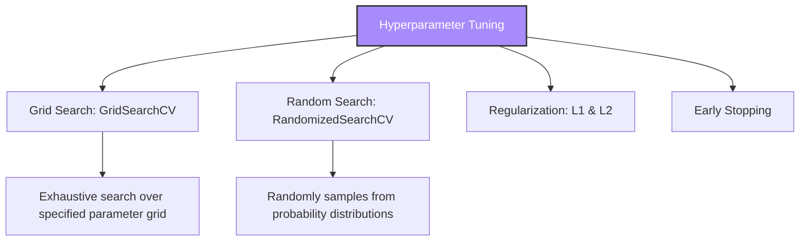

# ML Module 5: Hyperparameter Tuning (Practical ML Focus)

Hyperparameter tuning is the process of finding the optimal configuration of parameters that are set before training begins. While model *parameters* are learned during training, *hyperparameters* must be tuned to prevent underfitting or overfitting.

---

## 1. Concept Explanation



### A. Parameters vs. Hyperparameters
- **Parameters**: Learned directly from the training data (e.g. weights in a linear regression, split thresholds in a decision tree).
- **Hyperparameters**: Set by the engineer before training (e.g. learning rate, number of estimators in a random forest, regularization strength $C$).

### B. Search Strategies
- **GridSearchCV (Grid Search with Cross Validation)**: Exhaustively evaluates every combination of hyperparameters in a specified grid. Guaranteed to find the best combination within the grid, but computationally expensive.
- **RandomizedSearchCV (Random Search with Cross Validation)**: Randomly samples combinations from specified probability distributions for a fixed number of iterations ($n\_iter$). Far more efficient for high-dimensional parameter spaces.

### C. Regularization
Techniques used to prevent overfitting by adding a penalty term to the loss function, discouraging models from learning overly complex patterns.
- **L1 Regularization (Lasso)**: Adds a penalty proportional to the absolute values of the weights. Forces non-informative feature weights to absolute zero, acting as automatic feature selection.
- **L2 Regularization (Ridge)**: Adds a penalty proportional to the squared values of the weights. Shrinks weights close to zero but keeps them non-zero, distributing importance across features.

### D. Early Stopping
Used in iterative models (like gradient boosted trees or neural networks). Training is stopped when validation performance stops improving for a specified number of rounds, preventing overfitting and saving compute time.

---

## 2. Why It Matters

1. **Unlocking Model Potential**: Default hyperparameters in libraries like Scikit-Learn or XGBoost are generic. Tuning parameters like learning rate or tree depth can increase accuracy by 5% to 15%.
2. **Compute Budget Management**: Grid searching 5 parameters with 5 values each using 5-fold cross-validation requires training $5^5 \times 5 = 15,625$ models. Understanding when to use RandomizedSearch saves hours of compute cost.
3. **Preventing Generalization Failure**: Tuning regularization parameters (like `alpha`, `lambda` in XGBoost or `C` in Logistic Regression) forces models to learn simple patterns, ensuring stable performance in production.

---

## 3. Business Example

**Scenario**: A financial portal wants to deploy an XGBoost model to predict stock market transaction volumes.
* **The Problem**: Running the model with default parameters yields 92% training accuracy but only 68% validation accuracy (classic overfitting).
* **The Tuning Strategy**:
  1. Identify parameters controlling tree growth: `max_depth` (default 6) and `min_child_weight`.
  2. Identify parameters controlling regularization: `subsample` and `colsample_bytree`.
  3. Run a **RandomizedSearchCV** to scan combinations.
  4. The optimal model restricts `max_depth` to 3, sets `subsample` to 0.8, and adds L2 regularization.
* **Outcome**: Validation accuracy increases to 85% and training accuracy stabilizes at 88%, reducing model variance.

---

## 4. Dataset Example

Parameter Search Grid definition:

```python
param_grid = {
    'n_estimators': [50, 100, 200],
    'max_depth': [3, 5, 8],
    'min_samples_split': [2, 5, 10],
    'criterion': ['gini', 'entropy']
}
```
*Total combinations*: $3 \times 3 \times 3 \times 2 = 54$ combinations.

---

## 5. Python Example

Using Scikit-Learn to compare Grid Search and Random Search on a Random Forest Classifier:

```python
from sklearn.datasets import make_classification
from sklearn.model_selection import GridSearchCV, RandomizedSearchCV
from sklearn.ensemble import RandomForestClassifier
from scipy.stats import randint

# 1. Create simulated dataset
X, y = make_classification(n_samples=500, n_features=10, random_state=42)
clf = RandomForestClassifier(random_state=42)

# 2. Grid Search Setup (Exhaustive)
grid_params = {
    "n_estimators": [50, 100],
    "max_depth": [3, 5]
}
grid_search = GridSearchCV(clf, grid_params, cv=3, scoring="accuracy")
grid_search.fit(X, y)
print(f"Grid Search Best Params: {grid_search.best_params_}")
print(f"Grid Search Best Score: {grid_search.best_score_*100:.2f}%\n")

# 3. Random Search Setup (Distribution-based)
random_params = {
    "n_estimators": randint(50, 150),
    "max_depth": randint(3, 8)
}
random_search = RandomizedSearchCV(clf, random_params, n_iter=5, cv=3, scoring="accuracy", random_state=42)
random_search.fit(X, y)
print(f"Random Search Best Params: {random_search.best_params_}")
print(f"Random Search Best Score: {random_search.best_score_*100:.2f}%")
```

---

## 6. Capstone Project Context: ML Model Optimization Pipeline

In **Capstone Project 1** (`capstones/capstone1_churn/`) and **Project 3** (`capstones/capstone3_fraud/`), you will:
1. Initialize tuning pipelines for Random Forest and XGBoost.
2. Define search spaces for learning rates, regularization parameters, and estimators.
3. Compare the runtime and results of GridSearchCV and RandomizedSearchCV.
4. Extract the best estimator for production serialization.

---

## 7. Interview Questions

1. **What is the difference between Grid Search and Random Search? When is Random Search preferred?**
   *Answer*: Grid Search evaluates every single parameter combination in a defined grid. Random Search randomly samples combinations from distributions for a set number of iterations. Random Search is preferred when the parameter space is high-dimensional (e.g. tuning more than 3 parameters) because it samples widely, finding near-optimal combinations in a fraction of the time.
2. **Explain L1 (Lasso) vs. L2 (Ridge) regularization. How do they affect model weights?**
   *Answer*: L1 regularization adds a penalty equal to the sum of absolute weights ($L1 = \lambda \sum |w_i|$). It forces non-informative weights to absolute 0, making it useful for feature selection. L2 regularization adds a penalty equal to the sum of squared weights ($L2 = \lambda \sum w_i^2$). It shrinks weights close to 0 but keeps them non-zero, distributing importance across correlated features.
3. **What is Early Stopping, and how does it prevent overfitting?**
   *Answer*: Early stopping monitors validation set loss during iterative training (e.g. epochs in neural networks or trees in gradient boosting). If validation loss stops improving for a specified number of consecutive rounds (patience), training is terminated automatically, preventing the model from continuing to train and memorizing noise.

---

## 8. Common Mistakes

- **Tuning hyperparameters on the test set**: Evaluating parameter combinations on the test set. This leaks test set information into the hyperparameter selection process. You must use cross-validation on the training set or evaluate on a separate validation set.
- **Using an overly fine grid in Grid Search**: Setting a search grid like `n_estimators = [100, 101, 102, 103, 104]`. Differences this small rarely impact performance, but they waste massive amounts of compute time. Use log-scale intervals instead (e.g. `[10, 100, 1000]`).
- **Ignoring the runtime of cross-validation**: Forgetting that training a model with 5-fold cross-validation takes 5 times longer than training a single model. Always estimate search times before running high-dimensional grids.

---

## 9. Production Usage

In MLOps pipelines:
* **Automated Tuning (HPO)**: Frameworks like **Optuna** are used in production pipelines. Optuna uses Bayesian optimization (Tree-structured Parzen Estimator) to search hyperparameter spaces, adjusting its search direction based on previous trials to find optimal parameters efficiently.
* **Resource Constraints**: Production pipelines set hard timeout limits on training runs. If a hyperparameter search exceeds the timeout, the pipeline falls back to the best parameters found so far.

---

## 10. AI FDE Perspective

In enterprise engagements, clients will often expect you to run massive hyperparameter searches to squeeze out every drop of accuracy. 

As an FDE, balance performance gains against operational complexity. Explain to the client that a model that takes 2 days to tune and yields a 0.2% accuracy improvement over a model that trains in 5 minutes introduces operational risk. Propose a fast RandomizedSearch during initial training, keeping pipelines lightweight and maintainable.
