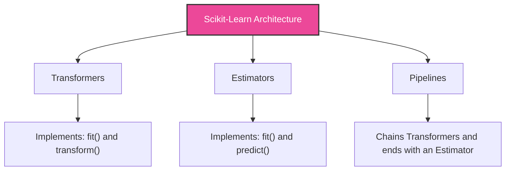

# ML Module 6: Scikit-Learn Pipelines (Practical ML Focus)

Scikit-Learn is the industry-standard library for classical machine learning. Writing production-grade machine learning code requires leveraging Scikit-Learn's core object-oriented architecture: **Estimators**, **Transformers**, and **Pipelines**.

---

## 1. Concept Explanation

Scikit-Learn divides operations into distinct, standardized interfaces.



### A. Core Interfaces
- **Estimators**: Any object that learns from data (e.g. models like `LogisticRegression` or `RandomForestClassifier`). 
  * *Method*: `fit(X, y)` trains the model parameters.
- **Transformers**: Estimators that transform datasets (e.g. `StandardScaler` or `OneHotEncoder`).
  * *Methods*: `fit(X)` calculates parameters (like mean and variance), and `transform(X)` applies the transformation. `fit_transform(X)` performs both in a single optimized step.
- **Predictors**: Estimators that predict targets.
  * *Methods*: `predict(X)` returns discrete class labels or values. `predict_proba(X)` returns class probabilities.

### B. ColumnTransformer
Used to apply specific preprocessing steps to different subsets of columns (e.g. scaling numerical columns while one-hot encoding categorical columns), returning a single combined feature matrix.

### C. Pipelines
A Scikit-Learn `Pipeline` chains multiple preprocessing transformers together, ending with a final estimator.
* **Benefits**:
  - Prevents data leakage by ensuring all transformations are fit *only* on the training folds during cross-validation.
  - Simplifies deployment by encapsulating the entire workflow into a single object.
  - Allows hyperparameter tuning of both preprocessing steps and model parameters simultaneously.

### D. Model Persistence (Joblib)
Saving trained models and preprocessing pipelines to disk so they can be loaded in production pipelines:
* **Saving**: `joblib.dump(pipeline, 'model.joblib')`
* **Loading**: `pipeline = joblib.load('model.joblib')`

---

## 2. Why It Matters

1. **Production-Ready Code**: Writing scripts with manual pandas cleaning steps scattered throughout makes it difficult to transition models to production. Packaging transformations into Scikit-Learn Pipelines yields clean, reproducible workflows.
2. **Preventing Data Leakage**: Chaining scalers and imputers in a pipeline guarantees they are recalculated correctly on training folds during cross-validation, ensuring accurate evaluation scores.
3. **Seamless Serving**: In production, the inference service loads a single `.joblib` file. It passes raw, uncleaned JSON requests directly to `pipeline.predict()`, which handles imputation, scaling, encoding, and inference automatically.

---

## 3. Business Example

**Scenario**: A fintech client wants to deploy a credit scoring API.
* **The Problem**: The engineering team complains that the data scientist's model code is a mess of manual pandas operations (e.g., filling NaNs with hardcoded values, custom mapping dictionaries), which is too risky to deploy.
* **The Solution**:
  1. Refactor the code to use a Scikit-Learn **Pipeline** containing a `ColumnTransformer` (for imputation and scaling) and a `LogisticRegression` classifier.
  2. Serialize the pipeline to a single `credit_pipeline.joblib` file.
  3. The engineering team deploys the pipeline in a FastAPI service. Incoming JSON payloads are converted to a pandas DataFrame and passed directly to `pipeline.predict_proba()`.
* **Outcome**: Development-to-production deployment time drops from weeks to minutes, with zero translation errors.

---

## 4. Dataset Example

Pipeline Column mapping layout:

```text
Incoming DataFrame 
  ├── Numerical Columns   --> SimpleImputer(median) --> StandardScaler()
  ├── Categorical Columns --> SimpleImputer(mode)   --> OneHotEncoder()
  └── Combine via ColumnTransformer --> Final Estimator (XGBoost)
```

---

## 5. Python Example

Using Scikit-Learn to build, train, evaluate, save, and load an end-to-end pipeline:

```python
import numpy as np
import pandas as pd
import joblib
from sklearn.model_selection import train_test_split
from sklearn.compose import ColumnTransformer
from sklearn.pipeline import Pipeline
from sklearn.impute import SimpleImputer
from sklearn.preprocessing import StandardScaler, OneHotEncoder
from sklearn.ensemble import RandomForestClassifier

# 1. Create simulated customer churn data
df = pd.DataFrame({
    "tenure_months": [12, 24, np.nan, 36, 6],
    "payment_method": ["Credit", "PayPal", "Credit", np.nan, "PayPal"],
    "churn": [0, 0, 1, 0, 1]
})

X = df[["tenure_months", "payment_method"]]
y = df["churn"]

# 2. Define sub-pipelines for numerical and categorical columns
num_pipeline = Pipeline([
    ("imputer", SimpleImputer(strategy="median")),
    ("scaler", StandardScaler())
])

cat_pipeline = Pipeline([
    ("imputer", SimpleImputer(strategy="most_frequent")),
    ("encoder", OneHotEncoder(handle_unknown="ignore", sparse_output=False))
])

# 3. Combine into a single ColumnTransformer
preprocessor = ColumnTransformer([
    ("num", num_pipeline, ["tenure_months"]),
    ("cat", cat_pipeline, ["payment_method"])
])

# 4. Create the final End-to-End Pipeline
full_pipeline = Pipeline([
    ("preprocessor", preprocessor),
    ("classifier", RandomForestClassifier(random_state=42))
])

# 5. Fit the entire pipeline (Imputes, Scales, Encoders, Trains)
full_pipeline.fit(X, y)

# 6. Model Persistence
joblib.dump(full_pipeline, "production_pipeline.joblib")
print("Successfully trained and saved pipeline binary to disk.\n")

# 7. Reload and predict on raw, dirty unseen transaction
loaded_pipeline = joblib.load("production_pipeline.joblib")
raw_request = pd.DataFrame({
    "tenure_months": [np.nan],  # Missing value
    "payment_method": ["PayPal"]
})

pred = loaded_pipeline.predict(raw_request)
prob = loaded_pipeline.predict_proba(raw_request)[0, 1]
print(f"Prediction for new request: {pred[0]} (Churn Probability: {prob*100:.2f}%)")
```

---

## 6. Capstone Project Context: End-to-End ML Pipeline

In **Capstone Project 5** (`capstones/capstone5_pipeline/`), you will build a production-ready model pipeline:
1. Define comprehensive data validation schemas.
2. Build custom transformers for feature creation.
3. Configure a multi-branch ColumnTransformer for numeric, ordinal, and nominal data.
4. Save the trained pipeline using Joblib.
5. Build a mockup API routing script that loads the model and runs inferences on raw inputs.

---

## 7. Interview Questions

1. **What is a Scikit-Learn Pipeline? What are its primary benefits?**
   *Answer*: A Pipeline chains multiple preprocessing transformers and ends with a final estimator. Its primary benefits are:
   - **Data Leakage Prevention**: It ensures transformers are fit only on the training folds during cross-validation.
   - **Code Cleanliness**: It packages all preprocessing and model steps into a single object.
   - **Ease of Deployment**: The production API can load the pipeline and call `.predict()` directly on raw inputs, eliminating the need to rewrite preprocessing steps in SQL or Scala.
2. **What is the difference between `fit()`, `transform()`, and `fit_transform()`?**
   *Answer*: 
   - `fit()` computes parameters (e.g. mean and variance for standard scaling) from a training dataset and saves them as internal state.
   - `transform()` applies those parameters to transform a dataset.
   - `fit_transform()` performs both steps sequentially in an optimized manner, and should only be used on the training set to learn parameters and transform the data in one step.
3. **What is a ColumnTransformer, and how does it differ from a Pipeline?**
   *Answer*: A Pipeline chains steps **sequentially** (e.g. first impute, then scale). A ColumnTransformer applies transformations **in parallel** to different columns of a dataset (e.g. applying standard scaling to numerical columns while applying one-hot encoding to categorical columns) and concatenates the resulting matrices. A ColumnTransformer is typically used as a step *inside* a Pipeline.

---

## 8. Common Mistakes

- **Calling `fit_transform()` on the validation/test set**: This is a classic form of data leakage, as it recalculates scaling parameters (like mean and variance) on the test set instead of using the parameters learned from the training set. Always call `transform()` on validation/test data.
- **Chaining estimators sequentially in a pipeline**: A pipeline can only contain transformers (which implement `fit` and `transform`) for all intermediate steps, ending with a single estimator. You cannot chain multiple models sequentially in a standard pipeline.
- **Forgetting to serialize custom transformer code**: If you write a custom transformer class, its definition code must be available in the environment where the model is loaded from disk, or Python will raise an `AttributeError` when unpickling the file.

---

## 9. Production Usage

In MLOps pipelines:
* **Model Registry**: Serialized pipelines (e.g. `.joblib` files) are versioned and stored in a central model registry (like **MLflow**). Each version is tagged with metadata (training duration, dataset used, evaluation metrics).
* **API Integration**: Serving frameworks (like Triton or FastAPI) load the serialized pipeline from the model registry, exposing it as a REST endpoint to serve real-time predictions.

---

## 10. AI FDE Perspective

In enterprise software deployments, you will work closely with the client's data engineering and DevOps teams. 

By packaging your entire solution into a Scikit-Learn Pipeline, you provide them with a single object to integrate, minimizing deployment complexity. This approach separates data science logic from engineering code, reducing friction between teams and ensuring a successful deployment.
