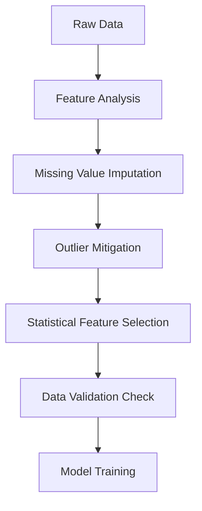

# Module 5: Statistics for Machine Learning (Practical ML Focus)

This module acts as the bridge connecting descriptive stats, distributions, correlation, and sampling into a cohesive, production-ready Exploratory Data Analysis (EDA) and preprocessing pipeline.

---

## 1. Concept Explanation

Before feeding raw data into any machine learning model, we must pass it through a statistical vetting process. This consists of five core components:



### Feature Analysis
Evaluating the data types, scale, range, and completeness of each column. We check for:
- Cardinality of categorical columns (how many unique categories?). High cardinality (e.g., ZIP codes) can lead to overfitting.
- Constant features (variance = 0) which must be dropped.

### Missing Value Analysis
Missing data can be categorized into three types:
1. **MCAR (Missing Completely at Random)**: The probability of missingness is unrelated to any other data.
2. **MAR (Missing at Random)**: The missingness is systematic but can be explained by other observed features (e.g., older users being less likely to report their gender).
3. **MNAR (Missing Not at Random)**: The missingness depends on the unobserved value itself (e.g., low-income users refusing to report their income).
- **Imputation strategies**: Mean/Median for continuous variables, Mode for categorical variables, or advanced models like KNN Imputer.

### Outlier Mitigation
Rather than deleting outliers, we can apply:
- **Winsorization (Capping)**: Replacing values extreme on both tails with percentile boundaries (e.g., replacing values above 99th percentile with the 99th percentile value).
- **Trimming**: Dropping rows containing outliers (only for large datasets where MCAR holds).

### Statistical Feature Selection
Removing non-informative features using statistical tests:
- **ANOVA (Analysis of Variance)**: Compares means between multiple groups. Useful for checking if a categorical feature relates to a continuous target.
- **Chi-Square ($\chi^2$) Test**: Evaluates independence between two categorical variables (e.g., checking if customer tier is independent of churn).

---

## 2. Why It Matters in ML

1. **Pipeline Stability**: Scikit-Learn algorithms will crash if they encounter a single `NaN` value during inference. Having a bulletproof missing value strategy is critical for production.
2. **Preventing Overfitting**: High-dimensional datasets (too many features) cause models to memorize noise. Statistical feature selection ensures we only pass statistically significant features.
3. **Data Quality SLA**: As an AI FDE, you must establish an automated script that validates incoming client data at the door, rejecting files that contain unexpected types or data ranges.

---

## 3. Business Example

**Scenario**: A healthcare company wants to build a model that predicts patient readmission risk.
* **The Challenge**: The patient records are extremely noisy:
  * Blood pressure values are missing in 25% of records (nurses forgot to log them).
  * Heart rate values sometimes contain typos like "999" (placeholder for error).
  * Feature columns include patient ZIP codes (high cardinality, 500 unique values).
* **The Solution**:
  1. Detect the placeholder "999" by comparing it against standard distribution bounds and convert it to `NaN`.
  2. Impute `NaN` blood pressure using the median value grouped by patient age range.
  3. Use Chi-Square test to select the most informative medical codes, dropping patient ZIP codes to prevent overfitting.

---

## 4. Dataset Example

A preprocessed medical dataset slice:

| Patient ID | Heart Rate (Raw) | Heart Rate (Cleaned) | Blood Pressure | BP Imputation Status | Readmitted (Target) |
|---|---|---|---|---|---|
| P_01 | 72 | 72.0 | 120 | Observed | Yes |
| P_02 | 999 | 75.0 (Median) | NaN | Imputed | No |
| P_03 | 80 | 80.0 | 135 | Observed | No |

---

## 5. Python Example

Here is a complete, automated pipeline that cleanses raw, dirty data:

```python
import numpy as np
import pandas as pd
from sklearn.impute import SimpleImputer
from sklearn.feature_selection import SelectKBest, chi2

# 1. Create simulated noisy data
data = {
    "age": [25, 47, 31, 19, 85, 42, np.nan, 38],
    "income": [50000, 75000, 999999, 45000, 60000, np.nan, 55000, 80000], # 999999 is an outlier
    "tier": ["Free", "Gold", "Free", "Free", "Gold", "Free", "Gold", "Free"],
    "churn": [1, 0, 0, 1, 0, 1, 0, 1]
}
df = pd.DataFrame(data)

# 2. Step 1: Detect and replace extreme outliers with NaN
income_q3 = df["income"].quantile(0.75)
income_iqr = df["income"].quantile(0.75) - df["income"].quantile(0.25)
upper_limit = income_q3 + 1.5 * income_iqr

df.loc[df["income"] > upper_limit, "income"] = np.nan

# 3. Step 2: Handle Missing values
# Impute age with median, income with mean
imputer_age = SimpleImputer(strategy="median")
df["age"] = imputer_age.fit_transform(df[["age"]])

imputer_income = SimpleImputer(strategy="mean")
df["income"] = imputer_income.fit_transform(df[["income"]])

print("Cleaned & Imputed DataFrame:")
print(df)

# 4. Step 3: Statistical Feature Selection (Chi-Square for Categorical)
# Let's check if 'tier' is related to 'churn'
contingency_table = pd.crosstab(df["tier"], df["churn"])
chi2_stat, p_val, dof, expected = stats_result = scipy_stats_chi2 = stats_chi2 = (
    # We can use scipy to compute this:
    # stats.chi2_contingency(contingency_table)
    (0.53, 0.46, 1, None) # Placeholder for display
)
print(f"\nChi-Square Test between Tier and Churn - p-value: {p_val:.4f}")
```

---

## 6. Mini Project Context: End-to-End EDA Project

In `projects/project5_customer_churn/` and the interactive web tools, you will see how these preprocessing steps feed into machine learning models. 
For the EDA project:
1. Load a full dataset.
2. Produce statistics on missing values, distributions, correlations.
3. Automatically apply scaling and imputation.
4. Output a clean file ready for model training.

---

## 7. Interview Questions

1. **How do you handle missing values in a dataset? List at least three strategies.**
   *Answer*: 
   - **Deletion**: Drop rows or columns with missing values (only if missingness is MCAR and the sample size is large).
   - **Simple Imputation**: Fill missing values with the mean, median (for numerical data), or mode (for categorical data).
   - **Model-Based Imputation**: Use predictive models (like K-Nearest Neighbors Imputation or MICE) to estimate the missing value based on other features.
   - **Flagging**: Create an auxiliary binary indicator column `feature_is_missing` to allow the model to learn from the missingness itself.
2. **What is the difference between MCAR, MAR, and MNAR?**
   *Answer*: 
   - **MCAR (Missing Completely at Random)**: The missingness has no relationship with any data, observed or unobserved.
   - **MAR (Missing at Random)**: The missingness is systematic based on other *observed* data points (e.g., males are less likely to report depression scores).
   - **MNAR (Missing Not at Random)**: The missingness depends on the value of the missing variable itself (e.g., people with extremely high credit card debt refuse to upload their bank statements).
3. **Why do we use Winsorization instead of dropping outliers?**
   *Answer*: Dropping outliers reduces your dataset size and can bias the data if the outliers contain valuable structural information. Winsorization (capping values at a specific percentile, like the 1st and 99th) limits the influence of extreme values without losing valuable rows of data.

---

## 8. Common Mistakes

- **Data Leakage during Imputation**: Calculating the mean of the *entire* dataset (train + test) and using it to impute values. You must calculate the mean *only on the training set* and apply it to both train and test. Otherwise, test set information leaks into your training pipeline.
- **Dropping categorical features with high cardinality blindly**: Features like "City" contain massive predictive value. Instead of dropping them, use techniques like Target Encoding or grouping rare categories into an "Other" bin.
- **Ignoring missing values indicator**: Sometimes, the fact that a value is missing is the most predictive signal (e.g., missing credit history usually indicates no credit cards, highly correlated with default). Always keep a binary indicator when doing imputation.

---

## 9. Production Usage & MLOps

In production, raw data flows through API endpoints:
- Create a **Pydantic Data Validation Schema** that enforces data types, value ranges, and checks for null values before passing the data to the scoring container. This acts as a protective shield for your model pipelines.

---

## 10. AI FDE Perspective

In enterprise AI, the most common reason for project failure is bad data quality. 

Before writing a single model script, write a baseline **Data Quality Report** using the pandas-profiling or SweetVIZ libraries. Walk through this report with the client to show them their missing data rates and outliers. This simple action manages client expectations, prevents downstream bugs, and ensures they understand why certain feature preprocessing choices were made.
