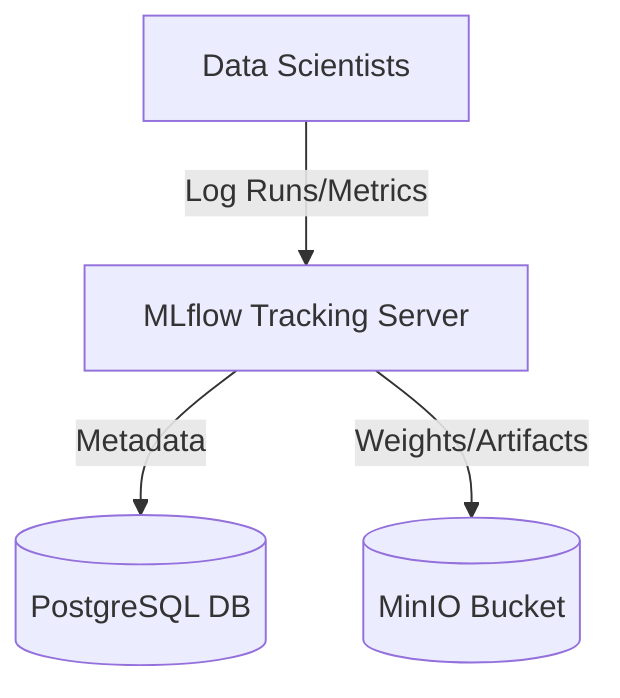
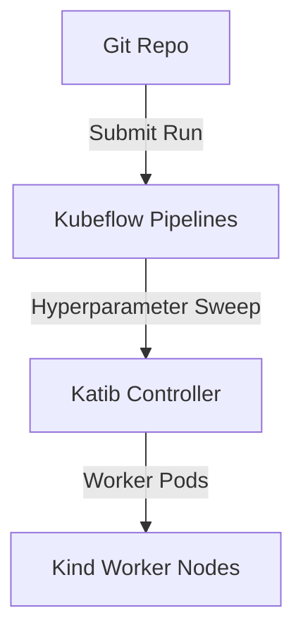
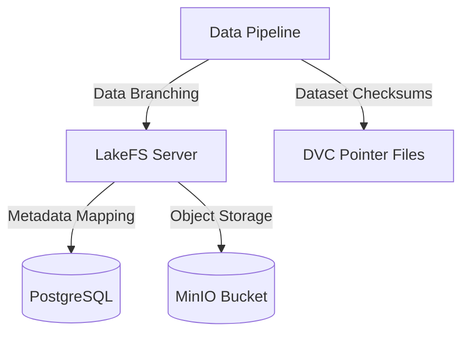
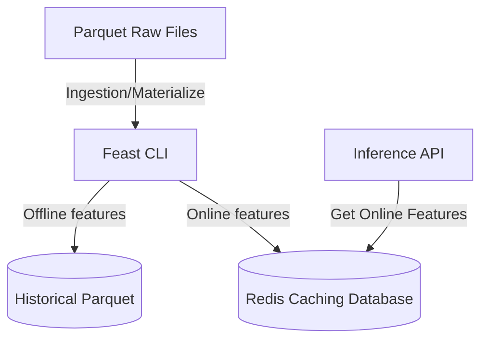
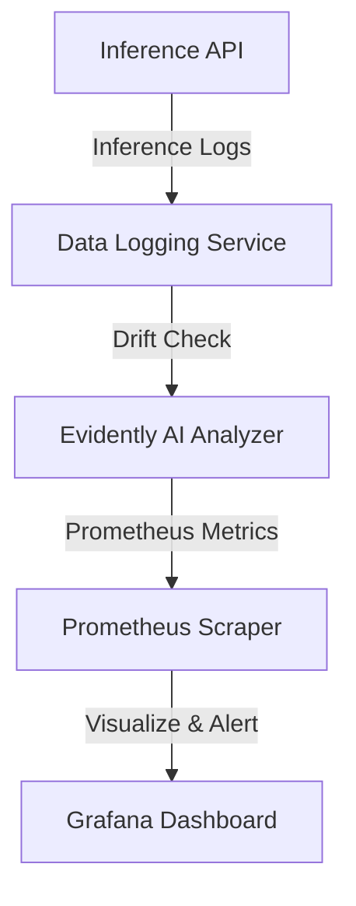
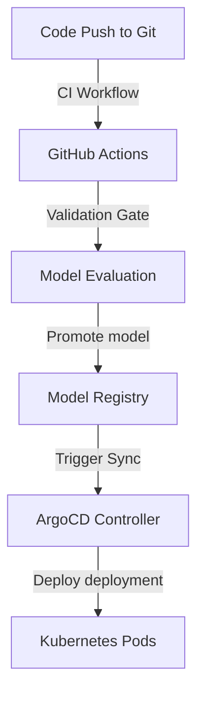
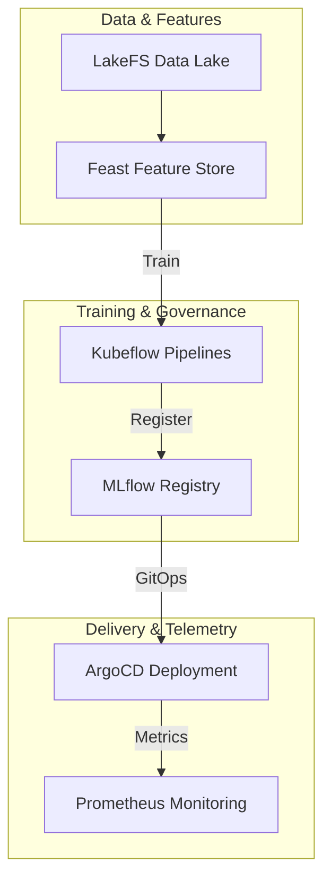

# Module 12: Enterprise Capstone Projects

This module outlines the architectures, requirements, and deployment steps for the seven enterprise capstone projects.

---

## Project 1: Enterprise Experiment Tracking Platform

### Overview
Build a production-ready, multi-tenant experiment tracking and model registry platform using MLflow backed by PostgreSQL and MinIO.

### Technology Stack
*   **Tracking Engine**: MLflow
*   **Database**: PostgreSQL
*   **Artifact Storage**: MinIO (S3-compatible)

### Architecture Diagram

### Key Deliverables
1.  **Deployment Scripts**: Bash scripts installing and configuring PostgreSQL and MinIO on Ubuntu.
2.  **Tracking Server Configuration**: Systemd service unit defining the MLflow server startup script with connection pooling.
3.  **Python Client Code**: Example training script logging parameters and model metrics.

---

## Project 2: Enterprise ML Training Platform

### Overview
Build an automated machine learning training and hyperparameter tuning platform using Kubeflow and Katib on a Kubernetes cluster.

### Technology Stack
*   **Orchestration**: Kubeflow Pipelines (KFP)
*   **AutoML**: Katib
*   **Kubernetes Cluster**: Kind / local cluster

### Architecture Diagram

### Key Deliverables
1.  **Compiled Pipeline**: A Python script using KFP SDK compiling training steps into an Argo Workflows YAML.
2.  **Katib Experiment Manifest**: YAML configuration file defining tuning metrics, parameter ranges, and trial controllers.
3.  **Troubleshooting Playbook**: Documentation for diagnosing pending pods and metrics extraction issues.

---

## Project 3: Enterprise Data Governance Platform

### Overview
Deploy a versioned data lake infrastructure using LakeFS and DVC to track dataset lineage and commit history.

### Technology Stack
*   **Data Lake Versioning**: LakeFS
*   **Dataset Tracking**: DVC
*   **Storage Backend**: AWS S3 / MinIO

### Architecture Diagram

### Key Deliverables
1.  **LakeFS Repository**: Set up a local repository with branching, merging, and revert configurations.
2.  **DVC Pipeline**: Git repository containing `.dvc` files and a `dvc.yaml` pipeline definition.
3.  **Pre-Merge Hook**: Script running schema validation checks before merging data branches.

---

## Project 4: Feature Store Platform

### Overview
Build a high-performance, real-time feature store using Feast with Redis as the online store.

### Technology Stack
*   **Feature Store Framework**: Feast
*   **Offline Store**: Parquet / file-based storage
*   **Online Store**: Redis

### Architecture Diagram

### Key Deliverables
1.  **Feature Repository Configuration**: Schema definition files declaring entities, feature views, and S3/Redis connection details.
2.  **Ingestion pipeline**: Cron scheduler script executing materialization incrementally.
3.  **Real-Time API Client**: Python script retrieving features from Redis with sub-millisecond latency.

---

## Project 5: Enterprise Model Monitoring Platform

### Overview
Build a model monitoring and drift detection system using Evidently AI, Prometheus, and Grafana.

### Technology Stack
*   **Drift Engine**: Evidently AI
*   **Time-Series Storage**: Prometheus
*   **Dashboards & Alerts**: Grafana

### Architecture Diagram

### Key Deliverables
1.  **Drift Detection Script**: Python script computing KS-test p-values on live payloads.
2.  **Prometheus Integration**: Exporter script exposing drift metrics at `/metrics`.
3.  **Grafana Dashboard Configuration**: JSON template displaying data drift status and alerting thresholds.

---

## Project 6: Enterprise ML CI/CD Platform

### Overview
Implement an end-to-end ML CI/CD pipeline using GitHub Actions, Jenkins, and ArgoCD.

### Technology Stack
*   **Automation**: GitHub Actions / Jenkins
*   **Delivery**: ArgoCD
*   **Kubernetes Cluster**: Kind / EKS

### Architecture Diagram

### Key Deliverables
1.  **CI Pipeline Manifest**: YAML file running tests, building Docker images, and executing validation gates.
2.  **GitOps Sync Config**: ArgoCD Application manifest tracking image tag changes.
3.  **Rollback Automation**: Script executing rollbacks if prediction checks fail.

---

## Project 7: End-to-End Enterprise MLOps Platform

### Overview
Integrate all subsystems into a unified, enterprise-grade MLOps platform managing the lifecycle of model development, validation, deployment, and monitoring.

### Technology Stack
*   **Data Lake**: LakeFS
*   **Feature Store**: Feast
*   **Orchestration**: Kubeflow
*   **Registry**: MLflow
*   **CD Delivery**: ArgoCD
*   **Monitoring**: Prometheus & Grafana

### Architecture Diagram

### Key Deliverables
1.  **Unified Infrastructure Code**: Terraform manifests provisioning VPCs, database instances, and EKS clusters.
2.  **End-to-End Workflow Pipeline**: A python script orchestrating data retrieval, feature sync, training, model registration, deployment updates, and monitoring configuration.
3.  **Platform Verification Suite**: Script validating connection status across all integrated tools.
