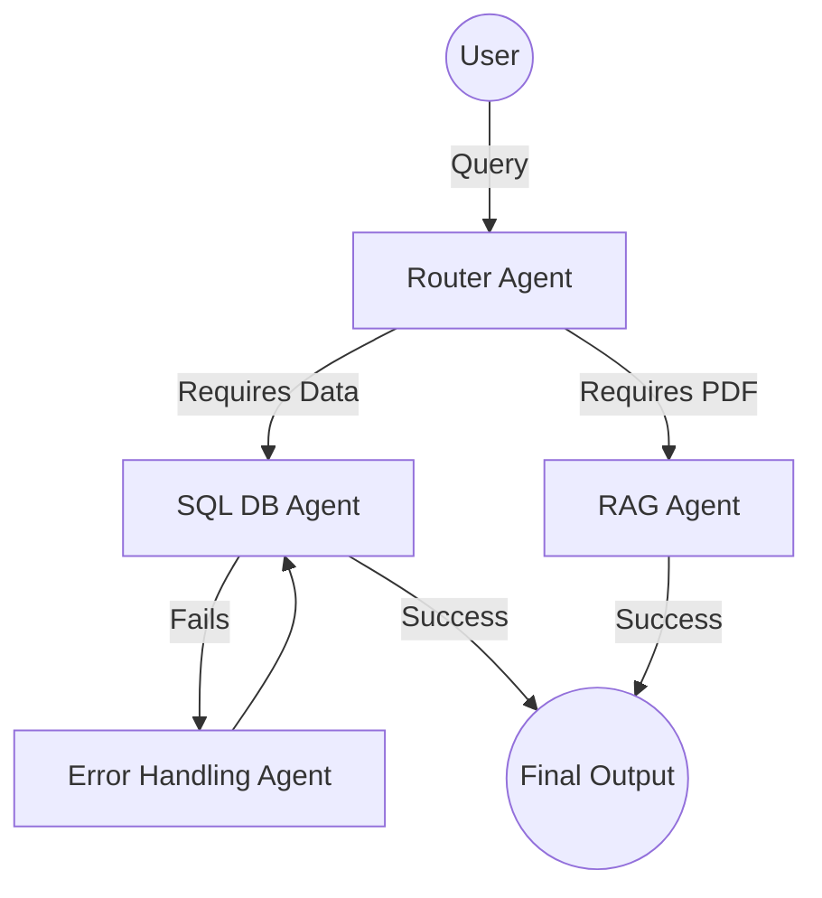

# Module 2.1: Core Data Structures

Welcome to the **Data Structures & Algorithms (DSA)** module. The difference between an AI tool that processes 10 documents a second and one that processes 10,000 documents a second is not the LLM—it is the underlying data structures. Before you can optimize, you must understand the primitives.

---

## 1. Detailed Theory

### Linear Data Structures
- **Arrays & Strings**: Contiguous blocks of memory. Accessing an element by index is O(1). However, inserting an element at the beginning requires shifting all other elements (O(N)). In Python, `list` is a dynamic array.
- **Linked Lists**: Elements (nodes) are scattered in memory, connected by pointers. Inserting a node is O(1) (if you have the reference), but finding a node is O(N) because you must traverse from the start.
- **Stacks**: Last-In, First-Out (LIFO). Think of a stack of plates. Push and Pop are O(1). Perfect for "Undo" functionality or tracking execution states.
- **Queues**: First-In, First-Out (FIFO). Think of a line at a store. Enqueue and Dequeue are O(1). Essential for task processing (like Celery workers).

### Non-Linear Data Structures
- **Hash Tables (Dictionaries)**: Key-Value pairs. A hash function converts the key into a memory address. Average lookup, insert, and delete are O(1). The most important data structure in Python.
- **Trees**: Hierarchical data. A root node branches down to child nodes. 
  - *Binary Search Trees (BST)*: Left child is smaller, right child is larger. Search is O(log N).
  - *Tries*: Prefix trees used for autocomplete.
- **Heaps**: A specialized tree where the parent is always smaller (Min-Heap) or larger (Max-Heap) than its children. Used for Priority Queues (O(log N) insert/extract).
- **Graphs**: Nodes (vertices) connected by edges. Can be directed or undirected, weighted or unweighted.

---

## 2. Architecture Diagram: Agent Network as a Graph


*In LangGraph, this is represented as a Directed Cyclic Graph (DCG).*

---

## 3. Production Use Cases

1. **Hash Tables for Caching**: Storing LLM responses in a Python `dict` or Redis instance. The key is the hashed prompt; the value is the response. Lookups are O(1), saving dollars and seconds.
2. **Queues for Message Brokers**: When thousands of users upload documents to your RAG system, an API endpoint pushes the file paths to a RabbitMQ Queue. Worker nodes pop items off the queue (FIFO) and process them without overwhelming the system.
3. **Graphs for Multi-Agent Workflows**: LangChain's LangGraph uses directed graphs to manage state. Each agent is a Node, and conditional routing logic forms the Edges.

---

## 4. Real Company Examples

- **Pinecone (Vector DB)**: Uses highly specialized Graph data structures (HNSW - Hierarchical Navigable Small World) to perform approximate nearest neighbor searches across billions of vectors in milliseconds.
- **Google Search**: Crawls the internet using Graph algorithms, storing the index in massive Hash Tables and Tries for instant search autocomplete.

---

## 5. Coding Examples

### The Queue (FIFO) using `collections.deque`
```python
from collections import deque

# Python lists are O(N) for popping from the front. Deque is O(1).
task_queue = deque()

# Enqueue (Add to right)
task_queue.append("Task 1: Embed Document A")
task_queue.append("Task 2: Embed Document B")

# Dequeue (Remove from left)
print("Processing:", task_queue.popleft()) # Processes Task 1
print("Remaining tasks:", len(task_queue))
```

### The Hash Table (O(1) Lookups)
```python
# A simple memory cache for an agent
agent_memory = {}

def get_answer(query: str):
    # O(1) lookup
    if query in agent_memory:
        return f"[CACHED] {agent_memory[query]}"
        
    # Simulate LLM call
    answer = f"Generated answer for: {query}"
    
    # O(1) insert
    agent_memory[query] = answer
    return answer

print(get_answer("What is Python?")) # Generated
print(get_answer("What is Python?")) # Cached!
```

---

## 6. Hands-on Labs

**Lab: Priority Queue (Heap)**
**Objective**: Build a triage system for enterprise support tickets.
**Instructions**:
1. Import `heapq`.
2. Initialize an empty list `triage = []`.
3. Push 3 tickets into the heap using `heapq.heappush(triage, (priority_level, "ticket_data"))`. Use priority `3` (Standard), `1` (System Down), and `2` (VIP User).
4. Use `heapq.heappop(triage)` three times. Notice how the "System Down" ticket is popped first, despite being added second!

---

## 7. Assignments

**Assignment: The Graph Builder**
Create an Adjacency List representation of a multi-agent system.
1. Create a dictionary where the keys are Agent names (Strings), and the values are Lists of Strings (representing the agents they can route to).
2. Triage can route to `Billing` and `TechSupport`.
3. `Billing` routes to `End`.
4. `TechSupport` routes to `Escalation` and `End`.
5. `Escalation` routes to `Human`.
6. Write a function `can_reach(start_agent, target_agent)` that returns True if there is a direct edge between them.

---

## 8. Interview Questions

1. **Why is a Python `list` bad for implementing a Queue?**
   *Answer Hint: A Python list is a dynamic array. `list.pop(0)` removes the first element, requiring every other element in the array to be shifted one memory address to the left. This takes O(N) time. You should use `collections.deque` which has O(1) pops from both ends.*
2. **What is a Hash Collision and how is it resolved?**
   *Answer Hint: When the hash function assigns two different keys to the same memory index. Resolved via chaining (storing a Linked List at that index) or open addressing (probing for the next available empty slot).*
3. **When would you use a Linked List over an Array?**
   *Answer Hint: When you need constant time O(1) insertions or deletions *in the middle* of the collection (provided you already have a pointer to the node), and you don't care about random access (which is O(N) in a linked list).*

---

## 9. Best Practices (FDE Standards)

- **Use Sets for Membership Testing**: If you need to check if a specific `document_id` exists in a collection of a million IDs, NEVER do `if doc_id in my_list:`. This is an O(N) linear search. Always convert the list to a set first `my_set = set(my_list)`, then `if doc_id in my_set:` takes O(1) constant time.
- **Understand built-in limitations**: Python's recursion limit is small (1000). Tree and Graph traversals in production Python often use iterative approaches (with a Stack or Queue) rather than deep recursion to avoid `RecursionError` crashes.
