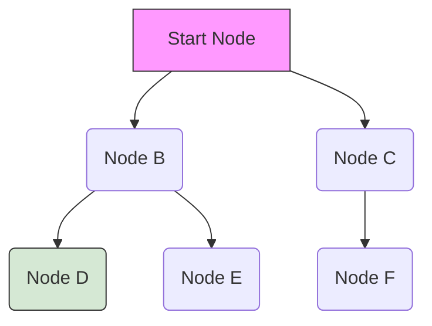

# Module 2.2: Algorithms

Welcome to **Module 2.2**. Algorithms are step-by-step procedures for solving problems. While you won't often write a QuickSort from scratch in production, understanding algorithmic paradigms (Greedy, Dynamic Programming, Graph Traversals) is essential for writing efficient routing logic and understanding how AI models traverse data.

---

## 1. Detailed Theory

### Sorting and Searching
- **Sorting**: Python's built-in `sort()` uses Timsort (O(N log N)). You rarely write custom sorts, but you will often write custom sorting *keys* (e.g., sorting LLM results by confidence score).
- **Binary Search**: Searching a *sorted* array by repeatedly dividing the search interval in half. Drops search time from O(N) to O(log N).

### Recursion & Backtracking
- **Recursion**: A function calling itself with a smaller input until it hits a base case.
- **Backtracking**: Used to explore all possible solutions. If a path fails, it "backtracks" to the previous step (e.g., solving a Sudoku puzzle, or an Agent testing different API parameters until one works).

### Dynamic Programming (DP)
Solving complex problems by breaking them down into overlapping subproblems, and caching (memoizing) the results of those subproblems so they are only calculated once.

### Greedy Algorithms
Making the locally optimal choice at each step with the hope of finding a global optimum. (e.g., Huffman coding, or picking the highest-confidence chunk for RAG).

### Graph Algorithms
- **Breadth-First Search (BFS)**: Explores level by level using a Queue. Finds the shortest path in an unweighted graph.
- **Depth-First Search (DFS)**: Explores as far down a branch as possible before backtracking using a Stack (or recursion).
- **Dijkstra's Algorithm**: Finds the shortest path in a weighted graph.

---

## 2. Architecture Diagram: Graph Traversal


*In BFS, order is A -> B -> C -> D -> E -> F.*
*In DFS, order is A -> B -> D -> E -> C -> F.*

---

## 3. Production Use Cases

1. **Graph Traversals (BFS) in Multi-Agent Systems**: An orchestration agent needs to figure out the shortest path of tool calls to reach a solution. Treating tools as nodes and outputs as edges, BFS can find the most efficient chain of thought.
2. **Dynamic Programming for Text Alignment**: Calculating the Levenshtein Distance (Edit Distance) between an LLM's output and an expected ground truth string in automated evaluation pipelines.
3. **Binary Search for Log Parsing**: You have a 100GB log file where lines are sorted by timestamp. You use Binary Search to find the exact log line where an error occurred at 12:01 PM in O(log N) time, rather than scanning from the top.

---

## 4. Real Company Examples

- **Google Maps / Uber**: Utilize complex variants of Dijkstra's algorithm and A* search (Graph Algorithms) to route drivers in real-time.
- **Anthropic**: When evaluating model outputs against thousands of safety policies, DP algorithms are used for fast substring matching and token alignment checks.

---

## 5. Coding Examples

### Binary Search (O(log N))
```python
def binary_search(arr, target):
    left, right = 0, len(arr) - 1
    
    while left <= right:
        mid = (left + right) // 2
        
        if arr[mid] == target:
            return mid # Found
        elif arr[mid] < target:
            left = mid + 1 # Search right half
        else:
            right = mid - 1 # Search left half
            
    return -1 # Not found

# Array MUST be sorted
timestamps = [100, 205, 310, 450, 500, 620]
print("Index:", binary_search(timestamps, 450)) # Output: 3
```

### Graph Traversal (BFS)
```python
from collections import deque

def agent_routing_bfs(graph, start_node, target_node):
    queue = deque([start_node])
    visited = set([start_node])
    
    while queue:
        current_agent = queue.popleft()
        print(f"Checking agent: {current_agent}")
        
        if current_agent == target_node:
            return True
            
        for neighbor in graph.get(current_agent, []):
            if neighbor not in visited:
                visited.add(neighbor)
                queue.append(neighbor)
                
    return False

# Adjacency List
agent_network = {
    "Triage": ["Billing", "TechSupport"],
    "Billing": ["End"],
    "TechSupport": ["Network", "Hardware"],
    "Network": ["End"],
    "Hardware": ["HumanEscalation"]
}

print("Can reach HumanEscalation?", agent_routing_bfs(agent_network, "Triage", "HumanEscalation"))
```

---

## 6. Hands-on Labs

**Lab: Custom Sorting**
**Objective**: Sort a complex data structure using Python's `sort(key=...)`.
**Instructions**:
1. You have a list of dictionaries representing chunk retrievals:
   `chunks = [{"text": "A", "score": 0.4}, {"text": "B", "score": 0.9}, {"text": "C", "score": 0.7}]`
2. Use the `.sort()` method on the list.
3. Provide a `lambda` function to the `key` argument that tells Python to sort based on the `score` dictionary key.
4. Add `reverse=True` to sort from highest to lowest.
5. Print the sorted list.

---

## 7. Assignments

**Assignment: The Recursive Retry**
Write a recursive function `call_llm_with_retry(prompt, retries_left)`.
1. Inside the function, print "Attempting call...".
2. Use `random.random()` to simulate success (e.g., `if random.random() > 0.7: return "Success!"`).
3. If it fails, check if `retries_left == 0`. If so, `return "Failed permanently."` (Base Case).
4. If it fails and retries remain, print "Failed, retrying..." and return the result of calling the function again with `retries_left - 1`.

---

## 8. Interview Questions

1. **Explain the difference between Dynamic Programming and Divide & Conquer.**
   *Answer Hint: Both break problems into subproblems. Divide and Conquer (like Merge Sort) breaks problems into DISJOINT (independent) subproblems. Dynamic Programming breaks problems into OVERLAPPING subproblems, and memorizes the answers so they aren't computed twice.*
2. **Why is BFS implemented with a Queue and DFS with a Stack?**
   *Answer Hint: A Queue is FIFO. BFS explores all neighbors of a node first (level by level), so it adds them to the back of the line and processes the front. A Stack is LIFO. DFS dives deep down a single path, adding nodes to the top of the stack and immediately processing them until it hits a dead end, then pops back up.*
3. **What is a Greedy Algorithm and when does it fail?**
   *Answer Hint: It makes the optimal choice at the current step. It fails when the globally optimal solution requires making a sub-optimal choice in the short term (e.g., the standard Coin Change problem with non-standard coin denominations).*

---

## 9. Best Practices (FDE Standards)

- **Don't reinvent the wheel**: Never write your own sorting algorithm in production. Python's Timsort is implemented in C and heavily optimized. Your custom Python Quicksort will be significantly slower.
- **Memoization**: If you have a deterministic function (same input = same output) that takes heavy compute, use Python's built-in `@functools.lru_cache`. This is a one-line way to implement Dynamic Programming memoization.

---

## 10. Common Mistakes

- **Missing the Base Case in Recursion**: If you forget to tell the recursive function when to stop, it will call itself infinitely until the Python interpreter crashes with a `RecursionError`.
- **Modifying a list while iterating**: A classic algorithmic bug.
  ```python
  for item in my_list:
      if item == "bad":
          my_list.remove(item) # Causes elements to be skipped!
  ```
  *Fix: Iterate over a copy (`for item in my_list[:]:`) or use a list comprehension.*
