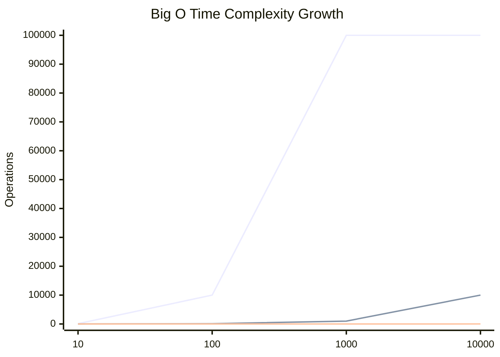

# Module 2.3: Complexity Analysis (Big O)

Welcome to **Module 2.3**. In AI engineering, datasets are huge. A script that takes 1 second to process 1,000 documents might take 3 years to process 10,000,000 documents if the time complexity is O(N²). Understanding Big O notation is non-negotiable for an FDE.

---

## 1. Detailed Theory

### What is Big O Notation?
Big O describes the *worst-case* mathematical bound of an algorithm's performance as the input size ($N$) approaches infinity. It strips away constants and hardware specifics (we don't care if a CPU is 3GHz or 5GHz, we care how the algorithm scales).

### Time Complexity (Speed)
How does the runtime increase as the input size increases?
- **O(1) [Constant]**: Takes the same time regardless of input (e.g., Dictionary lookup).
- **O(log N) [Logarithmic]**: Halving the search space every step (e.g., Binary Search). Extremely fast even for billions of records.
- **O(N) [Linear]**: Time scales directly with input size (e.g., looping through an array once).
- **O(N log N) [Linearithmic]**: The fastest possible time for comparison-based sorting (e.g., Merge Sort, Timsort).
- **O(N²) [Quadratic]**: Time squares as input doubles (e.g., a nested `for` loop). This is the "Danger Zone" for large datasets.

### Space Complexity (Memory)
How does the memory (RAM) usage increase as the input size increases?
- If you process a 10GB file line-by-line using a generator, your Space Complexity is **O(1)**.
- If you use `.readlines()` to load the entire 10GB file into a Python list, your Space Complexity is **O(N)** (and your server will crash).

---

## 2. Architecture Diagram: Big O Growth Curves


*(Visualizing why O(N²) becomes unusable rapidly).*

---

## 3. Production Use Cases

1. **Vector Search (O(N) vs O(log N))**: An exact K-Nearest Neighbors (KNN) search calculates the distance between your prompt and *every single document* in the database (O(N)). With 10 million vectors, this takes minutes. Approximate Nearest Neighbors (ANN) using HNSW graphs does this in O(log N) time, taking milliseconds.
2. **Deduplication (O(N²) vs O(N))**: You have two lists of 100,000 emails and need to find the overlaps. Doing a nested loop (checking every email in list A against every email in list B) is 10,000,000,000 operations (O(N²)). Converting list B to a Set and doing a single loop is 100,000 operations (O(N)).
3. **Memory Profiling**: Ensuring that a web scraper fetching massive AI training datasets operates in O(1) space complexity by streaming the data directly to disk, rather than keeping it all in variables.

---

## 4. Real Company Examples

- **Pinecone**: Their entire value proposition to enterprise clients is providing O(log N) vector search at a massive scale, abstracting away the complex math required to avoid O(N) linear scans.
- **Any FAANG Interview**: 90% of Big Tech interviews involve writing a working solution (which is usually O(N²)) and then the interviewer asking "Can you optimize this?" (aiming for O(N) or O(log N) using Hash Maps or Two Pointers).

---

## 5. Coding Examples

### O(N²) vs O(N) in Action

**The Problem**: Find if there are two numbers in an array that add up to a target sum (Two Sum).

**Bad Solution (O(N²) Time, O(1) Space)**
```python
def two_sum_slow(arr, target):
    n = len(arr)
    for i in range(n):
        for j in range(i + 1, n): # Nested loop!
            if arr[i] + arr[j] == target:
                return True
    return False
```

**Good Solution (O(N) Time, O(N) Space)**
```python
def two_sum_fast(arr, target):
    seen = set() # We trade Space (O(N)) for Speed!
    
    for num in arr: # Single loop (O(N))
        complement = target - num
        if complement in seen: # Set lookup is O(1)
            return True
        seen.add(num)
        
    return False
```

---

## 6. Hands-on Labs

**Lab: Time the Difference**
**Objective**: Prove Big O in Python.
**Instructions**:
1. Import the `time` module.
2. Create a massive list: `data = list(range(10_000_000))`.
3. Time how long it takes to find `-1` in the list: `start = time.time(); -1 in data; print(time.time() - start)`. (This is O(N) linear search).
4. Create a set: `data_set = set(data)`.
5. Time how long it takes to find `-1` in the set: `start = time.time(); -1 in data_set; print(time.time() - start)`. (This is O(1) constant search).
6. Compare the results.

---

## 7. Assignments

**Assignment: Analyze This Code**
What is the Time and Space complexity of the following function? (Think about it, write it down, then read the answer below).
```python
def find_duplicates(arr):
    duplicates = []
    for i in range(len(arr)):
        if arr.count(arr[i]) > 1 and arr[i] not in duplicates:
            duplicates.append(arr[i])
    return duplicates
```
*Answer: Time Complexity is O(N²). The `for` loop runs N times. Inside the loop, `arr.count()` iterates over the entire array again (N times), and `in duplicates` searches a list (N times). N * (N + N) simplifies to O(N²). Space complexity is O(N) to store the duplicates list.*

---

## 8. Interview Questions

1. **We drop constants in Big O (e.g., O(2N) becomes O(N)). Why?**
   *Answer Hint: Big O describes the asymptotic growth rate as N approaches infinity. A constant multiplier (like running a loop twice instead of once) doesn't change the shape of the growth curve on a graph; it scales linearly.*
2. **What is the time complexity of adding an element to the end of a Python List?**
   *Answer Hint: Amortized O(1). Python lists allocate extra space under the hood. Most appends are instant. Occasionally, the array fills up and Python must create a new, larger array and copy all elements over (which takes O(N)), but because this happens rarely, the "average" or "amortized" time is O(1).*
3. **If you have a nested loop, is it always O(N²)?**
   *Answer Hint: No. If the outer loop runs N times, but the inner loop only runs a fixed constant number of times (e.g., 5 times), the complexity is O(5N), which simplifies to O(N).*

---

## 9. Best Practices (FDE Standards)

- **Trade Space for Time**: In modern cloud computing, RAM is incredibly cheap. Compute time (and making the user wait) is expensive. If you can drop an algorithm from O(N²) to O(N) by utilizing a Hash Map (which takes O(N) space), you almost always make that trade.
- **Profile before Optimizing**: Don't spend 3 days rewriting a script to be O(N) if the input size `N` will never exceed 100 items. O(N²) on 100 items executes in a fraction of a millisecond. Optimize where it matters.

---

## 10. Common Mistakes

- **Hidden O(N) Operations**: Using `if item in my_list:` inside a `for` loop. Developers often think this is O(N) because they only see one `for` loop. But the `in` keyword on a list is an implicit loop written in C. The true complexity is O(N²).
