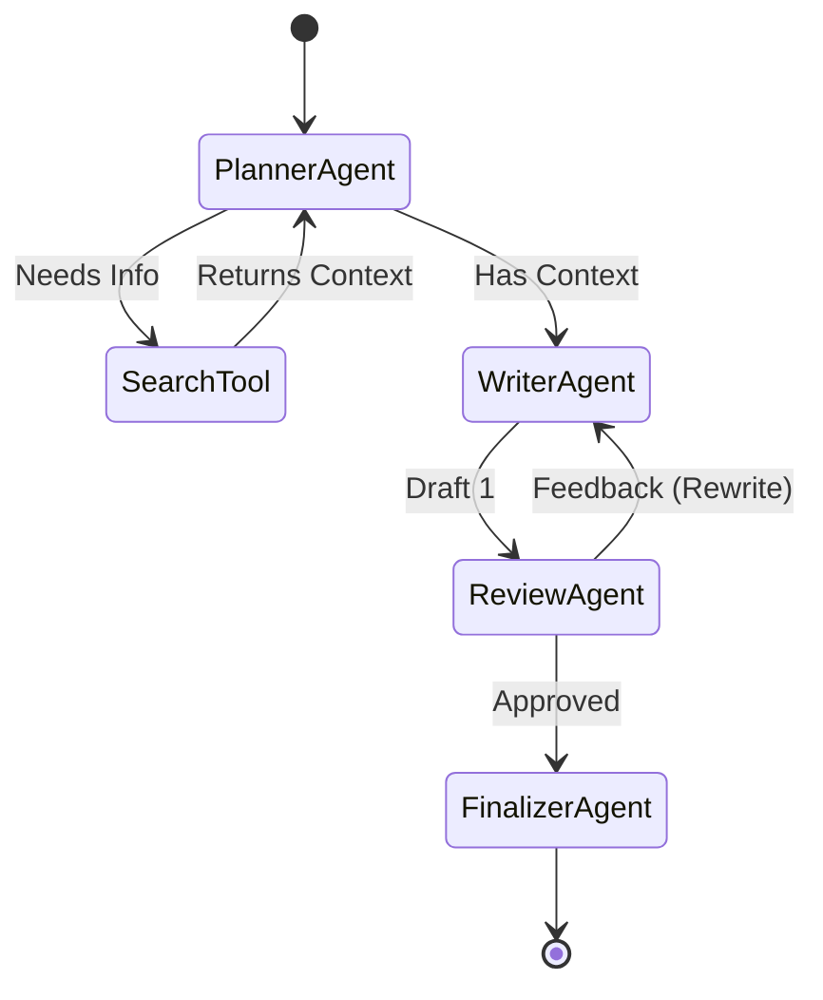

# Module 2.5: AI FDE Data Structures & Algorithms

Welcome to **Module 2.5**. We move from theoretical LeetCode problems into applied AI architecture. How do we structure agents so they don't loop infinitely? How do we build caching systems that don't run out of memory? 

---

## 1. Detailed Theory

### Caching Strategies
Caching LLM outputs saves tremendous money and latency. 
- **LRU (Least Recently Used) Cache**: A Hash Map combined with a Doubly Linked List. When the cache hits its max size, it evicts the item that hasn't been accessed in the longest time. (Python's `@lru_cache` does exactly this).
- **Semantic Caching**: Using vector embeddings (arrays of floats) to search for *similar* prompts in a Vector DB (Graph data structure) rather than *exact* string matches in a Hash Map.

### Workflow Graph Design (Agentic DAGs)
Multi-agent systems (like LangGraph) are modeled as Directed Acyclic Graphs (DAGs) or Directed Cyclic Graphs (DCGs).
- **Nodes**: Represent AI Agents or tools.
- **Edges**: Represent the conditional routing logic (e.g., "If validation fails, route back to WriterAgent").
- **State**: The data (dictionary) passed between nodes.

### Search Optimization (Recommendation Logic)
When building an AI system that recommends products, you aren't doing a linear search. You are calculating the Cosine Similarity between the user's vector and millions of product vectors. Optimized systems use Inverted Indices (Hash Maps mapping keywords to document IDs) combined with HNSW (Hierarchical Navigable Small World) graphs for sub-millisecond retrieval.

---

## 2. Architecture Diagram: Agent Execution Graph


*(This is a Directed Cyclic Graph. The cycle between Writer and Reviewer allows for iterative improvement, but requires a strict exit condition (e.g., `max_retries`) to avoid an infinite loop).*

---

## 3. Production Use Cases

1. **Preventing Infinite AI Loops (Cycle Detection)**: You deploy an autonomous agent. It hits an error, tries to fix it, hits the same error, and loops forever, burning $500 in OpenAI credits overnight. You must implement Cycle Detection (DFS algorithm) or a strict `visited_states` Hash Set to terminate the run.
2. **Hierarchical Document Chunking (Trees)**: When feeding a 100-page PDF to an LLM, naive chunking destroys context. You parse the document into a Tree structure (Document -> Chapters -> Sections -> Paragraphs). You embed the paragraphs, but when retrieving, you traverse *up* the tree to provide the parent section as context.

---

## 4. Coding Examples

### Implementing an LRU Cache (The concept)
*In an interview, you might be asked to implement this from scratch using a Dict + Doubly Linked List. In production, you just use `functools` or Redis.*

```python
from functools import lru_cache
import time

# Maxsize dictates the space complexity limits.
@lru_cache(maxsize=100)
def expensive_llm_call(prompt: str):
    print(f"Calling OpenAI for: {prompt}...")
    time.sleep(2) # Simulate network latency
    return f"Response to {prompt}"

print(expensive_llm_call("What is RAG?")) # Takes 2 seconds
print(expensive_llm_call("What is RAG?")) # Instant! O(1) cache hit.
```

### Agent State Cycle Prevention (Hash Set)
```python
def run_autonomous_agent(start_state):
    current_state = start_state
    visited_states = set() # O(1) lookups
    
    while current_state != "SUCCESS":
        # Hash the state to store in the set (states must be immutable/strings)
        state_hash = hash(current_state)
        
        if state_hash in visited_states:
            print("CRITICAL: Infinite loop detected. Terminating Agent.")
            return "FAILED_DUE_TO_LOOP"
            
        visited_states.add(state_hash)
        
        # Simulate agent action that generates a new state
        print(f"Agent executing in state: {current_state}")
        current_state = simulate_agent_action(current_state)
        
    return "SUCCESS"

def simulate_agent_action(state):
    # Mocking a bug where the agent gets stuck going back and forth
    if state == "START": return "ERROR_1"
    if state == "ERROR_1": return "FIXING_ERROR"
    if state == "FIXING_ERROR": return "ERROR_1" # The cycle!

run_autonomous_agent("START")
```

---

## 5. Hands-on Labs

**Lab: The Graph Router**
**Objective**: Build a basic LangGraph-style router using Python dictionaries.
**Instructions**:
1. Define a state dictionary: `state = {"messages": [], "status": "draft"}`.
2. Define a graph: `graph = {"Writer": review_node, "Reviewer": final_node}`.
3. Write functions for the nodes that mutate the state.
4. Write a `while` loop that passes the `state` from node to node based on the graph definition, until it reaches a "Terminal" node.

---

## 6. Assignments

**Assignment: Cosine Similarity**
Cosine similarity is the core algorithm behind Vector Search.
1. Write a function `cosine_similarity(vec1: list[float], vec2: list[float]) -> float`.
2. Do not use NumPy. Use raw Python `math` module.
3. The formula is: Dot Product of (A, B) divided by the (Magnitude of A * Magnitude of B).
4. Test it with `[1, 0, 0]` and `[1, 0, 0]` (Should be 1.0).

---

## 7. Interview Questions

1. **How would you prevent a LangGraph multi-agent system from looping infinitely?**
   *Answer Hint: Implement a `recursion_limit` parameter in the state that decrements on every node transition, or maintain a Hash Set of previous states to detect if the agent has entered an identical state context before.*
2. **What is an Inverted Index, and how is it used in Hybrid Search?**
   *Answer Hint: A Hash Map where the keys are words (e.g., "insurance") and the values are lists of document IDs that contain that word. Used alongside Vector DBs to allow hybrid search (keyword match + semantic match).*

---

## 8. Best Practices (FDE Standards)

- **Design for Statefulness**: When building agent workflows, design the "State" object (usually a TypedDict or Pydantic model) as the single source of truth. The agents (nodes) should be pure functions that take a State, mutate it, and return the new State. This makes debugging and resuming failed graphs vastly easier.
- **Always set timeouts and limits**: Never deploy a `while` loop or a recursive function to production without a hard counter limit (e.g., `if iterations > 10: raise MaxRetriesExceededError()`).

---

## 9. Common Mistakes

- **DeepCopy Overhead**: Passing massive dictionaries (State) between agents and using `copy.deepcopy()` at every step to prevent mutation bugs. This causes an explosion in Space Complexity and CPU usage. Modern frameworks use immutable data structures or explicit append-only logs.
