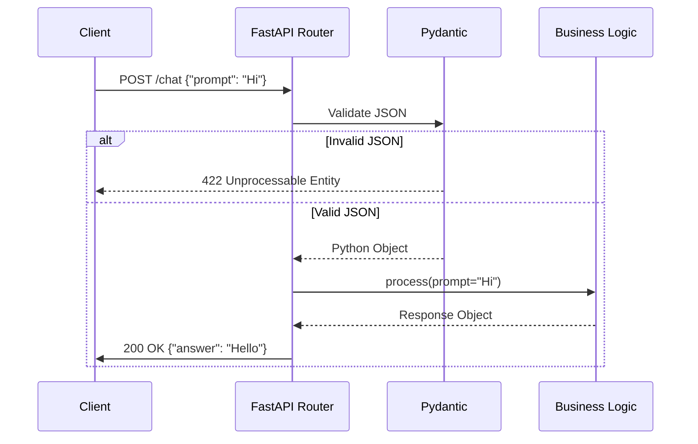

# Module 3.1: FastAPI Fundamentals

Welcome to the **FastAPI** module. If you are building an AI agent, it needs to live somewhere. The standard for modern AI startups and enterprise deployments is FastAPI. It is blisteringly fast, built on modern async Python, and auto-generates documentation based on type hints.

---

## 1. Detailed Theory

### Routing and Request Handling
FastAPI uses standard Python decorators (`@app.get()`, `@app.post()`) to route HTTP requests to specific functions. It automatically parses query parameters (e.g., `?limit=10`) and path parameters (e.g., `/users/{user_id}`).

### Pydantic (The Engine)
FastAPI is tightly coupled with **Pydantic**. You define the expected JSON payload using Python classes (Type Hinting). FastAPI uses these Pydantic models to do three things automatically:
1. Parse incoming JSON strings into Python objects.
2. Validate the data (crashing gracefully with a 422 Error if it's wrong).
3. Generate OpenAPI (Swagger) documentation.

### Response Models
Just as you validate inputs, you validate outputs. Using `response_model=UserResponse`, you guarantee that your API will never accidentally leak a password field in the JSON response, because Pydantic strips out any fields not explicitly defined in the response model.

---

## 2. Architecture Diagram: The Request Lifecycle



---

## 3. Production Use Cases

1. **AI Microservices**: A massive Node.js enterprise application needs to add a RAG feature. Instead of rewriting LangChain in JS, they spin up a tiny FastAPI microservice specifically for the AI features, and the Node app talks to it via HTTP.
2. **Webhook Receivers**: Building an endpoint that listens for incoming Slack messages or Stripe payment confirmations to trigger background AI workflows.

---

## 4. Real Company Examples

- **Netflix**: Uses FastAPI heavily for internal crisis management orchestration and data science workflows because of its async capabilities.
- **Uber**: Adopted FastAPI for machine learning model serving, replacing older Flask applications because it handles high concurrency better.

---

## 5. Coding Examples

### The "Hello World" + Path/Query Parameters
```python
from fastapi import FastAPI

app = FastAPI(title="AI Copilot API")

# Path parameter: {user_id}
# Query parameter: ?verbose=true (defaults to False)
@app.get("/users/{user_id}/history")
def get_history(user_id: int, verbose: bool = False):
    return {"user_id": user_id, "verbose": verbose, "history": []}
```

### Pydantic Validation (POST Request)
```python
from fastapi import FastAPI
from pydantic import BaseModel, Field

app = FastAPI()

# Input Validation
class ChatRequest(BaseModel):
    prompt: str = Field(..., min_length=3, max_length=1000)
    temperature: float = Field(default=0.7, ge=0.0, le=1.0)
    
# Output Validation
class ChatResponse(BaseModel):
    answer: str
    tokens_used: int
    
# The 'response_model' ensures we only return what is explicitly in ChatResponse
@app.post("/chat", response_model=ChatResponse)
def generate_chat(request: ChatRequest):
    # If the user sends temperature=2.5, FastAPI rejects it before this code even runs!
    
    # Mocking business logic
    answer = f"Echo: {request.prompt}"
    
    return ChatResponse(answer=answer, tokens_used=45)
```

---

## 6. Hands-on Labs

**Lab: Swagger UI**
**Objective**: Experience FastAPI's auto-generated documentation.
**Instructions**:
1. Copy the code from the Pydantic Validation example above into a file named `main.py`.
2. Run it using Uvicorn: `uvicorn main:app --reload`.
3. Open your browser and go to `http://localhost:8000/docs`.
4. Use the "Try it out" button to send a valid POST request.
5. Use the "Try it out" button to send an invalid POST request (e.g., `temperature: 5`) and observe the precise error message FastAPI returns.

---

## 7. Assignments

**Assignment: The Document Ingestion Endpoint**
1. Create a Pydantic model `DocumentUpload`. It should have `title` (string), `content` (string), and `tags` (list of strings).
2. Create a POST endpoint `/documents` that accepts this model.
3. If the `title` contains the word "CONFIDENTIAL", raise an `HTTPException` with status code 403 (Forbidden). (You'll need to `from fastapi import HTTPException`).
4. Otherwise, return a JSON response `{"status": "success", "doc_length": len(content)}`.

---

## 8. Interview Questions

1. **Why is FastAPI faster than Flask or Django?**
   *Answer Hint: FastAPI is built on Starlette (an ASGI framework) and Pydantic. ASGI allows for true asynchronous request handling (`async def`), meaning it doesn't block the thread while waiting for network I/O (like a database query or OpenAI API call).*
2. **What happens if you don't use `response_model`?**
   *Answer Hint: You risk leaking sensitive data. If you return a database ORM object directly, FastAPI might serialize the entire object to JSON (including the password hash). `response_model` acts as a strict filter.*
3. **What is the difference between Path parameters and Query parameters?**
   *Answer Hint: Path parameters identify a specific resource (`/users/123`). Query parameters are for filtering, sorting, or optional settings on that resource (`/users/123?sort=desc`). In FastAPI, if a variable is in the URL path, it's a Path param; if it's just in the function signature, it's a Query param.*

---

## 9. Best Practices (FDE Standards)

- **Always use `Field(...)` for strict validation**: Don't just type `age: int`. Use `age: int = Field(..., ge=18)` to ensure data integrity at the edge of your application.
- **Run with Uvicorn, not Python**: Never do `if __name__ == "__main__": app.run()` in production. Always use an ASGI server like Uvicorn or Gunicorn with Uvicorn workers.

---

## 10. Common Mistakes

- **Sync vs Async blocking**: Using a synchronous library (like standard `requests` or `psycopg2`) inside an `async def` endpoint. This blocks the entire event loop, destroying FastAPI's performance. If the library is synchronous, define the endpoint as standard `def` so FastAPI runs it in a separate threadpool!
