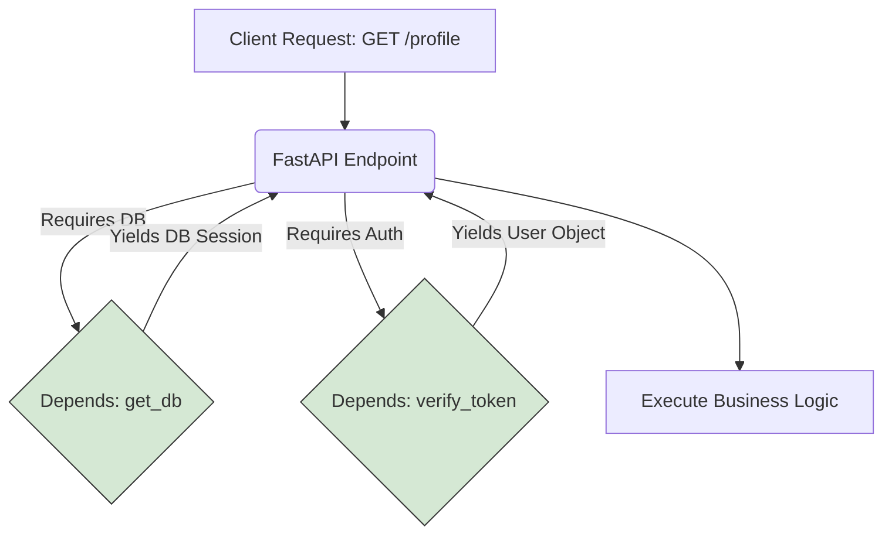

# Module 3.2: API Development & Dependency Injection

Welcome to **Module 3.2**. Building a single endpoint is easy. Building a scalable REST API requires a structured approach to CRUD (Create, Read, Update, Delete), unified Error Handling, and Dependency Injection to share logic across endpoints without repeating yourself.

---

## 1. Detailed Theory

### REST APIs and CRUD
Representational State Transfer (REST) maps HTTP methods to database operations:
- `POST` -> **Create** a new resource.
- `GET` -> **Read** a resource.
- `PUT` / `PATCH` -> **Update** a resource.
- `DELETE` -> **Delete** a resource.

### Error Handling
Instead of returning a manual `{"error": "Not Found"}` with a 200 status code (which is a terrible anti-pattern), you use `HTTPException` to correctly return standard HTTP status codes (404 Not Found, 400 Bad Request, 500 Internal Error).

### Dependency Injection (DI)
The most powerful feature of FastAPI. If 50 endpoints all need to "Verify the user is logged in" or "Connect to the database", you don't write that code 50 times. You write one Dependency function, and "Inject" it into the endpoints that need it via the `Depends()` keyword.

---

## 2. Architecture Diagram: Dependency Injection



---

## 3. Production Use Cases

1. **Database Sessions via DI**: Injecting a database session into an endpoint. When the endpoint finishes, the Dependency automatically closes the database connection, preventing memory leaks.
2. **API Key Validation via DI**: A dependency that checks the `Authorization` header on every request to the `/ai/*` routes, rejecting invalid keys immediately.
3. **Global Exception Handlers**: Overriding the default 422 Validation Error to log the exact failed payload to Sentry so engineers can see *why* users are failing to submit a form.

---

## 4. Real Company Examples

- **Instacart**: Uses Dependency Injection to inject heavily mocked services (like payment gateways) during testing, while injecting the real services in production, without changing a single line of endpoint code.

---

## 5. Coding Examples

### Standard CRUD API
```python
from fastapi import FastAPI, HTTPException

app = FastAPI()
mock_db = {} # Pretend this is Postgres

@app.post("/users/{user_id}", status_code=201)
def create_user(user_id: int, name: str):
    if user_id in mock_db:
        raise HTTPException(status_code=400, detail="User already exists")
    mock_db[user_id] = {"name": name}
    return {"message": "Created"}

@app.get("/users/{user_id}")
def get_user(user_id: int):
    user = mock_db.get(user_id)
    if not user:
        raise HTTPException(status_code=404, detail="User not found")
    return user
```

### Dependency Injection
```python
from fastapi import FastAPI, Depends, HTTPException, Header

app = FastAPI()

# 1. Define the Dependency
def verify_api_key(x_api_key: str = Header(...)):
    if x_api_key != "super_secret_key":
        raise HTTPException(status_code=401, detail="Unauthorized")
    return {"client": "EnterpriseCorp"} # Returns data to the endpoint!

# 2. Inject the Dependency
@app.get("/ai/generate")
def generate_text(prompt: str, auth_data: dict = Depends(verify_api_key)):
    # This code ONLY runs if the API key was valid.
    # auth_data contains the dictionary returned by the dependency.
    return {"client": auth_data["client"], "response": f"Generated: {prompt}"}
```

---

## 6. Hands-on Labs

**Lab: The Rate Limiter Dependency**
**Objective**: Build a dependency that limits requests.
**Instructions**:
1. Create a global dictionary `request_counts = {}`.
2. Write a dependency `def rate_limit(user_id: int):`.
3. Inside, increment `request_counts[user_id]`.
4. If it exceeds 3, raise an `HTTPException(429, "Too Many Requests")`.
5. Create an endpoint `@app.get("/search")` that takes `user_id` and injects this dependency.
6. Test it by hitting the endpoint 4 times.

---

## 7. Assignments

**Assignment: Global Exception Handler**
Read the FastAPI docs on "Handling Errors".
1. Create a custom exception class `class OutOfTokensException(Exception): pass`.
2. Use the `@app.exception_handler(OutOfTokensException)` decorator to catch this globally.
3. Make it return a JSON response with status code `402 Payment Required` and a message "Please upgrade your AI tier."
4. Create an endpoint that raises this custom exception manually.

---

## 8. Interview Questions

1. **What is the difference between `PUT` and `PATCH`?**
   *Answer Hint: `PUT` replaces the entire resource. If you send a PUT with just `{name: "Alice"}`, it overwrites the user and deletes their email field. `PATCH` is a partial update. It only updates the fields provided in the payload.*
2. **Why use Dependency Injection instead of just calling a function inside the endpoint?**
   *Answer Hint: DI promotes reusability, Decoupling, and easier Testing. FastAPI automatically documents dependencies in Swagger UI (e.g., noting that a Header is required). It also allows you to override dependencies during PyTest runs.*
3. **What is a `yield` dependency?**
   *Answer Hint: A dependency that sets up a resource (like a database connection), `yield`s it to the endpoint, and then executes cleanup code (closing the connection) AFTER the endpoint has finished returning a response.*

---

## 9. Best Practices (FDE Standards)

- **Return correct HTTP Status Codes**: Do not return `200 OK` when a resource isn't found. Use `404`. Use `201 Created` for POST requests.
- **Use Routers (`APIRouter`)**: In a real app, you don't put 50 endpoints in `main.py`. You create routers (e.g., `users.py`, `ai_agents.py`) and include them in `main.py` using `app.include_router(users_router)`.

---

## 10. Common Mistakes

- **Leaking DB Connections**: Opening a database connection in an endpoint and forgetting to close it if an exception occurs. *Fix: Always use a `yield` dependency with a `finally:` block to ensure the connection closes no matter what.*
