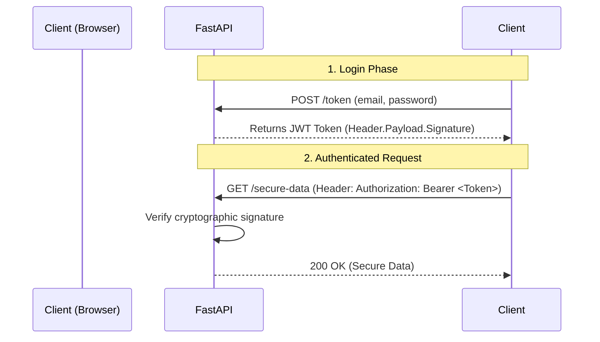

# Module 3.3: API Security & Authentication

Welcome to **Module 3.3**. If you deploy an AI agent to the internet without auth, malicious bots will find it in minutes and rack up a $10,000 OpenAI bill. You must know how to lock down endpoints using industry-standard JWT (JSON Web Tokens) and OAuth2.

---

## 1. Detailed Theory

### Authentication vs. Authorization
- **Authentication**: Who are you? (Logging in).
- **Authorization**: What are you allowed to do? (RBAC - Role-Based Access Control).

### JWT (JSON Web Tokens)
A stateless, cryptographically signed token.
1. User logs in with email/password.
2. Server verifies and creates a string (the JWT) containing `{"user_id": 1, "role": "admin"}` signed with a secret key.
3. The server sends the JWT back to the client.
4. On every subsequent request, the client sends the JWT in the `Authorization: Bearer <token>` header.
5. The server mathematically verifies the signature. It doesn't need to check the database! (Stateless).

### OAuth2 in FastAPI
FastAPI has built-in support for the `OAuth2PasswordBearer` scheme, which perfectly integrates JWTs into the Swagger UI (creating the little "Authorize" padlock button on the docs page).

---

## 2. Architecture Diagram: JWT Flow



---

## 3. Production Use Cases

1. **Role-Based Access (RBAC)**: A standard user can hit `/api/chat`, but only an Admin can hit `/api/fine-tune-model`. The Role is stored inside the JWT payload.
2. **Machine-to-Machine Auth**: When LangGraph agents talk to external enterprise systems, they don't use passwords. They use API Keys or Client Credential JWTs.
3. **CORS (Cross-Origin Resource Sharing)**: Configuring FastAPI to only accept requests from `https://your-frontend-domain.com` to prevent CSRF attacks.

---

## 4. Real Company Examples

- **Auth0 / Clerk / Okta**: Massive companies whose entire product is managing OAuth2 and JWT flows. Usually, you integrate FastAPI with Auth0 rather than writing custom password-hashing logic from scratch.

---

## 5. Coding Examples

### Simple JWT Authentication
*Pre-requisite: `pip install pyjwt passlib[bcrypt]`*

```python
from fastapi import FastAPI, Depends, HTTPException, status
from fastapi.security import OAuth2PasswordBearer
import jwt # PyJWT library

app = FastAPI()

# 1. Setup OAuth2 Scheme
oauth2_scheme = OAuth2PasswordBearer(tokenUrl="token")
SECRET_KEY = "my_super_secret_key_do_not_hardcode"
ALGORITHM = "HS256"

# 2. The Login Endpoint (Issues the token)
@app.post("/token")
def login(username: str):
    # In reality, verify username/password against DB here!
    
    # Create token payload
    payload = {"sub": username, "role": "admin"}
    token = jwt.encode(payload, SECRET_KEY, algorithm=ALGORITHM)
    
    return {"access_token": token, "token_type": "bearer"}

# 3. The Dependency (Verifies the token)
def get_current_user(token: str = Depends(oauth2_scheme)):
    try:
        payload = jwt.decode(token, SECRET_KEY, algorithms=[ALGORITHM])
        return payload["sub"] # Returns username
    except jwt.ExpiredSignatureError:
        raise HTTPException(status_code=401, detail="Token expired")
    except jwt.InvalidTokenError:
        raise HTTPException(status_code=401, detail="Invalid token")

# 4. Secure Endpoint
@app.get("/secure-ai-data")
def read_secure_data(username: str = Depends(get_current_user)):
    return {"message": f"Hello {username}, you are authorized."}
```

---

## 6. Hands-on Labs

**Lab: Test it in Swagger**
**Objective**: Use the Authorize button in Swagger docs.
**Instructions**:
1. Run the code above using Uvicorn.
2. Go to `/docs`. Notice the "Authorize" padlock at the top right.
3. Try to execute `/secure-ai-data`. It will fail (401).
4. Execute the `/token` endpoint with a username to get a token string.
5. Click the "Authorize" padlock and paste the token string.
6. Run `/secure-ai-data` again. It succeeds!

---

## 7. Assignments

**Assignment: RBAC Dependency**
1. Take the code from section 5.
2. Modify the `get_current_user` dependency to return the entire payload dictionary, not just the username.
3. Write a NEW dependency called `require_admin`.
4. `require_admin` should depend on `get_current_user` (Dependencies can depend on other dependencies!).
5. It should check `if payload["role"] != "admin"`. If not, raise `HTTPException(403, "Forbidden")`.
6. Apply `require_admin` to a new endpoint `/delete-database`.

---

## 8. Interview Questions

1. **Why is JWT considered "Stateless"?**
   *Answer Hint: The server does not need to store the token in a database or memory to verify it. The cryptographic signature validates the data. This allows the API to scale horizontally to 100 servers effortlessly.*
2. **What is the biggest security flaw with JWTs?**
   *Answer Hint: Token revocation. Because they are stateless, you cannot easily "log out" a user or invalidate a token before its expiration time. If a hacker steals a JWT, they have access until it expires. (Mitigated using short expiration times and Refresh Tokens).*
3. **What is CORS and how do you fix CORS errors in FastAPI?**
   *Answer Hint: A browser security feature that stops a website on Domain A from making API requests to Domain B. Fixed in FastAPI using the `CORSMiddleware` and explicitly allowing the frontend origins.*

---

## 9. Best Practices (FDE Standards)

- **Never put sensitive data in the JWT Payload**: The payload is merely base64 encoded, not encrypted. Anyone can decode it. Do not put passwords, SSNs, or API keys inside the token.
- **Hash Passwords with Bcrypt**: Never store plaintext passwords in PostgreSQL. Use the `passlib` library to hash passwords with a salt before saving.

---

## 10. Common Mistakes

- **Hardcoding the SECRET_KEY**: Pushing `SECRET_KEY = "my_secret"` to GitHub. A hacker will find it, generate their own JWT assigning themselves the "admin" role, and bypass all your security. *Fix: Always load it from an Environment Variable.*
