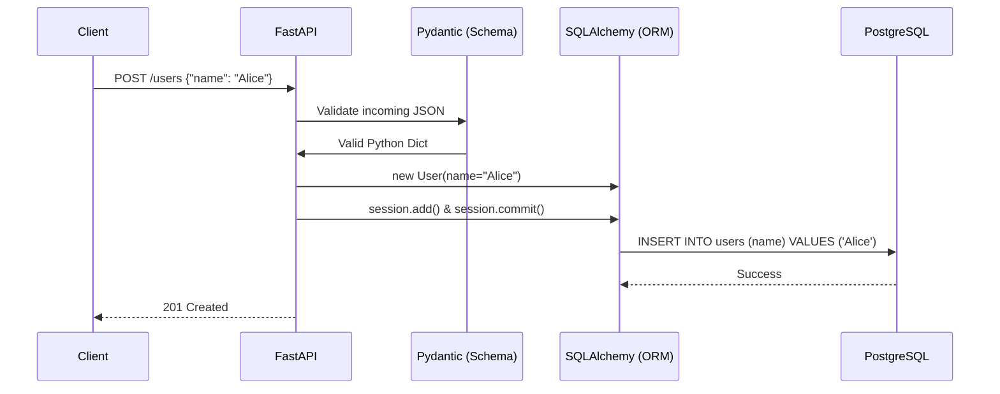

# Module 3.4: Database Integration (SQLAlchemy & Alembic)

Welcome to **Module 3.4**. While you learned raw SQL in Module 1, production Python applications rarely write raw SQL strings (due to SQL Injection risks and maintainability). They use an Object-Relational Mapper (ORM). **SQLAlchemy** is the industry standard ORM, and **Alembic** manages database migrations.

---

## 1. Detailed Theory

### SQLAlchemy ORM
An ORM translates Python Classes into SQL Tables, and Python method calls into SQL Queries.
- **Engine**: The core connection to the database.
- **Session**: The "workspace" where you manipulate objects before committing them to the database.
- **Models**: Python classes that inherit from a Base class, representing your tables.

### Pydantic vs. SQLAlchemy
- **Pydantic**: Validates data coming IN and OUT of the API (JSON).
- **SQLAlchemy**: Defines how data is stored IN THE DATABASE (SQL).
*You will often convert Pydantic objects to SQLAlchemy objects (on Create) and SQLAlchemy objects to Pydantic objects (on Read).*

### Alembic Migrations
When you change a SQLAlchemy model (e.g., adding a `stripe_id` column), you can't just drop and recreate the production database. Alembic tracks changes to your models and generates SQL scripts (Migrations) to safely upgrade the live database schema.

---

## 2. Architecture Diagram: The Data Flow



---

## 3. Production Use Cases

1. **Async Database Connections**: High-performance AI APIs use `asyncpg` and SQLAlchemy 2.0's AsyncEngine. While the database processes the query, the FastAPI worker is freed up to handle other incoming API requests, preventing timeouts.
2. **Migration CI/CD Pipeline**: When an FDE merges code to `main`, a GitHub Action automatically runs `alembic upgrade head` against the staging database to apply schema changes before deploying the FastAPI container.

---

## 4. Real Company Examples

- **Reddit**: Historically relied on massive SQLAlchemy architectures to handle their extreme relational database loads.
- **Palantir**: Heavy users of SQLAlchemy for abstracting complex ontological relationships into Python objects that data scientists can easily manipulate.

---

## 5. Coding Examples

### 1. The SQLAlchemy Model (database.py)
```python
from sqlalchemy import Column, Integer, String, Boolean
from sqlalchemy.orm import declarative_base

Base = declarative_base()

class DBUser(Base):
    __tablename__ = "users"
    
    id = Column(Integer, primary_key=True, index=True)
    email = Column(String, unique=True, index=True, nullable=False)
    is_active = Column(Boolean, default=True)
```

### 2. The FastAPI Integration (main.py)
```python
from fastapi import FastAPI, Depends, HTTPException
from sqlalchemy import create_engine
from sqlalchemy.orm import sessionmaker, Session
from pydantic import BaseModel

# --- Database Setup ---
SQLALCHEMY_DATABASE_URL = "sqlite:///./test.db"
engine = create_engine(SQLALCHEMY_DATABASE_URL, connect_args={"check_same_thread": False})
SessionLocal = sessionmaker(autocommit=False, autoflush=False, bind=engine)

# Create tables (In prod, use Alembic instead of this!)
Base.metadata.create_all(bind=engine) 

app = FastAPI()

# --- Dependency ---
def get_db():
    db = SessionLocal()
    try:
        yield db # Injects the session into the endpoint
    finally:
        db.close() # Closes the connection when done!

# --- Pydantic Schemas ---
class UserCreate(BaseModel):
    email: str

class UserResponse(BaseModel):
    id: int
    email: str
    is_active: bool
    
    class Config:
        from_attributes = True # Tells Pydantic to read SQLAlchemy objects!

# --- The Endpoint ---
@app.post("/users/", response_model=UserResponse)
def create_user(user: UserCreate, db: Session = Depends(get_db)):
    # 1. Check if exists (SQL: SELECT * FROM users WHERE email = ...)
    db_user = db.query(DBUser).filter(DBUser.email == user.email).first()
    if db_user:
        raise HTTPException(status_code=400, detail="Email already registered")
        
    # 2. Create ORM object and save (SQL: INSERT INTO users ...)
    new_user = DBUser(email=user.email)
    db.add(new_user)
    db.commit()
    db.refresh(new_user) # Get the generated ID back from the DB
    
    # 3. Return ORM object (Pydantic converts it to JSON automatically)
    return new_user
```

---

## 6. Hands-on Labs

**Lab: Initialize Alembic**
**Objective**: Setup migrations for your local DB.
*Pre-requisite: Install `alembic`.*
**Instructions**:
1. Run `alembic init alembic` in your terminal.
2. Open `alembic.ini` and set `sqlalchemy.url = sqlite:///./test.db`.
3. Open `alembic/env.py`. Import your `Base` from your models file. Set `target_metadata = Base.metadata`.
4. Run `alembic revision --autogenerate -m "initial migration"`. Look at the generated Python file in `alembic/versions`. It contains the DDL!
5. Run `alembic upgrade head` to apply it.

---

## 7. Assignments

**Assignment: AI Conversation Schema**
1. Write a SQLAlchemy Model `Session` with `id` and `user_id`.
2. Write a Model `Message` with `id`, `session_id` (ForeignKey), `role` (String), and `content` (String).
3. Add a relationship so `session.messages` returns a list of message objects.
4. Write a FastAPI endpoint that takes a `session_id`, queries the `Session` from the DB using Dependency Injection, and returns it along with all its messages using a Pydantic `response_model`.

---

## 8. Interview Questions

1. **What is SQL Injection and does SQLAlchemy protect against it?**
   *Answer Hint: SQL Injection is passing malicious code in an input field (e.g., `; DROP TABLE users`). Yes, SQLAlchemy uses parameterized queries under the hood. It treats inputs strictly as data, not as executable commands, rendering SQL injection virtually impossible unless you explicitly write raw SQL strings.*
2. **What does `from_attributes = True` (or `orm_mode=True` in v1) do in a Pydantic model?**
   *Answer Hint: Pydantic normally expects dictionaries (`data['email']`). SQLAlchemy objects are classes, so you access data via attributes (`data.email`). `from_attributes=True` tells Pydantic to try both, allowing it to seamlessly serialize ORM objects directly to JSON.*
3. **What is an N+1 Query problem in ORMs?**
   *Answer Hint: If you query 100 Users, and then loop through those users to print their Company name (a ForeignKey relationship), SQLAlchemy might execute 1 query for the users, and 100 separate queries for the companies. (N + 1 = 101 queries). This is fixed using `joinedload` (Eager Loading) to fetch it all in one SQL JOIN.*

---

## 9. Best Practices (FDE Standards)

- **Decouple Schemas from Models**: Always keep your Pydantic schemas in `schemas.py` and your SQLAlchemy models in `models.py`. Never let them bleed into each other.
- **Never expose raw DB IDs in URLs if avoidable**: While acceptable for internal tools, public APIs should use UUIDs to prevent enumeration attacks (scraping user 1, then 2, then 3...).

---

## 10. Common Mistakes

- **Forgetting `db.commit()`**: You can do `db.add(new_user)` all day, but if you forget `db.commit()`, the transaction is rolled back when the endpoint finishes and the data is lost.
- **Ignoring Migrations**: Manually adding columns to your production database using PGAdmin instead of Alembic. The next time the application boots, the code will be completely out of sync with the database state.
