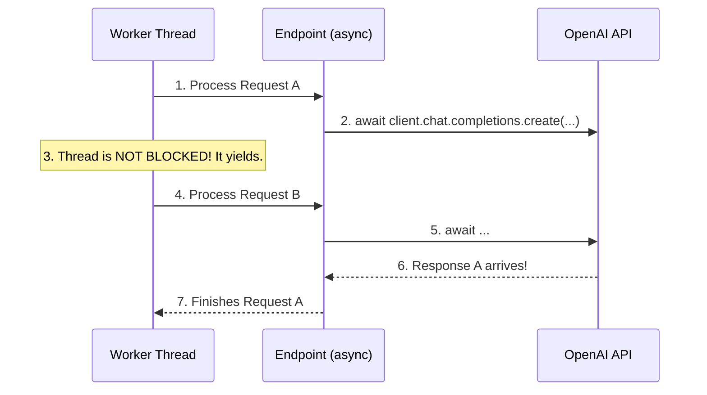

# Module 3.5: Production FastAPI

Welcome to **Module 3.5**. A functional API is not a production API. Production systems require deep observability, background processing for heavy LLM calls, robust middleware, and asynchronous event loops to handle scale.

---

## 1. Detailed Theory

### Middleware
Code that runs *before* every request reaches your endpoint, and *after* every response leaves. Used for CORS, custom metric tracking, injecting trace IDs, and global logging.

### Background Tasks vs. Celery
- **FastAPI BackgroundTasks**: Built-in, lightweight. Runs in the same process after the response is sent. Great for sending a quick welcome email.
- **Celery**: Heavyweight, distributed. Runs in separate worker containers. Required for 30-second LLM processing, video encoding, or massive document embedding.

### Async Programming (`async` / `await`)
FastAPI is built on `asyncio`. When your code waits for an external network request (like the OpenAI API), an `async` function yields control back to the server, allowing it to process 1,000 other user requests while waiting. A `sync` function would block the entire thread, halting the server.

### WebSockets
REST APIs are unidirectional (Client asks, Server answers). WebSockets are bidirectional, persistent connections. Essential for streaming LLM tokens in real-time to a frontend UI.

---

## 2. Architecture Diagram: Async Event Loop



---

## 3. Production Use Cases

1. **Global Traceability (Middleware)**: Adding a `X-Trace-ID` header to every incoming request via Middleware. This UUID is passed into the `structlog` logger, injected into the database, and sent to OpenAI. If the client complains about an error, you search that single UUID in Datadog and see the entire lifecycle of the request.
2. **Streaming RAG UI (WebSockets)**: ChatGPT feels fast because it streams tokens one by one. FastAPI WebSockets maintain an open connection to the React frontend, pushing each chunk yielded from OpenAI instantly.
3. **Async Embeddings**: When a user uploads a 500-page PDF, the endpoint immediately returns `202 Accepted` and hands the file to a Celery worker (or FastAPI BackgroundTask) so the user's browser doesn't freeze waiting for an HTTP response.

---

## 4. Real Company Examples

- **HuggingFace**: Uses highly optimized ASGI servers and WebSockets to stream massive model outputs to users in real-time.
- **Any Modern Tech Company**: Implements Prometheus middleware in FastAPI to scrape `request_latency` and `status_code_count` to populate Grafana dashboards and trigger PagerDuty alerts if 500 errors spike.

---

## 5. Coding Examples

### Middleware (Timing Requests)
```python
from fastapi import FastAPI, Request
import time

app = FastAPI()

@app.middleware("http")
async def add_process_time_header(request: Request, call_next):
    start_time = time.time()
    
    # 1. Pass request to the actual endpoint
    response = await call_next(request)
    
    # 2. Modify the response before sending to user
    process_time = time.time() - start_time
    response.headers["X-Process-Time"] = str(process_time)
    
    # Bonus: Log slow requests!
    if process_time > 1.0:
        print(f"WARNING: Slow endpoint {request.url.path} took {process_time}s")
        
    return response

@app.get("/")
def read_root():
    return {"message": "Hello World"}
```

### Background Tasks
```python
from fastapi import FastAPI, BackgroundTasks
import time

app = FastAPI()

def long_running_ai_task(email: str):
    print(f"Starting heavy processing for {email}...")
    time.sleep(10) # Simulate 10 second LLM task
    print(f"Finished processing. Email sent to {email}.")

@app.post("/trigger-ai")
async def trigger(email: str, background_tasks: BackgroundTasks):
    # This schedules the function to run AFTER the response is sent
    background_tasks.add_task(long_running_ai_task, email)
    
    # User gets this instantly!
    return {"message": "Processing started in the background."}
```

---

## 6. Hands-on Labs

**Lab: WebSockets**
**Objective**: Build a real-time echo server.
**Instructions**:
1. Copy this code into `main.py`:
```python
from fastapi import FastAPI, WebSocket
app = FastAPI()

@app.websocket("/ws")
async def websocket_endpoint(websocket: WebSocket):
    await websocket.accept()
    while True:
        data = await websocket.receive_text()
        await websocket.send_text(f"Agent says: {data}")
```
2. Run it. Open Postman (or an online WebSocket tester like Hoppscotch).
3. Connect to `ws://localhost:8000/ws`.
4. Send a message. You will receive an instant reply without HTTP overhead!

---

## 7. Assignments

**Assignment: Async vs Sync**
1. Write a standard `def` endpoint that uses `time.sleep(5)`.
2. Write an `async def` endpoint that uses `asyncio.sleep(5)`.
3. Open two terminal tabs. Use `curl` to hit the standard endpoint twice simultaneously. Notice that the second request waits for the first to finish (10 seconds total).
4. Hit the `async` endpoint twice simultaneously. Notice they both finish in 5 seconds because the server didn't block!

---

## 8. Interview Questions

1. **When should you NOT use `async def` in FastAPI?**
   *Answer Hint: If your function contains synchronous, blocking code (like standard `requests.get()` or complex CPU-bound math operations). If you put blocking code in an `async def`, it freezes the entire async event loop. For blocking code, use a standard `def`; FastAPI will smartly run it in a separate threadpool to protect the main event loop.*
2. **What is ASGI?**
   *Answer Hint: Asynchronous Server Gateway Interface. It is the modern Python standard that allows web frameworks (like FastAPI) and web servers (like Uvicorn) to handle requests asynchronously, replacing the older, synchronous WSGI standard (used by Flask/Django).*
3. **Why use Celery instead of FastAPI BackgroundTasks?**
   *Answer Hint: FastAPI BackgroundTasks run in the exact same memory space/container as the API. If the API container crashes or restarts, all queued tasks are lost forever. Celery stores tasks persistently in Redis/RabbitMQ and processes them on dedicated worker nodes, ensuring resilience and scale.*

---

## 9. Best Practices (FDE Standards)

- **Use Prometheus/Grafana**: In production, add the `prometheus-fastapi-instrumentator` middleware. It automatically exposes a `/metrics` endpoint that DevOps tools scrape to monitor your API's health.
- **Log Exceptions via Middleware**: Write a global exception handler or middleware that catches *unhandled* 500 errors and immediately pushes the stack trace to Sentry or Datadog.

---

## 10. Common Mistakes

- **Blocking the Event Loop**: (Repeated because it is the #1 FastAPI bug). Doing something like `df = pandas.read_csv("huge.csv")` inside an `async def` endpoint. Pandas is synchronous and CPU-bound. The entire FastAPI server will stop responding to all other users until that CSV finishes loading.
