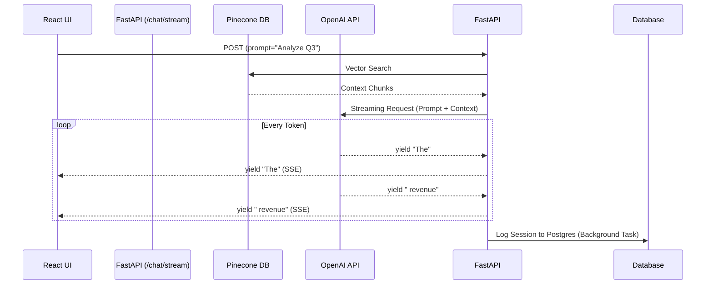

# Module 3.6: AI FDE FastAPI

Welcome to **Module 3.6**. This is where we fuse FastAPI with the LangChain/OpenAI stack. As an FDE, you are not just building CRUD APIs for user profiles; you are exposing complex Multi-Agent workflows behind robust, streamable HTTP endpoints.

---

## 1. Detailed Theory

### API Design for LLMs
LLM generation is slow. A standard REST request times out after 30-60 seconds. You must design APIs to handle this latency via:
1. **Server-Sent Events (SSE) / Streaming**: Returning a stream of tokens as they are generated.
2. **Async Polling**: Returning a `task_id` instantly, and making the client poll a `/status/{task_id}` endpoint.

### Exposing RAG Systems
A RAG API endpoint requires multiple distinct phases hidden behind a single POST request: Input Validation, Vector Search, LLM Generation, and Audit Logging.

### Multi-Agent Backend Services
When a LangGraph graph runs, it might take 2 minutes. The API must initiate the graph, optionally stream the intermediate *states* (e.g., "Agent 1 finished", "Agent 2 started") back to the UI, and handle tool execution securely.

---

## 2. Architecture Diagram: Streaming RAG API



---

## 3. Production Use Cases

1. **Enterprise Copilot Stream**: Providing a `/v1/chat/completions` endpoint that perfectly mimics the OpenAI API spec, but internally intercepts the request, scrubs it for PII, queries a local Pinecone database, and then streams the result back to a custom enterprise chat UI.
2. **Agent Webhooks**: An AI agent that needs to ask a human for approval before executing a dangerous tool (like deleting a server). The agent hits a FastAPI endpoint which sends a Slack message. The Slack button hits a callback URL on FastAPI `/approve/{task_id}`, which resumes the paused LangGraph workflow.

---

## 4. Coding Examples

### Server-Sent Events (Streaming Tokens)
*To build a ChatGPT-like UI, you use `StreamingResponse`.*

```python
from fastapi import FastAPI
from fastapi.responses import StreamingResponse
import asyncio

app = FastAPI()

# A mock async generator mimicking OpenAI's streaming SDK
async def mock_openai_stream(prompt: str):
    words = ["This ", "is ", "a ", "simulated ", "streaming ", "response."]
    for word in words:
        await asyncio.sleep(0.5) # Simulate token generation time
        yield word

@app.post("/chat/stream")
async def chat_stream(prompt: str):
    # StreamingResponse keeps the HTTP connection open and pushes chunks!
    return StreamingResponse(
        mock_openai_stream(prompt), 
        media_type="text/event-stream"
    )
```

### Wrapping an OpenAI Call (Async)
```python
from fastapi import FastAPI, HTTPException
from pydantic import BaseModel
import openai # Ensure this is configured with API keys

app = FastAPI()

class ChatRequest(BaseModel):
    user_id: str
    message: str

class ChatResponse(BaseModel):
    reply: str
    model_used: str

@app.post("/agent/ask", response_model=ChatResponse)
async def ask_agent(request: ChatRequest):
    try:
        # We MUST use the async client to avoid blocking the server!
        client = openai.AsyncOpenAI()
        
        response = await client.chat.completions.create(
            model="gpt-4",
            messages=[
                {"role": "system", "content": "You are a helpful enterprise assistant."},
                {"role": "user", "content": request.message}
            ]
        )
        
        reply = response.choices[0].message.content
        return ChatResponse(reply=reply, model_used="gpt-4")
        
    except Exception as e:
        # Always catch LLM provider errors (rate limits, timeouts)
        raise HTTPException(status_code=502, detail=f"Upstream AI Error: {str(e)}")
```

---

## 5. Hands-on Labs

**Lab: The Polling Architecture**
**Objective**: Handle long-running workflows without WebSockets.
**Instructions**:
1. Create a dictionary `job_store = {}`.
2. Create `POST /job` that takes a prompt, generates a random `job_id`, sets `job_store[job_id] = "Processing"`, triggers a BackgroundTask that waits 10 seconds and sets it to "Done", and immediately returns the `job_id`.
3. Create `GET /job/{job_id}` that looks up the ID in the dictionary and returns its status.
4. Hit the POST endpoint, get the ID, and hit the GET endpoint repeatedly to watch it change!

---

## 6. Assignments

**Assignment: RAG Endpoint Boilerplate**
Write a complete FastAPI endpoint `/api/rag` that:
1. Takes a JSON payload: `query` (str) and `namespace` (str).
2. Contains a mocked vector search function that returns a dummy string of context based on the namespace.
3. Contains a mocked LLM function that takes the `query` and `context` and returns an answer.
4. Uses dependency injection to "Verify API Key".
5. Returns a Pydantic model containing the final `answer` and a list of `sources`.

---

## 7. Interview Questions

1. **Why is `StreamingResponse` important for AI user interfaces?**
   *Answer Hint: Time To First Token (TTFT). If a response takes 20 seconds to generate, the user will stare at a loading spinner and think the app is broken. Streaming the response instantly makes the app feel highly performant, even if the total generation time is the same.*
2. **If OpenAI's API goes down, what HTTP status code should your FastAPI app return?**
   *Answer Hint: 502 Bad Gateway or 503 Service Unavailable. You should not return 500 (Internal Server Error) because your code didn't break, the upstream dependency broke.*
3. **How do you handle a scenario where an AI agent needs to process a 5-hour long video transcription task?**
   *Answer Hint: Never do this in the HTTP request lifecycle. Accept the request via FastAPI, save the task to a database, queue the job in Celery, return an HTTP 202 Accepted with a task ID. Let the Celery worker process it for 5 hours and update the database when finished.*

---

## 8. Best Practices (FDE Standards)

- **Use the Async SDKs**: `openai.AsyncOpenAI()`, `httpx.AsyncClient()`, etc. If you are using FastAPI, you must ensure that every single network call to external AI providers is awaited.
- **Fail Gracefully**: LLM APIs are flaky. Implement retry logic (e.g., using the `tenacity` library) around your API calls inside the FastAPI endpoint to automatically retry rate-limits before returning an error to the user.

---

## 9. Common Mistakes

- **JSON Encoding Streams**: Trying to return a complex Pydantic JSON object via a StreamingResponse. SSE is natively meant for string chunks. Streaming structured JSON objects (like tool call arguments) requires careful buffering and parsing on the client side.
