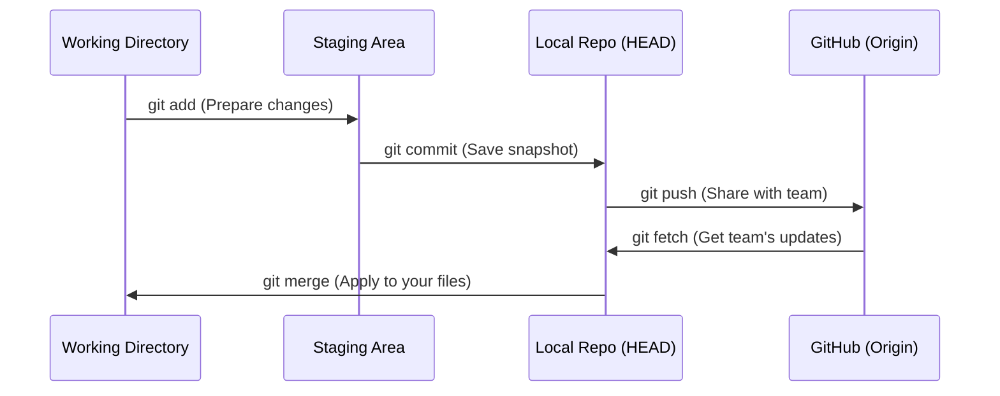

# Module 4.1: Git Fundamentals

Welcome to the **Git & GitHub** module. As an FDE, you are dropping into existing enterprise engineering teams. If you do not know how to manage code versions, resolve merge conflicts, and operate within a strict CI/CD pipeline, you will break their production systems. Git is the foundation of modern collaborative software engineering.

---

## 1. Detailed Theory

### What is Git?
Git is a Distributed Version Control System (VCS). Unlike older systems where a central server held the only copy of the code, in Git, every developer's laptop has a full, independent clone of the entire repository's history.

### Git Architecture (The 3 Trees)
Git operates by moving files between three different states (trees):
1. **Working Directory**: The actual files you are currently editing on your computer.
2. **Staging Area (Index)**: A temporary holding zone where you prepare the files you want to include in your next snapshot.
3. **Local Repository (HEAD)**: The database (`.git/` folder) containing all your committed snapshots. 
*(There is a 4th concept: The **Remote Repository** like GitHub, which you push to).*

### Core Concepts
- **Repository (Repo)**: A folder tracked by Git.
- **Commit**: A permanent snapshot of your code at a specific point in time. Every commit has a unique SHA-1 hash (e.g., `a1b2c3d4...`).
- **Branch**: A movable pointer to a specific commit. It allows you to create an isolated workspace to build a feature without affecting the main code. The default branch is usually `main` or `master`.
- **Merge**: Taking the changes from one branch and integrating them into another branch.

---

## 2. Architecture Diagram: The Git Workflow



---

## 3. Production Use Cases

1. **Feature Isolation**: You are tasked with upgrading LangChain from v0.1 to v0.2. This will break everything. You create a branch `feature/langchain-upgrade`. You work on it for 2 weeks. Meanwhile, a critical bug is found in production. You switch back to the `main` branch, fix the bug, push it, and then switch back to your feature branch to continue the upgrade.
2. **Audit Trails**: An AI model suddenly starts hallucinating badly on Tuesday. By using `git log`, the engineering team can see exactly who changed the prompt template on Monday afternoon and instantly roll back to the previous commit.

---

## 4. Real Company Examples

- **Microsoft**: Acquired GitHub because Git won the version control war. Microsoft maintains some of the largest Git monorepos in the world (the Windows codebase).
- **Every Enterprise**: No modern software company writes code without Git. You will never SSH into a server and edit files directly via `vim` in a production environment.

---

## 5. Coding Examples (Conceptual)

### Visualizing the Git Tree

Imagine the main branch has 3 commits:
`A --- B --- C (main)`

You create a branch `feature-x` and add a commit:
```text
A --- B --- C (main)
             \
              D (feature-x)
```

Meanwhile, someone else merges a hotfix to main:
```text
A --- B --- C --- E (main)
             \
              D (feature-x)
```

When you merge `feature-x` back into `main`, Git creates a "Merge Commit" (F):
```text
A --- B --- C --- E --- F (main)
             \         /
              D -------
```

---

## 6. Hands-on Labs

**Lab: Initialize and Commit**
**Objective**: Experience the 3 Trees.
**Instructions**:
1. Open a terminal and create a new folder: `mkdir git_test && cd git_test`.
2. Initialize Git: `git init`. (Notice it creates a hidden `.git` folder).
3. Create a file: `echo "print('Hello')" > app.py`. (This is in the Working Directory).
4. Check status: `git status`. It will say `Untracked files`.
5. Stage the file: `git add app.py`. (Moved to Staging Area).
6. Check status again: `git status`. It will say `Changes to be committed`.
7. Commit the file: `git commit -m "Initial commit"`. (Moved to Local Repo).
8. View history: `git log`.

---

## 7. Assignments

**Assignment: The Merge Conflict**
Merge conflicts happen when two people edit the *exact same line* in a file on different branches.
1. In your `git_test` folder, create a new branch: `git checkout -b new-feature`.
2. Edit `app.py` to say `print('Hello from feature')`. Commit it.
3. Switch back to main: `git checkout main`.
4. Edit `app.py` to say `print('Hello from main')`. Commit it.
5. Attempt to merge: `git merge new-feature`.
6. Git will yell at you! Open `app.py` in your text editor. You will see `<<<<<<< HEAD`. Delete the Git conflict markers, keep the code you want, save, `git add app.py`, and `git commit` to resolve it.

---

## 8. Interview Questions

1. **What is the difference between Git and GitHub?**
   *Answer Hint: Git is the underlying version control software that runs locally on your machine. GitHub is a cloud-hosting provider (owned by Microsoft) that hosts Git repositories and adds collaboration features like Pull Requests and Issue Tracking.*
2. **What does it mean when a file is "Staged"?**
   *Answer Hint: It means the file has been added to the Index, indicating that its current state is marked to be included in the very next commit snapshot.*
3. **What is a "Detached HEAD" state?**
   *Answer Hint: HEAD is a pointer that usually points to the latest commit of the current branch. If you checkout a specific historical commit hash (e.g., `git checkout a1b2c3`), HEAD detaches from the branch and points directly to the commit. Any new commits made here will be orphaned when you switch back to a branch.*

---

## 9. Best Practices (FDE Standards)

- **Commit Often, Perfect Later**: Do not work for 3 days and make one massive commit called "did some work". Make small, atomic commits: "Added DB connection", "Refactored Prompt Template", "Added Unit Tests".
- **Meaningful Commit Messages**: `git commit -m "fix"` is terrible. Use the imperative mood: `git commit -m "Add JWT validation middleware to FastAPI"`.

---

## 10. Common Mistakes

- **Committing Secrets**: Accidentally running `git add .` and committing a `.env` file containing OpenAI API keys. Even if you delete the file in the next commit, the key lives forever in the Git history. (If this happens, you must revoke the key immediately).
- **Working directly on `main`**: Never write code directly on the `main` branch. Always create a feature branch, do the work, and merge it via a Pull Request.
