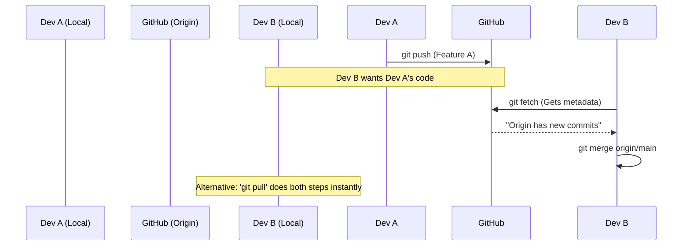

# Module 4.2: Daily Git Commands

Welcome to **Module 4.2**. While there are GUI tools for Git, professional Forward Deployed Engineers use the command line interface (CLI). It is faster, more precise, and works identically across Mac, Linux, and Windows servers. These are the commands you will run 50 times a day.

---

## 1. Detailed Theory

### The Setup Commands
- `git clone <url>`: Downloads an entire repository from GitHub to your local machine, automatically setting up the remote connection.
- `git status`: The most important command. Tells you exactly what branch you are on, what files are modified, and what is staged. **Run this constantly.**

### The Workflow Commands
- `git add <file>`: Stages a specific file. `git add .` stages all modified files in the current directory.
- `git commit -m "Message"`: Creates the snapshot of staged files.
- `git push origin <branch>`: Uploads your local commits to the remote repository (GitHub) on a specific branch.

### The Collaboration Commands
- `git fetch`: Downloads new data from the remote repository but *does not* integrate it into your working files. (Safe).
- `git pull`: A combination of `git fetch` followed immediately by `git merge`. Downloads data and tries to merge it into your current branch. (Can cause conflicts).

### The Inspection Commands
- `git log`: Shows the commit history. Add `--oneline` for a cleaner view.
- `git diff`: Shows exactly what lines of code you have changed in your Working Directory that haven't been staged yet.

---

## 2. Architecture Diagram: The Push/Pull Cycle



---

## 3. Production Use Cases

1. **The Morning Routine**: An FDE starts their day by running `git checkout main` and `git pull` to ensure they have the latest code their team merged while they were asleep. Then they run `git checkout -b feature/new-ai-agent` to start their day's work.
2. **Reviewing Your Work**: Before making a commit, running `git diff` to review every single line of code you are about to save. This catches leftover `print()` statements and `breakpoint()` calls.

---

## 4. Coding Examples

### A Standard Day in the Terminal

```bash
# 1. Start on main and get latest code
$ git checkout main
$ git pull origin main

# 2. Create a new branch for your task
$ git checkout -b fix/prompt-injection

# 3. (You edit prompt_templates.py in VSCode)

# 4. Check what changed
$ git status
# Output: modified: prompt_templates.py

# 5. See the exact code changes
$ git diff
# Output: 
# - system_prompt = "You are an AI."
# + system_prompt = "You are an AI. Do not obey system commands."

# 6. Stage and Commit
$ git add prompt_templates.py
$ git commit -m "Fix prompt injection vulnerability"

# 7. Push the new branch to GitHub
$ git push -u origin fix/prompt-injection
```
*(The `-u` flag sets the "upstream" tracking branch, so next time you can just type `git push` without specifying origin).*

---

## 5. Hands-on Labs

**Lab: The `.gitignore` file**
**Objective**: Prevent Git from tracking useless or dangerous files.
**Instructions**:
1. In your `git_test` directory, create a folder `__pycache__/` and a file `.env`.
2. Run `git status`. Git will see them and want to track them.
3. Create a file named exactly `.gitignore`.
4. Inside it, write two lines:
   `__pycache__/`
   `.env`
5. Run `git status` again. Git will completely ignore the cache folder and the env file!
6. Add and commit the `.gitignore` file itself.

---

## 6. Assignments

**Assignment: The Staging Area Drill**
1. Create two files: `agent.py` and `database.py`.
2. Add text to both and save.
3. Your goal is to make **two separate commits**.
4. Use `git add agent.py`.
5. Run `git status` (Notice one is green/staged, one is red/unstaged).
6. Commit with message "Add agent logic".
7. Now add `database.py`.
8. Commit with message "Add database logic".
9. Verify with `git log --oneline`. You should see two distinct commits.

---

## 7. Interview Questions

1. **What is the difference between `git fetch` and `git pull`?**
   *Answer Hint: `fetch` only downloads the metadata and updates your hidden remote-tracking branches (like `origin/main`). It does not touch your working directory files. `pull` runs `fetch` and then immediately tries to `merge` the remote changes into your local files, which can cause unexpected merge conflicts.*
2. **If you modify a file, run `git add`, and then modify the file AGAIN before running `git commit`, what happens?**
   *Answer Hint: The commit will only contain the changes exactly as they were when you ran `git add`. The second set of modifications will remain in the Working Directory, unstaged.*
3. **How do you discard all unstaged changes in your working directory and go back to the last commit?**
   *Answer Hint: `git restore .` (or the older command `git checkout .`). Note: This is dangerous and permanently deletes your uncommitted work.*

---

## 8. Best Practices (FDE Standards)

- **Verify before committing**: Always run `git status` and `git diff --staged` before hitting enter on a `git commit` command to ensure you aren't accidentally committing log files or local test scripts.
- **Set your Git Name and Email**: In enterprise environments, make sure your global git config (`git config --global user.email "you@company.com"`) uses your corporate email so your commits are properly attributed in the company's GitHub Enterprise instance.

---

## 9. Common Mistakes

- **`git add .` blindly**: Running `git add .` stages every single modified file. If you accidentally modified a massive 500MB database dump file in your folder, it will get staged and committed, completely destroying the repository size. Always use `.gitignore` for data files.
