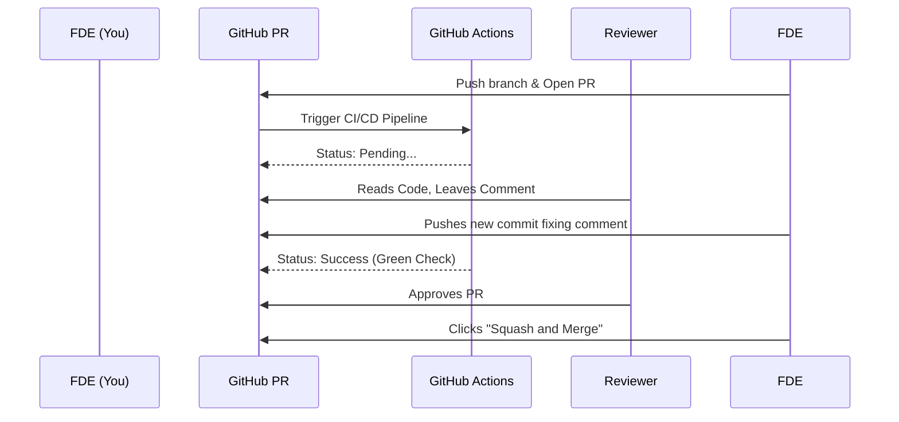

# Module 4.4: GitHub & Collaboration

Welcome to **Module 4.4**. Git is local; GitHub is the cloud. As a Forward Deployed Engineer, you will almost never merge your own code directly into a client's `main` branch. You will push your code to GitHub and open a Pull Request (PR), where senior engineers will review it.

---

## 1. Detailed Theory

### Pull Requests (PRs)
A Pull Request is a formal request asking the maintainers of a repository to "pull" your feature branch into the `main` branch. It provides a UI for reviewing diffs, commenting on specific lines of code, and running automated tests.

### Code Reviews
The process where peers examine your code before it merges. They look for:
- Logic bugs.
- Missing test coverage.
- Violations of the company's style guide.
- Security vulnerabilities (e.g., hardcoded OpenAI keys).

### Branch Protection Rules
Enterprise repositories are locked down. You cannot `git push origin main`. Branch protection rules enforce:
- No direct pushes to `main`.
- At least 2 approved code reviews required before merging.
- All CI/CD tests (GitHub Actions) must pass (Green).

### GitHub Actions (CI/CD)
GitHub's built-in Continuous Integration / Continuous Deployment runner. You define YAML files in `.github/workflows/`. When you push code, GitHub automatically spins up a virtual machine, installs your dependencies, and runs PyTest.

---

## 2. Architecture Diagram: The GitHub PR Lifecycle



---

## 3. Production Use Cases

1. **Automated AI Testing (CI)**: When you open a PR changing the LangChain prompt template, a GitHub Action automatically runs a suite of "LLM Evaluation" tests. If the model's accuracy drops below 90%, the Action fails, turning the PR red and preventing the merge.
2. **Releases & Tags**: When an AI platform is ready for production, the FDE creates a GitHub Release tagged `v1.2.0`. A GitHub Action listens for this tag, builds the Docker container, and pushes it to the client's AWS Elastic Container Registry.
3. **CODEOWNERS**: An enterprise repo has a `.github/CODEOWNERS` file. If you modify any file in the `database/` folder, GitHub automatically assigns the DBA team to review your PR.

---

## 4. Real Company Examples

- **Palantir**: Has legendary, intense code review cultures. PRs are scrutinized for efficiency and security. FDEs spend a large portion of their day reviewing others' code via GitHub or internal Bitbucket instances.
- **Open Source (e.g., FastAPI, LlamaIndex)**: Rely entirely on GitHub Issues (for bug tracking) and Pull Requests (for community contributions).

---

## 5. Coding Examples

### A Standard GitHub Action (CI) YAML
*(Located in `.github/workflows/tests.yml`)*

```yaml
name: Python AI Tests

# Run this workflow on every push to main, and on every PR
on:
  push:
    branches: [ "main" ]
  pull_request:
    branches: [ "main" ]

jobs:
  test:
    runs-on: ubuntu-latest

    steps:
    - name: Check out repository code
      uses: actions/checkout@v3

    - name: Set up Python 3.11
      uses: actions/setup-python@v4
      with:
        python-version: "3.11"

    - name: Install dependencies
      run: |
        python -m pip install --upgrade pip
        pip install poetry
        poetry install

    - name: Run PyTest
      run: |
        # Run tests and fail the Action if tests fail
        poetry run pytest tests/
```

---

## 6. Hands-on Labs

**Lab: The Perfect PR Template**
**Objective**: Standardize PR descriptions.
**Instructions**:
1. In a GitHub repository, create a `.github/PULL_REQUEST_TEMPLATE.md` file.
2. Add the following Markdown:
```markdown
## Description
Provide a brief summary of what this PR does. (e.g., Added Redis caching to the RAG endpoint).

## Related Tickets
Resolves #123

## Type of Change
- [ ] Bug fix
- [ ] New feature
- [ ] Breaking change

## Testing Instructions
1. Run `docker-compose up`
2. Hit the `/api/chat` endpoint and verify latency is < 1s.
```
3. Commit and push it. The next time anyone opens a PR in that repo, GitHub will automatically pre-fill the text box with this template!

---

## 7. Assignments

**Assignment: Code Review Roleplay**
Look at the following Python snippet that someone submitted in a PR:
```python
@app.get("/user")
def get_user(email: str):
    api_key = "sk-1234567890abcdef"
    db = connect_db()
    user = db.execute(f"SELECT * FROM users WHERE email = {email}")
    return user
```
Write 3 specific code review comments explaining why this code is highly dangerous and should be rejected.
*(Answers: 1. Hardcoded API key in source code. 2. Raw SQL string concatenation leading to catastrophic SQL Injection. 3. DB connection isn't closed, leading to connection leaks).*

---

## 8. Interview Questions

1. **What is a "Squash and Merge" in GitHub?**
   *Answer Hint: When completing a PR, instead of moving all 20 of your messy development commits into the main branch history, GitHub combines (squashes) them into one single, clean commit on the main branch.*
2. **What does a Continuous Integration (CI) pipeline actually do?**
   *Answer Hint: It automatically builds the code and runs all unit tests, linters, and static analysis tools every time code is pushed. It ensures that new code does not break existing functionality before it is allowed to be merged.*
3. **If you fork a repository, how do you keep your fork updated with the original repository?**
   *Answer Hint: You add the original repository as a new remote (usually named `upstream`). Then you run `git fetch upstream` and merge `upstream/main` into your local `main` branch.*

---

## 9. Best Practices (FDE Standards)

- **Keep PRs Small**: A PR with 1,500 lines of code changed will get a rubber-stamp "Looks Good To Me" (LGTM) because humans cannot mentally parse that much code. A PR with 50 lines of code will receive intense, valuable scrutiny. Break large features into smaller PRs.
- **Review your own PR first**: Before adding reviewers, read through your own GitHub Diff. You will almost always catch a typo or a forgotten `print` statement.

---

## 10. Common Mistakes

- **Ignoring CI Failures**: A junior dev sees a red X on their PR because a test failed, but they ask the senior engineer to merge it anyway because "it works on my machine." *Fix: The CI is the source of truth. If CI fails, you fix the code.*
