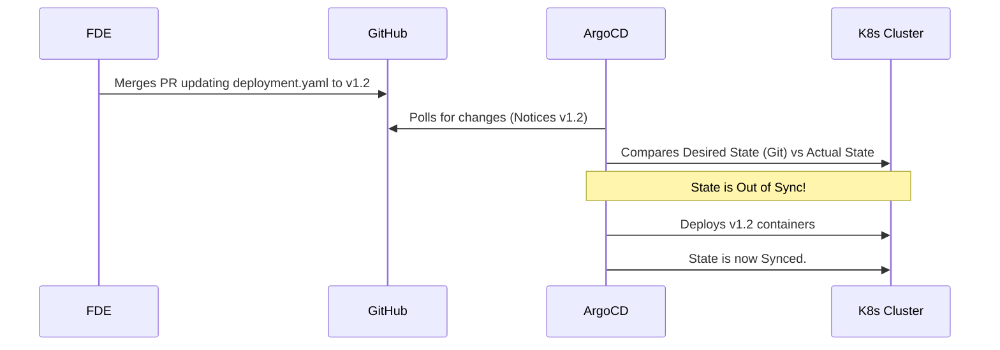

# Module 4.5: Enterprise GitOps & Branching Models

Welcome to **Module 4.5**. How do 500 engineers work on the same codebase without destroying it? They follow strict Branching Models. How do they deploy that code to 10,000 servers safely? They use GitOps.

---

## 1. Detailed Theory

### Branching Models
1. **GitFlow**: The classic, rigid enterprise model. 
   - `main` (Production only).
   - `develop` (Integration branch).
   - `feature/*` (Branches off develop).
   - `release/*` (Branches off develop, prepares for main).
   - `hotfix/*` (Branches directly off main to fix emergencies).
2. **Trunk-Based Development**: The modern, fast model used by high-performing teams (and AI startups). Developers push small, daily updates directly to `main` (the Trunk) via fast PRs, relying heavily on automated testing to catch bugs instead of relying on long manual QA cycles.

### GitOps
A deployment methodology where Git is the Single Source of Truth for your **Infrastructure** (not just your Python code). If you want to deploy a new AI agent container, you do not SSH into a server. You open a PR modifying a Kubernetes `.yaml` file in Git. When merged, an operator (like ArgoCD) detects the change and automatically syncs the cluster to match Git.

### ArgoCD Integration
ArgoCD is a Kubernetes controller. It sits inside your cluster, constantly watching a GitHub repository. If the Git repo says "Run 5 API Pods" but the cluster currently has 3, ArgoCD spins up 2 more automatically.

---

## 2. Architecture Diagram: GitOps Flow



---

## 3. Production Use Cases

1. **Disaster Recovery (GitOps)**: A junior engineer accidentally deletes the entire production Kubernetes cluster. Because all configurations were stored in GitHub via GitOps, the DevOps team spins up a blank cluster, installs ArgoCD, points it at GitHub, and the entire platform rebuilds itself automatically in 10 minutes.
2. **Trunk-Based Feature Flags**: You are building a complex Multi-Agent system that isn't ready for users. Using Trunk-Based Development, you merge the code to `main` anyway, but wrap it in an `if ENABLE_MULTI_AGENT:`. The code is safe in production, but completely hidden from users until you toggle the flag.

---

## 4. Real Company Examples

- **Weaveworks**: Coined the term "GitOps". They evangelized the idea that operations should be managed via Pull Requests.
- **Palantir Apollo**: A massive, proprietary system that operates somewhat similarly to GitOps, managing the deployment of complex AI and data pipelines across hundreds of disconnected client networks based on declared configurations.

---

## 5. Coding Examples

### Trunk-Based Development (Feature Flagging in Python)
```python
import os
from fastapi import FastAPI

app = FastAPI()

# Loaded from an environment variable injected by DevOps
ENABLE_EXPERIMENTAL_AI = os.getenv("ENABLE_EXPERIMENTAL_AI", "false").lower() == "true"

@app.get("/chat")
def chat():
    if ENABLE_EXPERIMENTAL_AI:
        return {"response": "Using unstable GPT-4-Turbo multi-agent flow!"}
    else:
        return {"response": "Using stable GPT-3.5 standard flow."}
```
*(You can safely merge this to main. The code is deployed, but dormant).*

---

## 6. Hands-on Labs

**Lab: GitFlow Mental Sandbox**
**Objective**: Trace the path of code in GitFlow.
**Instructions**:
Write down the sequence of Git commands required to fix a critical bug in production using GitFlow.
1. You are on `main` (which is broken).
2. Branch off `main` to `hotfix/fix-auth`.
3. Fix code, add, commit.
4. Merge `hotfix/fix-auth` into `main`.
5. *Crucial Step*: What else must you merge this into? (Answer: You MUST also merge the hotfix into `develop`, otherwise the next release will re-introduce the bug!)

---

## 7. Assignments

**Assignment: CI/CD vs GitOps Explanation**
Write a 3-sentence explanation of the difference between "Push-based CI/CD" (GitHub Actions) and "Pull-based GitOps" (ArgoCD).
*(Answer Hint: Push-based CI/CD runs a script in GitHub that reaches out to the server and pushes new code. Pull-based GitOps has an agent living securely inside the server that reaches out to GitHub, pulls the configurations, and applies them internally).*

---

## 8. Interview Questions

1. **What is the main drawback of the GitFlow branching model?**
   *Answer Hint: "Merge Hell." Because feature branches live for weeks or months without merging into `main`, when developers finally try to merge, the codebase has changed so drastically that resolving the conflicts takes days.*
2. **What is Infrastructure as Code (IaC)?**
   *Answer Hint: Writing code (usually Terraform or YAML) to provision and manage servers, databases, and networks, rather than clicking around in the AWS console. This code is stored in Git, enabling GitOps.*
3. **If your code is in Git, and your infrastructure is in Git, where are your passwords?**
   *Answer Hint: NEVER in Git. Passwords and API keys are stored in Secret Managers (like AWS Secrets Manager or HashiCorp Vault). The Git configuration code merely contains a reference pointing to the vault (e.g., `<secret-arn>`), which the application resolves at runtime.*

---

## 9. Best Practices (FDE Standards)

- **Trunk-Based is the future**: If your team has strong automated PyTest coverage, push for Trunk-Based Development. It speeds up AI iteration loops massively compared to the sluggish GitFlow model.

---

## 10. Common Mistakes

- **Drift**: Manually SSHing into a Kubernetes cluster and changing a setting to fix a bug, but forgetting to update the YAML file in GitHub. ArgoCD will notice the manual change (Configuration Drift) and immediately overwrite your manual fix to match the Git state, bringing the bug back. *Fix: Never touch production manually. Always edit Git.*
