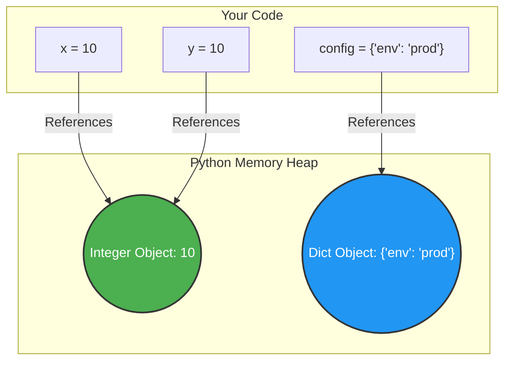

# Module 1: Python Fundamentals for AI Forward Deployed Engineers

Welcome to **Module 1**. As an AI Forward Deployed Engineer (FDE), your code must be robust, readable, and scalable from day one. You are not just writing scripts; you are building the connective tissue between complex AI models and enterprise data systems. This module covers the core building blocks of Python.

---

## 1. Detailed Theory

### Variables and Memory
In Python, variables are not "buckets" containing data; they are "labels" or "references" pointing to objects in memory. Python is dynamically typed (types are checked at runtime) and strongly typed (you cannot perform operations on incompatible types without explicit casting).

### Data Types
- **Primitives**: `int` (integers), `float` (decimals), `bool` (True/False), `str` (text).
- **Collections**:
  - `list` (`[]`): Mutable, ordered sequence. Crucial for storing sequences of events, API responses, or AI message histories.
  - `tuple` (`()`): Immutable, ordered sequence. Used for fixed records, like coordinates or configuration keys that shouldn't change.
  - `set` (`{}`): Mutable, unordered, unique elements. Extremely fast for membership testing (e.g., checking if an ID exists).
  - `dict` (`{key: value}`): Mutable, key-value mappings. The backbone of JSON data manipulation, configuration management, and API payloads.

### Operators
- **Arithmetic**: `+`, `-`, `*`, `/`, `//` (integer division), `%` (modulo), `**` (exponentiation).
- **Logical**: `and`, `or`, `not`.
- **Identity & Membership**: `is` (checks memory address), `in` (checks presence in a collection).

---

## 2. Architecture Diagram: Variable Memory Allocation

When you assign a variable in Python, the interpreter handles memory dynamically. Here is how Python references memory for immutable vs. mutable types.


*Note: Because integers are immutable, `x` and `y` point to the exact same object in memory (Python caches small integers).*

---

## 3. Production Use Cases

As an AI FDE, you will use these fundamentals constantly:
1. **API Payloads (`dict`, `list`)**: Every interaction with the OpenAI or Anthropic API involves building complex dictionaries and lists of messages.
2. **Data Deduplication (`set`)**: When ingesting millions of documents for a RAG system, you use sets to quickly filter out duplicate Document IDs.
3. **Environment Configuration (`str`, type casting)**: Reading environment variables (which are always strings) and casting them to integers (e.g., `MAX_RETRIES = int(os.getenv("RETRIES", "3"))`).

---

## 4. Real Company Examples

- **Palantir (Forward Deployed Engineering)**: FDEs at Palantir heavily use Python dictionaries and lists to map disparate enterprise data sources (e.g., SAP ERP systems) into a unified ontology format before running analytical models.
- **Scale AI**: Engineers use tuples to represent fixed bounding box coordinates `(x, y, width, height)` for computer vision tasks, ensuring the coordinates cannot be accidentally modified down the pipeline.

---

## 5. Coding Examples

### Type Casting and Safe I/O
When writing command-line tools for internal ops teams:
```python
# Raw input is always a string
user_input_str = input("Enter chunk size for Vector DB (e.g., 512): ")

# Type casting
try:
    chunk_size = int(user_input_str)
    print(f"Chunk size set to: {chunk_size} of type {type(chunk_size)}")
except ValueError:
    print("Invalid input. Defaulting to 256.")
    chunk_size = 256
```

### Advanced Dictionary & Set Usage
```python
# API Payload Construction
ai_request = {
    "model": "gpt-4-turbo",
    "temperature": 0.0,
    "messages": [
        {"role": "system", "content": "You are a helpful assistant."},
        {"role": "user", "content": "Analyze this data."}
    ]
}

# Modifying lists inside dictionaries
ai_request["messages"].append({"role": "assistant", "content": "Data received."})

# Set operations for filtering
existing_user_ids = {"usr_123", "usr_456", "usr_789"}
new_batch_ids = ["usr_456", "usr_999", "usr_123"]

# Fast deduplication and finding new users
unique_new_batch = set(new_batch_ids)
users_to_add = unique_new_batch - existing_user_ids
print(f"Users to insert into DB: {users_to_add}") # Output: {'usr_999'}
```

---

## 6. Hands-on Labs

**Lab 1: The API Configurator**
**Objective**: Build a script that initializes a configuration dictionary for an AI model pipeline, modifies the values based on simulated user input, and prints out the final JSON-like structure.
**Instructions**:
1. Create a dictionary with keys: `endpoint`, `api_key`, `max_tokens`, `allowed_models` (a set).
2. Cast a string "1024" to an integer and update `max_tokens`.
3. Add a new model "claude-3-opus" to the `allowed_models` set.
4. Extract the keys into a list and print them.

---

## 7. Assignments

**Assignment: Enterprise Log Parser Foundation**
You are given a raw string representing a single log line from a distributed AI application:
`"2023-10-27T10:00:00Z | ERROR | Model gpt-4 latency 1500ms | UserID: 9876"`

Your task (using only string methods, lists, and dicts):
1. Split the string to extract the Timestamp, Log Level, Message, and User ID.
2. Store these components in a dictionary.
3. Extract the numeric value of the latency (1500) and cast it to an integer.
4. Add a boolean flag to the dictionary `is_critical` which is `True` if the Log Level is "ERROR".

---

## 8. Interview Questions

1. **What is the difference between a `list` and a `tuple`? When would you use a `tuple` over a `list`?**
   *Answer Hint: Mutability. Use tuples for fixed data (hashable, can be dictionary keys) and lists for dynamic data.*
2. **How does Python manage memory for variables?**
   *Answer Hint: Variables are references to objects. Mention garbage collection and reference counting.*
3. **What is the time complexity of checking if an item exists in a `list` versus a `set`?**
   *Answer Hint: `O(n)` for lists, `O(1)` for sets.*

---

## 9. Best Practices (FDE Standards)

- **Use descriptive variable names**: Never use `x`, `y`, `temp`. Use `user_message_list`, `api_response_payload`, `retry_count`.
- **Prefer `dict.get(key, default)`**: Instead of `my_dict["key"]` which throws a `KeyError` if missing, use `.get()` to handle missing configurations safely.
- **Immutability by default**: If a collection of items shouldn't change throughout the script's execution, make it a `tuple` instead of a `list`. It prevents accidental bugs.

---

## 10. Common Mistakes

- **Modifying a list while iterating**: This causes indexing bugs. (You'll learn more about this in Module 2, but it applies to lists).
- **Confusing `is` with `==`**: 
  - `==` checks if the *values* are equal. 
  - `is` checks if they are the exact same object in memory. Always use `==` for comparing values (like strings or numbers).
- **Default mutable arguments**: (A preview of functions) Setting a default value to an empty list `[]` can cause data leaks between function calls.

---

## 11. End-to-End Project: AI CLI Configuration Generator

**Scenario**: You are deploying a new internal AI tool for your enterprise client. They need a quick command-line tool to generate configuration files based on their inputs.

**Code:**
```python
def main():
    print("=== AI Enterprise Tool Configurator ===")
    
    # 1. Gather Inputs
    project_name = input("Enter project name: ").strip()
    env = input("Enter environment (dev/prod): ").strip().lower()
    
    # 2. Type Casting and Validation
    try:
        timeout = int(input("Enter API timeout (seconds): "))
    except ValueError:
        print("Invalid number. Defaulting to 30 seconds.")
        timeout = 30
        
    # 3. Data Structures
    # Using a tuple for immutable valid environments
    VALID_ENVS = ("dev", "staging", "prod")
    
    if env not in VALID_ENVS:
        env = "dev"
        
    # Using a set to ensure unique tags
    tags_input = input("Enter tags separated by commas (e.g., ai,nlp,finance): ")
    tags_set = set(tags_input.replace(" ", "").split(","))
    
    # 4. Constructing the final configuration
    config = {
        "project": project_name,
        "environment": env,
        "api_settings": {
            "timeout_seconds": timeout,
            "retry_on_failure": True
        },
        "metadata": {
            "tags": list(tags_set) # Convert back to list for JSON compatibility later
        }
    }
    
    # 5. Output
    print("\n--- Generated Configuration ---")
    print(config)
    print("-------------------------------")

if __name__ == "__main__":
    main()
```
*Run this code locally. This represents the basic logic of parsing client parameters before initializing cloud infrastructure or AI pipelines.*
