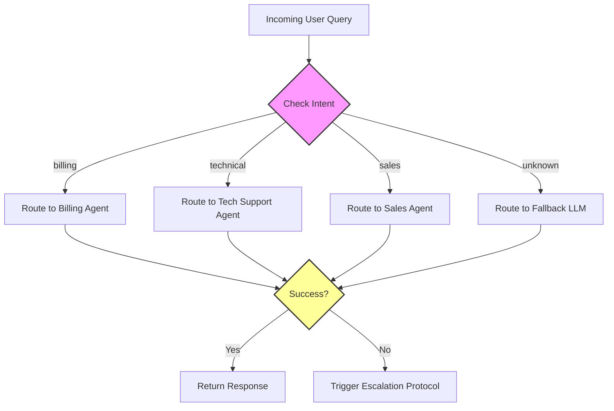

# Module 2: Control Flow for AI Forward Deployed Engineers

Welcome to **Module 2**. Control flow dictates how your program decides what to execute and when. In an AI engineering context, control flow is essential for routing user queries, handling API rate limits via retries, and processing massive streams of enterprise data conditionally.

---

## 1. Detailed Theory

### Conditionals (`if`, `elif`, `else`, Nested Conditions)
Conditionals allow your code to branch based on specific logic. Python evaluates expressions to Boolean (`True` or `False`).
- **Falsy values**: `None`, `False`, `0`, `""`, `[]`, `{}`, `set()`. Everything else is typically Truthy.
- **Nested Conditions**: Using `if` inside another `if`. Too much nesting leads to "Spaghetti Code" and should be avoided (using early returns or logical operators).

### Structural Pattern Matching (`match` / `case`)
Introduced in Python 3.10, this is Python's version of `switch/case`. It is incredibly powerful for routing complex payloads (like parsing different types of AI agent actions or webhook events).

### Iteration (`for`, `while`)
- **`for` loop**: Used when iterating over a known sequence (lists, strings, ranges, dictionaries). E.g., iterating over a batch of API requests.
- **`while` loop**: Used when the number of iterations is unknown, but a condition must be met. E.g., polling an async API until the status is "COMPLETED".

### Loop Control (`break`, `continue`, `pass`)
- **`break`**: Exits the loop entirely. Useful for stopping a search once an item is found.
- **`continue`**: Skips the rest of the current iteration and moves to the next one. Useful for filtering out invalid data inside a loop.
- **`pass`**: A null operation. Used as a placeholder for code you haven't written yet.

---

## 2. Architecture Diagram: Control Flow in AI Routing

This diagram shows a typical control flow for an AI prompt router, demonstrating `if/elif/else` logic.



---

## 3. Production Use Cases

1. **API Rate Limit Handling (`while` + `break`)**: Polling an AI model endpoint and waiting if a 429 Too Many Requests status is returned, breaking only when a 200 OK is received.
2. **Data Cleansing (`for` + `continue`)**: Iterating over 100,000 messy CSV rows, using `continue` to skip rows with missing critical fields before vectorizing them.
3. **Multi-Agent Intent Routing (`match`/`case`)**: Parsing the structured output from a classifier LLM and routing the request to the appropriate specialized worker agent.

---

## 4. Real Company Examples

- **Scale AI**: When managing human labeling queues, task distribution systems use complex `if/elif` logic to determine the priority, language, and difficulty of a task before assigning it to a labeler.
- **Anthropic**: The Claude API uses rate limiting logic (`while` loops under the hood) to handle exponential backoff internally when systems are overloaded.

---

## 5. Coding Examples

### Routing with `match`/`case`
```python
def route_agent_action(action_payload: dict):
    match action_payload:
        case {"tool": "search_db", "query": q}:
            print(f"Executing database search for: {q}")
        case {"tool": "send_email", "to": email, "body": body}:
            print(f"Sending email to {email}")
        case {"tool": "end_conversation"}:
            print("Conversation terminated by Agent.")
        case _:
            print("Unknown tool action. Falling back to default.")

# Simulating LLM JSON output
route_agent_action({"tool": "search_db", "query": "latest invoice"})
```

### Exponential Backoff using `while` and `break`
```python
import time
import random

def simulate_api_call():
    # 80% chance of failure to simulate rate limiting
    return 200 if random.random() > 0.8 else 429

max_retries = 5
retry_count = 0
wait_time = 1

while retry_count < max_retries:
    print(f"Attempt {retry_count + 1}...")
    status = simulate_api_call()
    
    if status == 200:
        print("API call successful!")
        break
    
    print(f"Rate limited (429). Waiting for {wait_time} seconds...")
    time.sleep(wait_time)
    wait_time *= 2  # Exponential backoff
    retry_count += 1
else:
    # This 'else' belongs to the 'while' loop. 
    # It executes ONLY if the loop finishes without a 'break'.
    print("CRITICAL: Max retries reached. Pipeline failed.")
```

---

## 6. Hands-on Labs

**Lab 1: The Token Truncator**
**Objective**: LLMs have token limits. You need to simulate a system that truncates a list of document chunks until it fits within a limit.
**Instructions**:
1. Create a list of integers representing chunk sizes (e.g., `[500, 800, 200, 1500, 300]`).
2. Set a `max_capacity = 2000`.
3. Iterate over the chunks using a `for` loop. Keep a running `total_tokens`.
4. If adding the next chunk exceeds `max_capacity`, use `break` to stop adding chunks.
5. Print the final list of accepted chunks and the total token count.

---

## 7. Assignments

**Assignment: Bad Data Filter**
You are building the ingestion pipeline for a RAG application. You receive a list of dictionaries representing documents:
```python
docs = [
    {"id": 1, "text": "Valid doc", "is_corrupt": False},
    {"id": 2, "text": "", "is_corrupt": False},
    {"id": 3, "text": "Error data", "is_corrupt": True},
    {"id": 4, "text": "Good doc 2", "is_corrupt": False}
]
```
**Task**:
Iterate through `docs`. Use `continue` to skip any document that is corrupt (`is_corrupt == True`) OR has empty text (`text == ""`). Print only the valid documents.

---

## 8. Interview Questions

1. **How do you avoid deeply nested `if` statements?**
   *Answer Hint: Use "early returns" or "Guard Clauses". Check for invalid conditions first and return/break, rather than nesting the valid condition inside the `if`.*
2. **What is the difference between `break` and `continue`?**
   *Answer Hint: `break` exits the entire loop. `continue` skips the rest of the current iteration and jumps to the next one.*
3. **What is the purpose of the `else` clause in a `for` or `while` loop?**
   *Answer Hint: It executes only if the loop terminates normally (i.e., the loop condition becomes false) and is NOT interrupted by a `break` statement. Extremely useful for "search and if not found" scenarios.*

---

## 9. Best Practices (FDE Standards)

- **Guard Clauses over Nesting**:
  *Bad:*
  ```python
  if user_exists:
      if user_has_credits:
          run_ai_model()
  ```
  *Good:*
  ```python
  if not user_exists or not user_has_credits:
      return False
  run_ai_model()
  ```
- **Use Truthiness**: Instead of `if len(my_list) > 0:`, just use `if my_list:`. It is more Pythonic and faster.
- **Match/Case for State Machines**: When building AI Agents that transition between states (e.g., `THINKING`, `ACTING`, `WAITING_FOR_USER`), use `match/case` over long `if/elif` chains.

---

## 10. Common Mistakes

- **Infinite Loops**: Writing a `while` loop but forgetting to update the condition variable inside the loop.
- **Modifying Collections While Iterating**: Doing `for item in my_list:` and then doing `my_list.remove(item)` inside the loop will cause elements to be skipped. *Fix: Iterate over a copy (`for item in my_list.copy():`) or use list comprehensions.*
- **Off-by-One Errors**: Using `range(1, 10)` thinking it includes 10. `range(start, stop)` goes up to `stop - 1`.

---

## 11. End-to-End Project: Local CLI AI Intent Router

**Scenario**: You are prototyping the routing logic for an enterprise Customer Support AI. Before hooking up the real LLM, you need a deterministic script to test the routing flow based on keywords.

**Code:**
```python
def main():
    print("--- Enterprise AI Support Router ---")
    print("Type 'exit' or 'quit' to terminate.")
    
    while True:
        user_input = input("\nUser Query: ").strip().lower()
        
        # 1. Loop Control
        if user_input in ("exit", "quit"):
            print("Terminating router...")
            break
            
        if not user_input:
            print("Empty query received. Please type something.")
            continue
            
        # 2. Simple intent classification (Mocking an LLM)
        intent = "unknown"
        if "password" in user_input or "login" in user_input:
            intent = "auth_issue"
        elif "invoice" in user_input or "billing" in user_input:
            intent = "billing_issue"
        elif "bug" in user_input or "error" in user_input:
            intent = "technical_issue"
            
        # 3. Routing via Match/Case
        print("Routing to Agent -> ", end="")
        match intent:
            case "auth_issue":
                print("SECURITY AGENT: Sending password reset link.")
            case "billing_issue":
                print("FINANCE AGENT: Retrieving latest invoice.")
            case "technical_issue":
                print("TECH SUPPORT AGENT: Please provide the error logs.")
            case _:
                print("FALLBACK AGENT: I'm not sure how to help. Routing to a human operator.")

if __name__ == "__main__":
    main()
```
*Run this code locally. Test typing different queries containing keywords to see how the system routes requests endlessly until you type 'exit'.*
