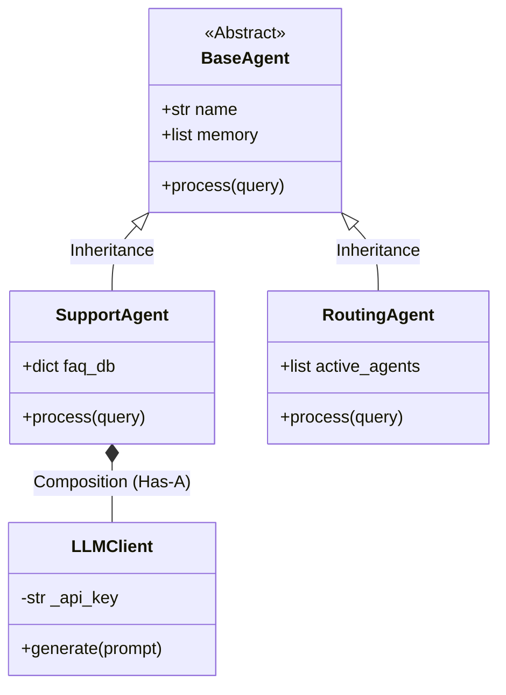

# Module 4: Object-Oriented Programming (OOP)

Welcome to **Module 4**. Up until now, we've written procedural code. For enterprise AI applications, you need to model real-world concepts (like `User`, `Agent`, `VectorDatabase`, `APIClient`) using Objects. Object-Oriented Programming (OOP) is crucial for building maintainable, stateful architectures.

---

## 1. Detailed Theory

### Classes and Objects
- **Class**: A blueprint or template (e.g., `LLMClient`).
- **Object**: An instance of a class (e.g., `openai_client = LLMClient(api_key="123")`).
- **Constructor (`__init__`)**: The method called automatically when an object is created to initialize its state.
- **`self`**: The reference to the current instance of the class. It must be the first parameter of any instance method.

### The 4 Pillars of OOP
1. **Encapsulation**: Bundling data (attributes) and methods that operate on that data within a class. Hiding internal state using private variables (e.g., `_api_key`).
2. **Inheritance**: Creating a new class that absorbs the properties and methods of an existing one. Avoids code duplication.
3. **Polymorphism**: The ability for different classes to provide different implementations of the same method (e.g., `generate_text()` doing different things in `OpenAIClient` vs `LocalLlamaClient`).
4. **Abstraction**: Hiding complex implementation details and exposing only the necessary parts. Often achieved using Abstract Base Classes (`abc` module).

### Composition over Inheritance
Instead of building massive class hierarchies (A inherits B inherits C), you build classes that *contain* other classes (A has a B). E.g., An `AIAgent` *has a* `MemoryBuffer` and *has a* `LLMClient`.

### Magic (Dunder) Methods
Special methods surrounded by double underscores (e.g., `__str__`, `__len__`, `__call__`). They allow objects to interact seamlessly with built-in Python syntax.

---

## 2. Architecture Diagram: OOP in a Multi-Agent System



---

## 3. Production Use Cases

1. **API Client Wrappers**: Building an OOP wrapper around the OpenAI API to handle rate limiting, token counting, and caching internally, exposing a clean `generate()` method to the rest of the app.
2. **Abstract AI Providers (Polymorphism)**: Defining a `BaseLLM` class. Then creating `OpenAILLM` and `AnthropicLLM` classes that inherit from it. The rest of your app doesn't need to know *which* provider it's using, allowing you to swap them instantly.
3. **Data Models**: Creating classes to represent chunks of data for a Vector Database (e.g., a `Document` class with attributes `text`, `metadata`, and `embedding`).

---

## 4. Real Company Examples

- **LangChain**: LangChain's entire architecture is built on OOP. They have a base `BaseChatModel` class, which is inherited by `ChatOpenAI`, `ChatAnthropic`, etc. This abstraction is what allows developers to swap models with one line of code.
- **HuggingFace (Transformers)**: Uses classes extensively (e.g., `AutoModel`, `AutoTokenizer`) to encapsulate the complex state of massive neural networks.

---

## 5. Coding Examples

### Abstraction and Polymorphism
```python
from abc import ABC, abstractmethod

# 1. Abstraction: Define a blueprint
class BaseLLMClient(ABC):
    def __init__(self, api_key: str):
        self._api_key = api_key # Encapsulated (Private) attribute
        
    @abstractmethod
    def generate(self, prompt: str) -> str:
        pass

# 2. Inheritance and Polymorphism
class OpenAILLM(BaseLLMClient):
    def generate(self, prompt: str) -> str:
        # Mocking OpenAI API Call
        return f"[OpenAI] Generated response for: '{prompt}' using key {self._api_key[-4:]}"

class AnthropicLLM(BaseLLMClient):
    def generate(self, prompt: str) -> str:
        # Mocking Anthropic API Call
        return f"[Claude] Processed prompt: '{prompt}' using key {self._api_key[-4:]}"

# 3. Usage
def run_agent(client: BaseLLMClient, query: str):
    # This function doesn't care which client it receives! (Polymorphism)
    print(client.generate(query))

gpt_client = OpenAILLM("sk-1234567890ABCDEF")
claude_client = AnthropicLLM("ant-1234567890XYZ")

run_agent(gpt_client, "Hello!")
run_agent(claude_client, "Hello!")
```

### Magic Methods
```python
class PromptTemplate:
    def __init__(self, template: str):
        self.template = template
        
    def __str__(self):
        # Defines what happens when you print() the object
        return f"Template: {self.template}"
        
    def __call__(self, **kwargs):
        # Makes the object callable like a function!
        return self.template.format(**kwargs)

# Usage
greet_template = PromptTemplate("Hello {name}, you are an {role}.")
print(greet_template) # Triggers __str__
formatted = greet_template(name="Alice", role="Admin") # Triggers __call__
print(formatted)
```

---

## 6. Hands-on Labs

**Lab: The Vector Database Mock**
**Objective**: Build a simple class that simulates a Vector Database collection.
**Instructions**:
1. Create a class `LocalVectorDB`.
2. In `__init__`, initialize an empty list `self.records`.
3. Create an `insert(self, doc_id: str, text: str)` method that appends a dictionary to `self.records`.
4. Create a `__len__(self)` magic method that returns the number of records.
5. Create an instance, insert 2 records, and print the `len()` of the database object.

---

## 7. Assignments

**Assignment: AI Agent Composition**
1. Create a `Memory` class that holds a list of chat messages. It should have methods `add_message(role, content)` and `get_history()`.
2. Create an `Agent` class.
3. The `Agent` should not inherit from `Memory`. Instead, use **Composition**: the `Agent`'s `__init__` should instantiate `self.memory = Memory()`.
4. Add a `chat(self, user_message)` method to `Agent` that adds the user message to memory, generates a mock response, adds the mock response to memory, and returns it.

---

## 8. Interview Questions

1. **What is the difference between `__init__` and `__new__`?**
   *Answer Hint: `__new__` creates the object in memory and returns it. `__init__` initializes the state of the object after it has been created.*
2. **What does the `@classmethod` decorator do?**
   *Answer Hint: It defines a method that operates on the Class itself rather than an instance. It takes `cls` as the first parameter instead of `self`. Often used for alternative constructors.*
3. **Why should you favor Composition over Inheritance?**
   *Answer Hint: Inheritance creates tight coupling and rigid hierarchies (the "Gorilla Banana problem"). Composition creates flexible, loosely coupled systems by assembling smaller, independent components.*

---

## 9. Best Practices (FDE Standards)

- **Use Private Variables appropriately**: Prefix variables with a single underscore (e.g., `self._config`) to signal to other developers that this is an internal variable and shouldn't be modified directly from outside the class.
- **Properties over Getters/Setters**: Instead of `get_name()` and `set_name()`, use Python's `@property` decorator to create clean, attribute-like access with underlying logic.
- **Keep `__init__` clean**: Avoid doing heavy computation or network calls in `__init__`. Initialization should be fast. Use a separate `connect()` or `load()` method for heavy lifting.

---

## 10. Common Mistakes

- **Forgetting `self`**: Defining a method `def process(data):` instead of `def process(self, data):` will cause a `TypeError` when called.
- **Mutable Class Attributes**: Defining an attribute at the class level instead of inside `__init__` causes it to be shared across *all instances* of the class!
  *Bad:*
  ```python
  class Agent:
      history = [] # Shared by ALL agents!
  ```
  *Good:*
  ```python
  class Agent:
      def __init__(self):
          self.history = [] # Unique to this instance
  ```

---

## 11. End-to-End Project: Factory Pattern for AI Providers

**Scenario**: You are building the core router for an enterprise middleware platform. Clients will request generations, and based on their subscription tier, you need to instantiate the correct AI provider class using the Factory Design Pattern.

**Code:**
```python
from abc import ABC, abstractmethod

# --- Core Abstractions ---
class AIProvider(ABC):
    @abstractmethod
    def generate(self, prompt: str) -> str:
        pass

class OpenAIProvider(AIProvider):
    def generate(self, prompt: str) -> str:
        return f"[Premium] OpenAI output for '{prompt}'"

class OpenSourceProvider(AIProvider):
    def generate(self, prompt: str) -> str:
        return f"[Standard] LLaMA output for '{prompt}'"

# --- The Factory ---
class AIFactory:
    @staticmethod
    def get_provider(tier: str) -> AIProvider:
        """Instantiates the correct provider based on user tier."""
        if tier == "premium":
            return OpenAIProvider()
        elif tier == "standard":
            return OpenSourceProvider()
        else:
            raise ValueError(f"Unknown tier: {tier}")

# --- Application Logic ---
def main():
    print("--- Enterprise Middleware ---")
    
    # 1. Route Premium Request
    premium_user_provider = AIFactory.get_provider("premium")
    print(premium_user_provider.generate("Write a financial report."))
    
    # 2. Route Standard Request
    standard_user_provider = AIFactory.get_provider("standard")
    print(standard_user_provider.generate("Write a financial report."))

if __name__ == "__main__":
    main()
```
