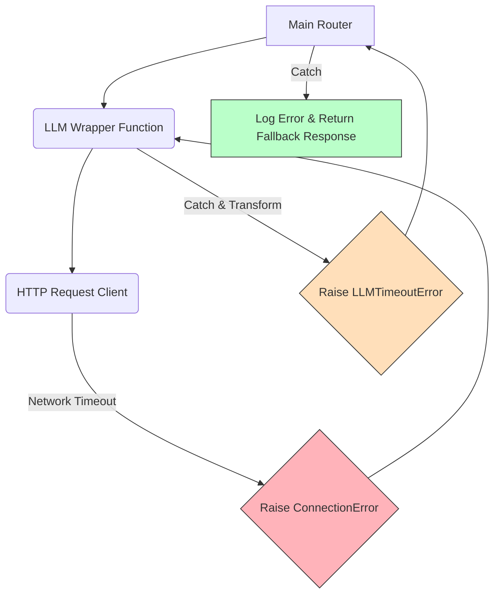

# Module 5: Exception Handling for AI Forward Deployed Engineers

Welcome to **Module 5**. In enterprise environments, failure is not an option—it is an inevitability. APIs rate limit, databases go down, users input malformed JSON, and LLMs return hallucinated structures. Your Python code must anticipate and handle these exceptions gracefully without crashing the entire pipeline.

---

## 1. Detailed Theory

### `try`, `except`, `finally`
- **`try`**: The block of code where you attempt an operation that might fail (e.g., parsing a JSON string).
- **`except`**: The block that executes if a specific exception is raised in the `try` block. You can chain multiple `except` blocks to handle different types of errors differently.
- **`finally`**: A block of code that executes *no matter what* (whether an exception occurred or not). Used strictly for cleanup (closing database connections, clearing temporary files).

### The `raise` Keyword
Used to intentionally trigger an exception. In FDE work, you often catch a generic error, log the critical context, and `raise` it again to let the higher-level routing logic handle it.

### Custom Exceptions
Inheriting from Python's base `Exception` class to create domain-specific errors. Instead of throwing a generic `ValueError`, an AI pipeline should throw a `PromptTooLongError` or `LLMFormatError`.

---

## 2. Architecture Diagram: Exception Bubbling

How an exception bubbles up from an API call to the main router.



---

## 3. Production Use Cases

1. **JSON Parsing Resilience**: Catching `json.JSONDecodeError` when an LLM fails to output valid JSON for a structured data extraction task, triggering a retry or fallback prompt.
2. **Database Cleanup**: Using the `finally` block to ensure a database transaction is rolled back and the connection is returned to the pool, even if the data insertion fails.
3. **Custom Domain Errors**: Throwing a `VectorDBConnectionError` to specifically trigger an alert to the DevOps PagerDuty, rather than a generic HTTP error.

---

## 4. Real Company Examples

- **OpenAI Python SDK**: The SDK defines highly specific custom exceptions like `RateLimitError`, `AuthenticationError`, and `APIConnectionError`. This allows engineers using the SDK to write precise `except` blocks rather than catching all `Exception`.
- **Snowflake (Data Pipelines)**: Data ingestion pipelines heavily utilize `finally` blocks to release file locks on massive CSV dumps, preventing deadlocks when parsing fails.

---

## 5. Coding Examples

### The Robust API Caller
```python
import time

class LLMRateLimitError(Exception):
    """Custom exception raised when the LLM provider rate limits us."""
    pass

def mock_llm_call(prompt: str):
    # Simulate a rate limit
    raise Exception("HTTP 429: Too Many Requests")

def safe_generate(prompt: str):
    try:
        print(f"Attempting to generate response for: {prompt}")
        response = mock_llm_call(prompt)
        return response
    except Exception as e:
        if "429" in str(e):
            # Transform generic exception to domain-specific
            print("Detected rate limit. Transforming error...")
            raise LLMRateLimitError(f"Provider rejected request: {e}")
        else:
            # Re-raise if it's an unknown error
            raise
    finally:
        print("[CLEANUP] Closing temporary HTTP session.")

# Execution
try:
    safe_generate("Summarize this text.")
except LLMRateLimitError as e:
    print(f"Handled gracefully in main loop: {e}")
```

---

## 6. Hands-on Labs

**Lab: The JSON Validator**
**Objective**: Handle malformed LLM outputs gracefully.
**Instructions**:
1. Import the `json` module.
2. Create a string `bad_json = "{'key': 'value'"`.
3. Write a `try` block that attempts to parse it using `json.loads(bad_json)`.
4. Catch the `json.JSONDecodeError`.
5. In the `except` block, print "Failed to parse JSON. Falling back to default." and set a dictionary `data = {"status": "error"}`.
6. Print `data`.

---

## 7. Assignments

**Assignment: Enterprise Error Hierarchy**
1. Create a base custom exception called `AIPlatformError` (inherits from `Exception`).
2. Create two specific exceptions that inherit from `AIPlatformError`:
   - `TokenLimitExceededError`
   - `ModelUnavailableError`
3. Write a function `route_query(query, tokens)`:
   - If `tokens > 8000`, raise `TokenLimitExceededError`.
   - If `query == "use_gpt_5"`, raise `ModelUnavailableError`.
4. Write a main loop that tests both scenarios and catches them specifically, printing a custom user-friendly message for each.

---

## 8. Interview Questions

1. **Why is it a bad practice to write `except Exception as e:`?**
   *Answer Hint: Catching the base `Exception` class catches EVERYTHING, including typos in your code (like `NameError`) and system exits. It hides bugs. You should always catch the most specific exception possible (e.g., `KeyError`, `ConnectionError`).*
2. **What is the difference between `Exception` and `BaseException` in Python?**
   *Answer Hint: `BaseException` is the root of all exceptions. `Exception` inherits from it. System-exiting exceptions like `KeyboardInterrupt` (Ctrl+C) inherit from `BaseException`, not `Exception`. Therefore, catching `Exception` allows Ctrl+C to still kill the program.*
3. **When must you use a `finally` block instead of just putting code after the `try/except`?**
   *Answer Hint: If an exception is raised in the `try` block and NOT caught by the `except` block (or if a `return` statement is called inside the `try`), the code after the block will not execute. The `finally` block guarantees execution.*

---

## 9. Best Practices (FDE Standards)

- **Fail Fast**: If a critical configuration (like an API key) is missing, raise a `ValueError` immediately upon application startup, rather than letting the application crash later when making an API call.
- **Log the Stack Trace**: In the `except` block, use the `logging` module to log the error with `exc_info=True` so you have the full stack trace for debugging, while returning a clean error message to the user.
- **Provide Actionable Error Messages**: `raise ValueError("Invalid input")` is terrible. `raise ValueError("Vector size mismatch: Expected 1536, got 768.")` saves hours of debugging.

---

## 10. Common Mistakes

- **Silent Failures**:
  ```python
  try:
      save_to_database(data)
  except:
      pass # NEVER DO THIS
  ```
  This completely swallows the error. If the database goes down, you will never know until the client complains.
- **Catching `Exception` for logic control**: Exceptions are for *exceptional* circumstances (errors), not for standard control flow (like checking if a key exists in a dictionary—use `.get()` instead).

---

## 11. End-to-End Project: Resilience Wrapper

**Scenario**: You are deploying a microservice that queries a vector database. The database is sometimes unreachable. You need a wrapper that catches connection errors, logs them, and returns a safe fallback response so the UI doesn't crash.

**Code:**
```python
import logging

# Set up basic logging
logging.basicConfig(level=logging.ERROR)

class VectorDBConnectionError(Exception):
    pass

def query_pinecone(vector: list):
    # Simulating a sudden database outage
    raise VectorDBConnectionError("Timeout connecting to index 'enterprise-rag-v1'")

def search_documents(query_text: str):
    print(f"\n[INFO] Starting search for: '{query_text}'")
    mock_vector = [0.1, 0.2, 0.3]
    
    try:
        results = query_pinecone(mock_vector)
        return results
    except VectorDBConnectionError as e:
        # 1. Log for the engineering team
        logging.error(f"Vector DB Failure: {str(e)}", exc_info=False) # Set to True in prod
        
        # 2. Return safe fallback for the client
        return {
            "status": "degraded",
            "message": "AI Search is temporarily unavailable. Displaying standard search results.",
            "data": []
        }
    finally:
        print("[INFO] Search request lifecycle completed.")

def main():
    response = search_documents("Quarterly revenue reports")
    print(f"Client UI Receives: {response}")

if __name__ == "__main__":
    main()
```
