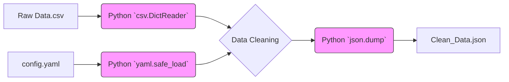

# Module 6: File Handling for AI Forward Deployed Engineers

Welcome to **Module 6**. AI applications consume massive amounts of data and generate extensive logs. Knowing how to efficiently read and write text, CSV, JSON, and YAML files is a fundamental requirement for building pipelines, loading configurations, and interacting with the file system safely.

---

## 1. Detailed Theory

### Context Managers (`with` statement)
In Python, you should always use the `with` statement when opening files. It acts as a context manager, ensuring that the file is automatically closed when the block of code exits, even if an exception is raised.

### Text Files (`.txt`)
Basic file I/O. Use `mode="r"` for reading, `"w"` for writing (overwrites), and `"a"` for appending.

### JSON Files (`.json`)
The lingua franca of the web and AI APIs. The `json` module provides `json.load()` (read file to dict) and `json.dump()` (write dict to file). Note: `loads()` and `dumps()` operate on strings, not files.

### CSV Files (`.csv`)
Comma-Separated Values. Used heavily for tabular datasets (like fine-tuning data). The `csv` module provides `csv.reader` and `csv.DictReader` (which parses rows into dictionaries based on the header).

### YAML Files (`.yaml` / `.yml`)
Yet Another Markup Language. The industry standard for configuration files (Kubernetes, Docker Compose, CI/CD pipelines, and AI agent configs). Requires the external `PyYAML` package.

---

## 2. Architecture Diagram: File Processing Pipeline



---

## 3. Production Use Cases

1. **System Prompt Loading (.txt / .md)**: Storing complex LLM system prompts in external text files rather than hardcoding massive strings in Python code.
2. **Batch Processing (CSV -> JSONL)**: Reading a massive CSV of customer reviews and converting it line-by-line into a JSONL (JSON Lines) file required by OpenAI for model fine-tuning.
3. **Configuration Management (.yaml)**: Loading database URIs, API keys, and model parameters from a `config.yaml` file on application startup.

---

## 4. Real Company Examples

- **Scale AI**: Processes millions of rows of CSV data containing raw customer data, transforming and saving them into strict JSON schemas required by labeling tools.
- **Kubernetes / Docker**: Every infrastructure deployment you will do as an FDE relies heavily on reading, templating, and generating YAML files via Python.

---

## 5. Coding Examples

### Context Managers and Text I/O
```python
# Writing to a file (creates it if it doesn't exist)
with open("system_prompt.txt", "w", encoding="utf-8") as file:
    file.write("You are an expert financial analyst AI.\n")
    file.write("Always cite your sources.")

# Reading from the file safely
with open("system_prompt.txt", "r", encoding="utf-8") as file:
    content = file.read()
    print(content)
```

### JSON Processing
```python
import json

data = {
    "model": "gpt-4",
    "parameters": {"temperature": 0.2, "top_p": 0.9}
}

# Write Dict to JSON File
with open("model_config.json", "w") as f:
    # indent=4 makes it human-readable (pretty print)
    json.dump(data, f, indent=4)

# Read JSON File to Dict
with open("model_config.json", "r") as f:
    loaded_config = json.load(f)
    print(f"Loaded Model: {loaded_config['model']}")
```

---

## 6. Hands-on Labs

**Lab: The CSV to JSON Converter**
**Objective**: Transform tabular data into JSON format.
**Instructions**:
1. Create a file `users.csv` manually with the following content:
   ```text
   id,name,role
   1,Alice,Admin
   2,Bob,User
   ```
2. Write a Python script using the `csv` module and `csv.DictReader`.
3. Open `users.csv` and append each row (which is a dictionary) to a list.
4. Use the `json` module to dump this list into a new file called `users.json` with `indent=2`.

---

## 7. Assignments

**Assignment: AI Log Analyzer**
1. You have a log file `ai_requests.log` where each line is a JSON string representing a single API request:
   ```json
   {"timestamp": "2023-10-01T10:00:00Z", "model": "gpt-4", "tokens": 150}
   {"timestamp": "2023-10-01T10:05:00Z", "model": "claude-2", "tokens": 300}
   {"timestamp": "2023-10-01T10:10:00Z", "model": "gpt-4", "tokens": 200}
   ```
2. Write a script that reads this file line by line.
3. Parse each line using `json.loads()`.
4. Calculate and print the total number of tokens consumed specifically by the "gpt-4" model.

---

## 8. Interview Questions

1. **Why is using `with open(...)` preferred over just calling `f = open(...)`?**
   *Answer Hint: The `with` statement acts as a context manager. It guarantees that `f.close()` is called automatically when the block ends, preventing memory leaks and locked files, even if an exception occurs.*
2. **What is the difference between `json.load()` and `json.loads()`?**
   *Answer Hint: `load()` reads directly from a file object. `loads()` (load string) parses a JSON-formatted Python string.*
3. **When parsing a 10GB CSV file, how do you prevent Python from running out of memory?**
   *Answer Hint: You iterate over the file object line-by-line using a `for` loop (or `csv.reader`). You never call `.read()` or `.readlines()` on massive files because that loads the entire file into RAM.*

---

## 9. Best Practices (FDE Standards)

- **Always specify encoding**: When opening text files, always explicitly state `encoding="utf-8"`. Windows defaults to `cp1252`, which will crash when trying to read emojis or special characters common in AI text generation.
- **Use `pathlib` over `os.path`**: Modern Python code uses `from pathlib import Path` for file paths. It handles Windows/Linux slash differences automatically and provides an object-oriented approach to file systems.
- **YAML `safe_load`**: Never use `yaml.load()`, as it can execute arbitrary Python code embedded in the YAML file (a major security vulnerability). Always use `yaml.safe_load()`.

---

## 10. Common Mistakes

- **File Paths**: Hardcoding `C:\\Users\\Bob\\project\\config.json`. If you run this on a Linux server in production, it will fail. Always use relative paths or `pathlib`.
- **Forgetting `indent` in JSON**: Writing JSON data without `indent=4`. It writes a single, massive, unreadable line of text.

---

## 11. End-to-End Project: Configuration Loader Module

**Scenario**: You are building an enterprise AI agent. Instead of hardcoding API keys and model parameters in your code, you need a configuration loader that reads a YAML file and initializes the application state safely.

*Pre-requisite: Run `pip install pyyaml`*

**1. Create `config.yaml` manually:**
```yaml
app_name: "Enterprise RAG Pipeline"
environment: "production"
llm_settings:
  provider: "openai"
  model: "gpt-4-turbo"
  temperature: 0.1
vector_db:
  host: "db.internal.corp"
  port: 5432
```

**2. Python Code (`config_loader.py`):**
```python
import yaml
from pathlib import Path

class ConfigError(Exception):
    pass

def load_environment_config(config_path: str) -> dict:
    path = Path(config_path)
    
    if not path.exists():
        raise ConfigError(f"Configuration file not found at {path.absolute()}")
        
    try:
        with open(path, "r", encoding="utf-8") as file:
            # ALWAYS use safe_load for YAML
            config_data = yaml.safe_load(file)
            print(f"[SUCCESS] Loaded config for: {config_data.get('app_name')}")
            return config_data
    except yaml.YAMLError as e:
        raise ConfigError(f"Failed to parse YAML file: {e}")

def main():
    try:
        # Load the configuration
        app_config = load_environment_config("config.yaml")
        
        # Access nested dictionaries safely
        llm_model = app_config.get("llm_settings", {}).get("model")
        print(f"[INIT] Booting up AI Agent with model: {llm_model}")
        
    except ConfigError as e:
        print(f"[CRITICAL FAILURE] {e}")

if __name__ == "__main__":
    main()
```
