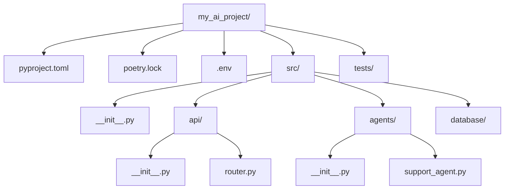

# Module 7: Modules and Packages for AI FDEs

Welcome to **Module 7**. AI applications are not single scripts; they are complex systems involving API clients, database ORMs, web frameworks, and ML libraries. Structuring your code logically into modules and managing external dependencies cleanly is critical for production deployments.

---

## 1. Detailed Theory

### Modules and Imports
- **Module**: Any Python file (`.py`).
- **Importing**: Using `import` or `from ... import ...` to bring code from one module into another. 

### Package Structure
- **Package**: A directory containing multiple Python modules.
- **`__init__.py`**: Historically required to make Python treat a directory as a package (though optional in Python 3.3+, still highly recommended). It is executed when the package is imported and is often used to expose a cleaner public API.

### Virtual Environments
A self-contained directory tree that contains a Python installation for a particular version of Python, plus a number of additional packages. **Never** install dependencies globally on your machine or a server.

### Dependency Management (Pip & Poetry)
- **Pip & `requirements.txt`**: The standard package installer. You freeze dependencies into a text file.
- **Poetry**: Modern dependency management and packaging tool. Uses `pyproject.toml` and creates a lockfile (`poetry.lock`) ensuring perfectly reproducible builds across environments.

---

## 2. Architecture Diagram: Standard AI Project Layout



---

## 3. Production Use Cases

1. **Dependency Pinning**: Using Poetry to lock `langchain` and `openai` to specific versions because their APIs change rapidly, preventing random production crashes on deployment.
2. **Encapsulation via `__init__.py`**: Hiding internal implementation files (e.g., `_utils.py`) and exposing only the necessary Agent classes in the package's `__init__.py` so other developers have a clean import experience.
3. **Containerization**: Copying the `poetry.lock` file into a Docker container and running `poetry install --no-dev` to build an isolated, lightweight production image.

---

## 4. Real Company Examples

- **Hugging Face**: The `transformers` library uses massive, carefully constructed `__init__.py` files to lazily load heavy machine learning models only when the developer explicitly imports them, saving memory and startup time.
- **Scale AI / Anthropic**: Strictly enforce the use of `Poetry` or similar modern dependency resolvers (like `uv`) to ensure that every developer and CI/CD pipeline builds the exact same environment down to the sub-dependency level.

---

## 5. Coding Examples

### Clean Package Imports via `__init__.py`

Assume this directory structure:
```text
agents/
  ├── __init__.py
  ├── _internal_helpers.py
  ├── router.py
  └── support.py
```

**`agents/support.py`**
```python
class CustomerSupportAgent:
    def solve(self, issue):
        return f"Solving: {issue}"
```

**`agents/__init__.py`**
```python
# Expose only what is needed, hiding internal helper files
from .support import CustomerSupportAgent
from .router import IntentRouter

__all__ = ["CustomerSupportAgent", "IntentRouter"]
```

**`main.py`**
```python
# Now the import is super clean!
from agents import CustomerSupportAgent

agent = CustomerSupportAgent()
```

---

## 6. Hands-on Labs

**Lab: Setting up a Poetry Project**
*Pre-requisite: Install Poetry globally (`pip install poetry`).*
**Objective**: Initialize a modern Python project.
**Instructions**:
1. Open your terminal in a new directory `ai_tool`.
2. Run `poetry init`. Answer the prompts (you can press enter to accept defaults).
3. Run `poetry add openai pydantic`. Notice how it creates a `pyproject.toml` and a `poetry.lock` file.
4. Run `poetry add --group dev pytest`. This adds testing tools only for development.
5. Run `poetry run python -c "import openai; print(openai.__version__)"` to execute code inside the virtual environment.

---

## 7. Assignments

**Assignment: The Modular AI App**
1. Create a directory structure:
   ```text
   myapp/
     ├── main.py
     └── utils/
         ├── __init__.py
         ├── text_cleaner.py
         └── logger.py
   ```
2. In `text_cleaner.py`, write a function `clean(text)` that removes whitespace.
3. In `logger.py`, write a function `log(msg)` that prints `[INFO] msg`.
4. In `__init__.py`, import both functions so they can be accessed directly from `utils`.
5. In `main.py`, write `from utils import clean, log` and use both functions.

---

## 8. Interview Questions

1. **What is the purpose of a virtual environment?**
   *Answer Hint: To isolate project dependencies. It prevents conflicts where Project A requires `openai==0.28` and Project B requires `openai==1.0.0`.*
2. **What problem does `poetry.lock` (or `requirements.txt` with exact versions) solve?**
   *Answer Hint: "It works on my machine" syndrome. It guarantees deterministic, reproducible builds across development, staging, and production.*
3. **What does `if __name__ == "__main__":` do?**
   *Answer Hint: It allows a script to be executed standalone, but prevents the code under that block from running if the file is imported as a module in another script.*

---

## 9. Best Practices (FDE Standards)

- **Never `import *`**: Using `from module import *` pollutes your namespace and makes it impossible to figure out where a function came from. Always import explicitly.
- **Absolute vs Relative Imports**: Use absolute imports (`from src.agents.support import Agent`) in large projects to avoid confusing path resolution. Use relative imports (`from .support import Agent`) only within the same package.
- **Lockfiles in Version Control**: Always commit your `poetry.lock` (or `Pipfile.lock`) to Git. This is the entire point of having a lockfile.

---

## 10. Common Mistakes

- **Circular Imports**: Module A imports Module B, but Module B imports Module A. Python cannot resolve this. *Fix: Refactor the shared logic into a Module C that both A and B can import.*
- **Naming a file after a standard library**: Creating a file named `json.py` or `random.py`. When you type `import json`, Python will load your local file instead of the standard library, crashing everything.

---

## 11. End-to-End Project: CLI Bootstrapper

**Scenario**: You are an FDE starting a new client engagement. You want to automate the creation of your standard project folder structure.

**Code (`setup_project.py`):**
```python
import os
from pathlib import Path

def create_structure(base_name: str):
    base_path = Path(base_name)
    
    # 1. Define the directories
    directories = [
        base_path / "src" / "api",
        base_path / "src" / "agents",
        base_path / "src" / "core",
        base_path / "tests"
    ]
    
    # 2. Define the files
    files = {
        base_path / "src" / "__init__.py": "",
        base_path / "src" / "api" / "__init__.py": "",
        base_path / "src" / "agents" / "__init__.py": "",
        base_path / "src" / "core" / "__init__.py": "",
        base_path / "src" / "main.py": "def run():\n    print('App Started')\n\nif __name__ == '__main__':\n    run()\n",
        base_path / "README.md": f"# {base_name}\n\nEnterprise AI Solution.",
        base_path / "requirements.txt": "fastapi\nlangchain\nopenai\npydantic\n"
    }
    
    print(f"Bootstrapping AI Project: {base_name}...")
    
    # Create directories
    for dir_path in directories:
        dir_path.mkdir(parents=True, exist_ok=True)
        print(f"Created directory: {dir_path}")
        
    # Create files
    for file_path, content in files.items():
        with open(file_path, "w") as f:
            f.write(content)
        print(f"Created file: {file_path}")
        
    print("\n[SUCCESS] Project bootstrapped! Run `pip install -r requirements.txt` to begin.")

if __name__ == "__main__":
    create_structure("enterprise_copilot")
```
