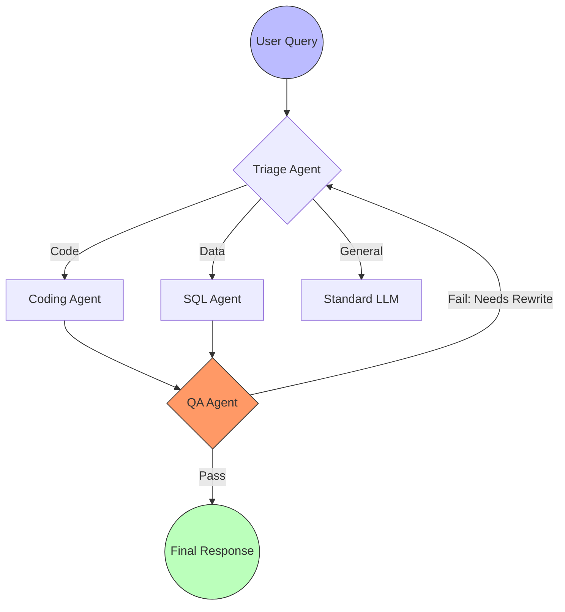

# Module 8: Data Structures & Algorithms for AI FDEs

Welcome to **Module 8**. While AI models do the heavy lifting for reasoning, Data Structures and Algorithms (DSA) form the plumbing. Efficient data routing, memory management, and graph traversals (for agents) require a solid understanding of time and space complexity. 

---

## 1. Detailed Theory

### Big O Notation (Time & Space Complexity)
- **O(1) [Constant]**: Direct access (e.g., dictionary lookup).
- **O(log N) [Logarithmic]**: Binary search.
- **O(N) [Linear]**: Iterating through a list.
- **O(N log N)**: Efficient sorting (e.g., Merge Sort).
- **O(N^2) [Quadratic]**: Nested loops (Avoid in large data pipelines).

### Core Data Structures
- **Arrays/Lists (O(1) access, O(N) search)**: Dynamic arrays in Python. Used for storing sequential data like token streams.
- **Stacks (LIFO)**: Last In, First Out. Used for undo operations or tracking nested API calls.
- **Queues (FIFO)**: First In, First Out. Critical for task processing (e.g., Celery task queues for long-running LLM jobs).
- **Hash Maps (O(1) lookup)**: Python Dictionaries. Used for caching LLM responses and rapid lookups.
- **Trees (Logarithmic)**: Hierarchical data. Used in Decision Trees, ASTs, and representing structured JSON outputs.
- **Heaps**: Priority queues. Used when routing tasks to AI agents based on urgency (e.g., Enterprise support routing).
- **Graphs**: Nodes connected by edges. The fundamental data structure behind **Agentic Workflows** (e.g., LangGraph), RAG knowledge graphs, and neural networks.

---

## 2. Architecture Diagram: Agent Routing via Graph

LangGraph and state machines use directed cyclic/acyclic graphs to manage multi-agent flow.



---

## 3. Production Use Cases

1. **Caching LLM Calls (Hash Map)**: Before hitting the expensive OpenAI API, checking an in-memory dictionary or Redis (a distributed hash map) in O(1) time to see if the exact prompt has been answered recently.
2. **Task Processing (Queues)**: When 1,000 users upload PDFs for embedding simultaneously, placing the tasks in a RabbitMQ or Redis queue (FIFO) so worker nodes can process them asynchronously without crashing the web server.
3. **Semantic Search Optimization (Trees/Graphs)**: Vector databases (like Pinecone or FAISS) use HNSW (Hierarchical Navigable Small World) graphs and KD-Trees under the hood to perform approximate nearest neighbor search in O(log N) rather than checking every single embedding in O(N).

---

## 4. Real Company Examples

- **LangChain (LangGraph)**: Heavily utilizes Graph data structures to define stateful, cyclic AI workflows where agents can loop and communicate until a condition is met.
- **Palantir**: Uses massive Knowledge Graphs (Nodes = Entities like People/Organizations, Edges = Relationships) to power AI-assisted intelligence analysis.

---

## 5. Coding Examples

### Caching with a Hash Map (O(1) Time)
```python
# Simulated Cache
llm_cache = {}

def get_ai_response(prompt: str):
    # O(1) lookup
    if prompt in llm_cache:
        print("[CACHE HIT] Returning saved response.")
        return llm_cache[prompt]
    
    print("[API CALL] Simulating expensive LLM generation...")
    # Simulate API cost and time
    response = f"Generated text for: {prompt}"
    
    # Save to cache
    llm_cache[prompt] = response
    return response

# Execution
print(get_ai_response("What is Python?")) # Miss
print(get_ai_response("What is Python?")) # Hit (Instant)
```

### Queue for Task Processing (FIFO)
```python
from collections import deque
import time

# deque (Double Ended Queue) is O(1) for appending/popping from ends
# A standard Python list is O(N) when popping from index 0!
task_queue = deque()

# Add tasks
task_queue.append("Embed doc_1.pdf")
task_queue.append("Embed doc_2.pdf")
task_queue.append("Embed doc_3.pdf")

print("Starting async worker...")
while task_queue:
    # Pop from the front (left) in O(1) time
    current_task = task_queue.popleft()
    print(f"Processing: {current_task}...")
    time.sleep(0.5) # Simulate work

print("Queue empty. Worker resting.")
```

---

## 6. Hands-on Labs

**Lab: The Stack-based Prompt Reverter**
**Objective**: Build an "Undo" feature for a prompt engineering tool using a Stack (LIFO).
**Instructions**:
1. Initialize a standard list `prompt_history = []`.
2. Append three string versions of a prompt to the list (e.g., "Summarize", "Summarize in 5 bullet points", "Summarize in 5 bullet points like a pirate").
3. To perform an "Undo", use `prompt_history.pop()` (which removes and returns the last element in O(1) time).
4. Print the current state of the prompt.

---

## 7. Assignments

**Assignment: Agent Priority Queue**
You are building the support router. Some users are VIPs and their tickets should jump the queue.
1. Import `heapq` (Python's priority queue module).
2. Create an empty list `support_queue = []`.
3. Use `heapq.heappush(support_queue, (priority_integer, "Ticket Data"))`.
   *(Hint: In Python heaps, lower numbers represent higher priority).*
4. Insert: Priority 3 (Standard User), Priority 1 (VIP User), Priority 2 (Premium User).
5. Use a `while` loop and `heapq.heappop()` to process and print the tickets. Notice the order!

---

## 8. Interview Questions

1. **Why should you use `collections.deque` instead of a standard `list` for a queue?**
   *Answer Hint: `list.pop(0)` takes O(N) time because it has to shift every other element in memory one space to the left. `deque.popleft()` takes O(1) time.*
2. **What is the time complexity of looking up a value in a dictionary, and why?**
   *Answer Hint: O(1) average case. Dictionaries are Hash Maps; the key is hashed to compute a direct memory address.*
3. **How do Vector Databases find similar text so quickly?**
   *Answer Hint: They don't do an O(N) linear scan comparing the input to every document. They use specialized data structures like HNSW graphs or KD-Trees to find Approximate Nearest Neighbors in sub-linear time.*

---

## 9. Best Practices (FDE Standards)

- **Know when to use Sets**: If you have a list of 100,000 document IDs and need to check if a new document is a duplicate, `if doc_id in doc_list:` takes O(N) time. Convert the list to a set first: `doc_set = set(doc_list)`, then `if doc_id in doc_set:` takes O(1) time. This single change can turn a 2-hour script into a 5-second script.
- **Memory Profiling**: Large dictionaries consume a lot of memory. If dealing with tens of millions of records, consider database solutions (Redis/SQLite) instead of holding them in RAM.

---

## 10. Common Mistakes

- **Quadratic Time Algorithms (O(N^2))**: 
  ```python
  # Searching a list inside a list comprehension or loop
  for item in massive_list_A:
      if item in massive_list_B: # O(N) search inside an O(N) loop!
          pass
  ```
  *Fix: Make `massive_list_B` a set first.*

---

## 11. End-to-End Project: Graph-based Agent Router

**Scenario**: You are building a hardcoded version of a LangGraph-style workflow. You will represent agents as nodes in a graph and simulate routing a request through them.

**Code:**
```python
# A simple Directed Graph representation using an Adjacency List
# Nodes are Agents, Edges are routing paths based on conditions
workflow_graph = {
    "Triage": ["BillingAgent", "TechAgent", "Escalation"],
    "BillingAgent": ["End"],
    "TechAgent": ["QA_Agent", "Escalation"],
    "QA_Agent": ["TechAgent", "End"], # Cyclic! QA can send back to Tech
    "Escalation": ["End"],
    "End": []
}

def simulate_agent_flow(start_node: str, logic_simulator: list):
    """
    Simulates traversing the agent graph. 
    logic_simulator is a list of decisions to fake LLM routing.
    """
    current_node = start_node
    print(f"[START] Entered workflow at: {current_node}")
    
    # We use an iterator to pull our fake decisions
    decision_iter = iter(logic_simulator)
    
    while current_node != "End":
        possible_destinations = workflow_graph[current_node]
        
        if not possible_destinations:
            break
            
        print(f"[{current_node}] Evaluating next step... Available: {possible_destinations}")
        
        try:
            # Simulate the LLM making a routing decision
            next_node = next(decision_iter)
            if next_node not in possible_destinations:
                raise ValueError(f"Invalid route! LLM hallucinated {next_node}")
                
            print(f"  -> Routing to: {next_node}")
            current_node = next_node
        except StopIteration:
            print("[ERROR] Ran out of simulated decisions.")
            break

    print("[DONE] Workflow complete.")

def main():
    print("--- Simulating Happy Path ---")
    simulate_agent_flow("Triage", ["TechAgent", "QA_Agent", "End"])
    
    print("\n--- Simulating QA Failure Loop ---")
    # QA fails the first time, sends back to Tech, then passes
    simulate_agent_flow("Triage", ["TechAgent", "QA_Agent", "TechAgent", "QA_Agent", "End"])

if __name__ == "__main__":
    main()
```
