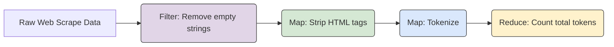

# Module 9: Functional Programming for AI FDEs

Welcome to **Module 9**. While Object-Oriented Programming (OOP) is great for managing stateful entities (like an API client), Functional Programming (FP) shines when you need to transform data safely and concurrently. In AI engineering, data transformation is constant: parsing CSVs, filtering out PII (Personally Identifiable Information), and mapping JSON payloads into database records.

---

## 1. Detailed Theory

### Functional Programming Core Concepts
- **Pure Functions**: Functions that always produce the same output for the same input and have *no side effects* (they don't mutate global variables or modify the inputs).
- **Immutability**: Avoiding changing data structures after they are created. Instead of modifying a list, you create a new one with the modifications.

### `map`, `filter`, `reduce`
- **`map(function, iterable)`**: Applies a function to every item in an iterable.
- **`filter(function, iterable)`**: Returns only the items for which the function returns `True`.
- **`reduce(function, iterable)`**: Applies a rolling computation to sequential pairs of values to reduce the iterable to a single value (requires `functools`).

### Comprehensions
Python's idiomatic, readable, and highly optimized way of doing functional transformations.
- **List Comprehensions**: `[f(x) for x in collection if condition]`
- **Dictionary Comprehensions**: `{k: v for k, v in dict.items() if condition}`

---

## 2. Architecture Diagram: Data Transformation Pipeline

A functional pipeline where data flows through pure functions immutably.



---

## 3. Production Use Cases

1. **PII Scrubbing (`map` & `filter`)**: Processing a list of chat logs before sending them to the OpenAI API. Using `map` to run a regex scrubbing function over every log entry.
2. **JSON Payload Restructuring (Dict Comprehensions)**: Receiving a deeply nested JSON payload from a webhook and flattening it into a clean dictionary required by your Vector Database metadata schema.
3. **Calculating Embedding Distances (`reduce` / `map`)**: When implementing custom similarity search, applying mathematical functions across arrays of vectors.

---

## 4. Real Company Examples

- **Scale AI**: Data ingestion pipelines rely heavily on functional programming constructs to apply thousands of mapping and filtering functions to massive datasets without mutating the original source data (which is immutable on S3).
- **Apache Spark (PySpark)**: Spark, the industry standard for big data processing, is fundamentally based on `map` and `reduce` paradigms (RDDs).

---

## 5. Coding Examples

### Map and Filter (The Traditional Way vs Comprehensions)

```python
# Raw LLM generations, some failed and returned None
generations = ["  Here is the code.  ", None, "   Summary: AI is good.", ""]

# 1. Filter out None and empty strings
def is_valid(text):
    return text is not None and len(text.strip()) > 0

valid_generations = list(filter(is_valid, generations))

# 2. Map a cleaning function (strip whitespace)
clean_generations = list(map(str.strip, valid_generations))

print(f"Map/Filter Output: {clean_generations}")

# 3. The Pythonic Way: List Comprehensions
# Achieves both map and filter in one elegant, highly optimized line
pythonic_clean = [text.strip() for text in generations if text is not None and len(text.strip()) > 0]

print(f"Comprehension Output: {pythonic_clean}")
```

### Dictionary Comprehensions
```python
# Example: We need to invert a mapping of Model Names to Internal IDs
model_to_id = {
    "gpt-4": "oai_1",
    "claude-3": "ant_1",
    "llama-3": "meta_1"
}

# Reverse the dictionary (ID to Model) using comprehension
id_to_model = {v: k for k, v in model_to_id.items()}
print(id_to_model)
```

---

## 6. Hands-on Labs

**Lab: Data Extractor**
**Objective**: Extract specific data from a mock database response.
**Instructions**:
1. You have a list of users: `users = [{"id": 1, "role": "admin"}, {"id": 2, "role": "user"}, {"id": 3, "role": "admin"}]`.
2. Use a List Comprehension to create a list of *only* the IDs of the users who are "admin".
3. Print the resulting list `[1, 3]`.

---

## 7. Assignments

**Assignment: Token Reducer**
1. Import `reduce` from `functools`.
2. You have a list representing the number of tokens used in 5 sequential API calls: `tokens_used = [150, 400, 250, 800, 100]`.
3. Use `reduce` and a `lambda` function to calculate the total sum of tokens used. (Yes, `sum()` exists, but do this to practice `reduce`!).
4. Find the maximum token usage in the list using `reduce`.

---

## 8. Interview Questions

1. **Why are List Comprehensions generally faster than `for` loops with `.append()` in Python?**
   *Answer Hint: List comprehensions are optimized in C under the hood. A `for` loop requires Python to execute the `append` function call and evaluate the loop logic on every iteration in the Python interpreter.*
2. **What is a pure function and why is it desirable in parallel processing?**
   *Answer Hint: Pure functions have no side effects and don't rely on external state. Because they don't modify shared memory, you can run them across thousands of threads or servers simultaneously without race conditions or deadlocks.*
3. **When would you use `map` instead of a list comprehension?**
   *Answer Hint: In modern Python, comprehensions are preferred for readability. However, `map` is useful when passing an existing built-in function (like `map(int, list_of_strings)`) as it can be slightly cleaner.*

---

## 9. Best Practices (FDE Standards)

- **Readability first**: Do not write massively complex, nested list comprehensions. If a comprehension spans multiple lines and is hard to read, refactor it into a standard `for` loop or extract the logic into a helper function.
- **Immutability protects from bugs**: When processing data, never do `original_dict["new_key"] = ...` if you can avoid it. Instead, create a new dictionary. This ensures that if the process fails halfway, the original data is untouched.

---

## 10. Common Mistakes

- **Side effects inside comprehensions**: 
  *Bad:* `[print(x) for x in my_list]`
  List comprehensions are for *creating lists*, not executing logic. If you just want to do something for every item without saving the result, use a standard `for` loop.

---

## 11. End-to-End Project: PII Scrubbing Pipeline

**Scenario**: You are processing chat logs from a customer service bot before saving them to a data lake for fine-tuning. You must functionally remove all email addresses and filter out empty logs.

**Code:**
```python
import re

# 1. Pure Functions
def remove_emails(text: str) -> str:
    """Replaces email addresses with a [REDACTED] tag. Pure function."""
    email_regex = r'\b[A-Za-z0-9._%+-]+@[A-Za-z0-9.-]+\.[A-Z|a-z]{2,7}\b'
    return re.sub(email_regex, '[EMAIL_REDACTED]', text)

def is_meaningful_log(text: str) -> bool:
    """Checks if the log has more than 5 characters after stripping. Pure function."""
    return len(text.strip()) > 5

def process_logs_functionally(raw_logs: list) -> list:
    """
    Applies the functional pipeline.
    Notice how raw_logs is never mutated. A new list is generated.
    """
    # 1. Map: Scrub PII
    scrubbed_logs = map(remove_emails, raw_logs)
    
    # 2. Filter: Remove empty/useless logs
    # Using a comprehension here to combine steps!
    final_logs = [log for log in scrubbed_logs if is_meaningful_log(log)]
    
    return final_logs

def main():
    chat_logs = [
        "Hello, my email is john.doe@enterprise.com, I need help.",
        "   ", # Meaningless
        "The system crashed.",
        "ok", # Too short
        "Contact me at admin@startup.io for the contract."
    ]
    
    print("--- RAW LOGS ---")
    for log in chat_logs: print(f"- {log}")
    
    cleaned_data = process_logs_functionally(chat_logs)
    
    print("\n--- PROCESSED LOGS (Safe for fine-tuning) ---")
    for log in cleaned_data: print(f"- {log}")
    
    # Prove immutability
    assert "john.doe@enterprise.com" in chat_logs[0], "Original data was mutated!"

if __name__ == "__main__":
    main()
```
