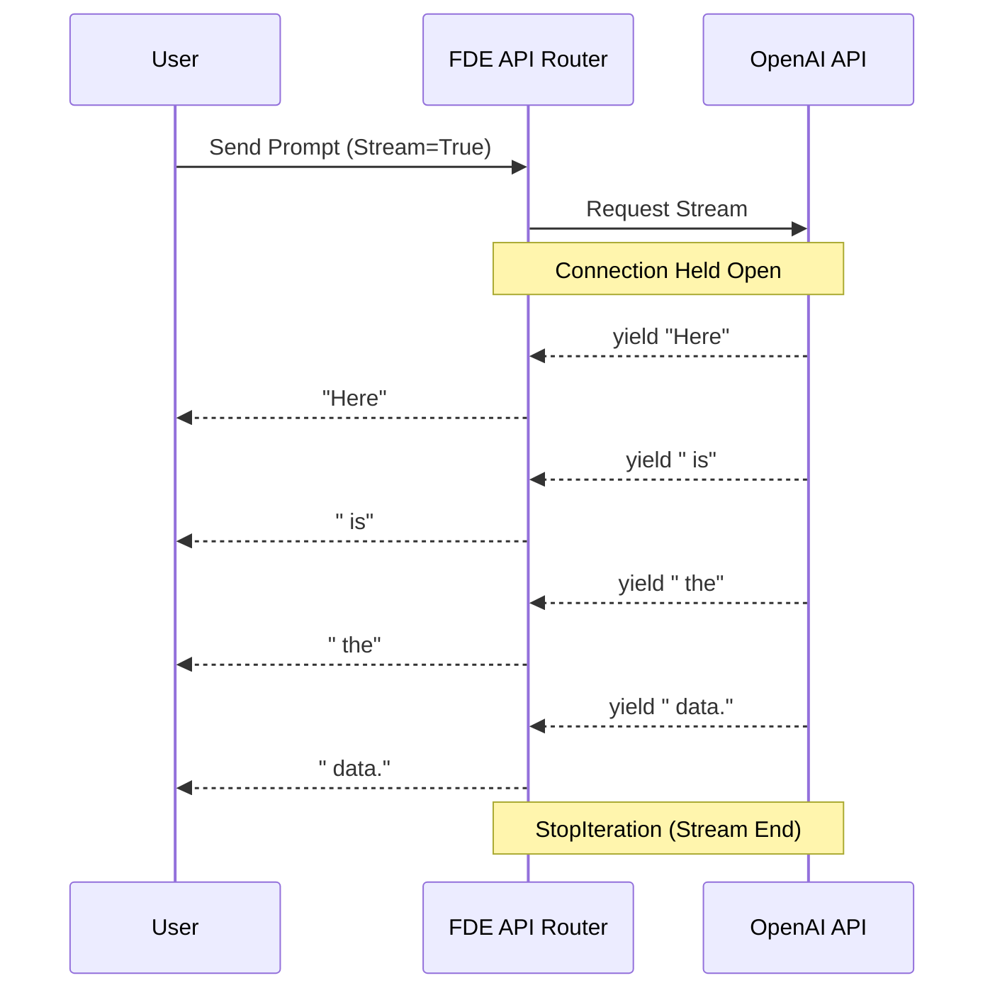

# Module 10: Iterators and Generators for AI FDEs

Welcome to **Module 10**. As an AI engineer, you will deal with data that cannot fit into RAM: gigabytes of log files, massive vector databases, and streaming LLM tokens. Iterators and Generators are Python's elegant solution for memory optimization through "lazy evaluation."

---

## 1. Detailed Theory

### Iterators
An object that implements the Iterator Protocol (`__iter__()` and `__next__()` methods). They allow you to process a collection one item at a time. Once an iterator is exhausted (raises `StopIteration`), it cannot be reused.

### Generators and `yield`
Generators are a simpler way to create iterators using functions. Instead of returning a value and terminating using `return`, a generator uses the `yield` keyword.
- `yield` pauses the function, saves its entire state (local variables), and returns a value to the caller.
- When `next()` is called again, it resumes exactly where it left off.

### Generator Expressions
Similar to list comprehensions, but wrapped in parentheses `()` instead of brackets `[]`. They evaluate lazily.
- `[x**2 for x in range(1000000)]` creates a list of 1 million integers in RAM instantly.
- `(x**2 for x in range(1000000))` creates a generator object that takes almost 0 RAM, computing values only when requested.

### Lazy Evaluation
Computing values strictly on-demand. This is how streaming LLM responses (like ChatGPT's typewriter effect) work under the hood.

---

## 2. Architecture Diagram: Streaming LLM Responses

How generators facilitate Server-Sent Events (SSE) and token streaming.



---

## 3. Production Use Cases

1. **Streaming API Responses**: Wrapping an LLM API client in a generator function to `yield` tokens one by one to a frontend UI, rather than waiting 15 seconds for the entire completion to finish.
2. **Reading Massive Files**: Parsing a 50GB CSV file for RAG ingestion. Using a generator to `yield` one row, embed it, save to Vector DB, and discard it from memory before reading the next row.
3. **Database Pagination**: Pulling millions of user records using pagination limits/offsets and yielding them seamlessly to the application logic as if it were a single list.

---

## 4. Real Company Examples

- **OpenAI SDK**: When you set `stream=True` in the OpenAI Python SDK, it returns a Python Generator. You use a `for` loop to iterate over the chunks as they arrive over the network.
- **AWS Boto3**: S3 bucket paginators act like generators under the hood, allowing you to iterate over buckets containing millions of objects without crashing your memory.

---

## 5. Coding Examples

### The `yield` Keyword (Lazy Evaluation)
```python
def log_reader_simulator():
    print("[INIT] Opening huge file...")
    yield "Log line 1: User login"
    print("[PROCESSING] Memory freed. Reading next...")
    yield "Log line 2: Database query"
    print("[PROCESSING] Memory freed. Reading next...")
    yield "Log line 3: Logout"
    print("[CLEANUP] Closing file.")

# Creating the generator object (No code in the function runs yet!)
gen = log_reader_simulator()

# Execution happens only on demand
print(next(gen)) # Runs up to first yield
print(next(gen)) # Runs up to second yield
# If we put it in a loop, the loop handles the StopIteration exception automatically.
```

### Memory Optimization: Lists vs Generators
```python
import sys

# List Comprehension: Evaluated immediately, stored in RAM
ram_heavy = [x * 2 for x in range(10000)]
print(f"List Size: {sys.getsizeof(ram_heavy)} bytes") # ~80,000 bytes

# Generator Expression: Evaluated lazily
ram_light = (x * 2 for x in range(10000))
print(f"Generator Size: {sys.getsizeof(ram_light)} bytes") # ~100 bytes (Constant!)

# You can iterate over both exactly the same way
for val in ram_light:
    if val > 10: break # We only computed the first few items! Massive time/memory save.
```

---

## 6. Hands-on Labs

**Lab: The Infinite ID Generator**
**Objective**: Build a generator that creates unique IDs infinitely.
**Instructions**:
1. Create a function `generate_ids(prefix="AI_")`.
2. Inside, set `counter = 1`.
3. Use a `while True:` loop.
4. Inside the loop, `yield f"{prefix}{counter}"` and then increment the counter.
5. Create the generator object `id_gen = generate_ids()`.
6. Call `next(id_gen)` 5 times and print the results. (Notice how the infinite loop doesn't crash the program because it pauses at `yield`).

---

## 7. Assignments

**Assignment: RAG Batch Chunker**
When sending documents to an embedding model (like text-embedding-3-small), there is a maximum batch size (e.g., 100 documents per API call).
1. Write a generator function `batch_processor(data_list, batch_size)`.
2. The function should iterate through the list and `yield` chunks (sub-lists) of length `batch_size`.
3. Test it: `data = list(range(1, 26))`. Iterate over `batch_processor(data, 10)`.
   *Expected output printed:*
   `[1, 2... 10]`
   `[11, 12... 20]`
   `[21, 22... 25]`

---

## 8. Interview Questions

1. **What is the `StopIteration` exception?**
   *Answer Hint: It is raised by the `next()` function to signal that the iterator has no further items. `for` loops catch this exception silently to know when to stop looping.*
2. **Can you iterate over a generator twice?**
   *Answer Hint: No. Generators compute values on the fly and forget them immediately to save memory. Once exhausted, they are empty. You must recreate the generator to iterate again.*
3. **How does `yield` differ from `return`?**
   *Answer Hint: `return` exits the function completely and destroys its local state. `yield` pauses the function, returns a value, and saves the local state so the function can be resumed later.*

---

## 9. Best Practices (FDE Standards)

- **Use generators for ETL (Extract, Transform, Load)**: When building pipelines that move data from an SQL database to a Vector DB, *never* load the entire SQL table into a list. Always yield rows one by one or in small batches.
- **Close generators if necessary**: If a generator holds a network connection open (like reading from a stream), and you break out of the loop early, you can call `generator.close()` to forcefully terminate it and trigger any `finally` cleanup blocks inside the generator.

---

## 10. Common Mistakes

- **Assuming generators have a length**: You cannot call `len(generator)`. Because values are generated on the fly, the total length is unknown until the generator is exhausted.
- **Trying to index a generator**: `my_gen[5]` will throw a `TypeError`. You must iterate up to the 5th element.

---

## 11. End-to-End Project: Mock Streaming LLM Client

**Scenario**: You are building the backend for a ChatGPT clone. You need to simulate the OpenAI API's streaming response, yielding tokens progressively with a slight delay, and then consume that stream in a main routing function.

**Code:**
```python
import time
import random

def mock_openai_stream(prompt: str):
    """
    Generator function simulating a streaming response from an LLM.
    """
    print(f"\n[NETWORK] Opening connection to LLM provider for prompt: '{prompt}'...")
    time.sleep(0.5) # Simulate initial latency (Time to First Token)
    
    mock_response = "As an AI language model, I process data using distributed matrices and attention mechanisms."
    tokens = mock_response.split(" ")
    
    for token in tokens:
        # Simulate network jitter/compute time per token
        time.sleep(random.uniform(0.05, 0.2))
        
        # YIELD the token to the caller immediately
        yield token + " "
        
    print("\n[NETWORK] Stream completed. Connection closed.")

def frontend_handler(prompt: str):
    """
    Consumes the generator and prints to the console as if it were a UI.
    """
    # 1. Initiate the request (gets the generator object)
    stream = mock_openai_stream(prompt)
    
    print("--- UI RESPONSE BOX ---")
    
    # 2. Consume the stream
    # The for loop automatically calls next() and handles StopIteration
    for chunk in stream:
        # flush=True forces the terminal to print immediately without buffering
        print(chunk, end="", flush=True) 

def main():
    frontend_handler("How do you process data?")

if __name__ == "__main__":
    main()
```
