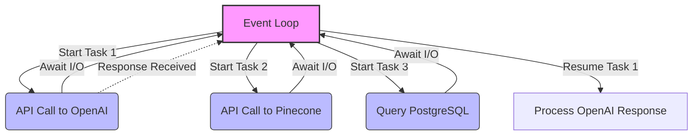

# Module 11: Concurrency and Parallelism for AI FDEs

Welcome to **Module 11**. AI workloads are inherently slow. A single LLM API call might take 5 seconds. If you have to process 100 queries sequentially, it takes over 8 minutes. By using concurrency, you can process all 100 simultaneously in just 5 seconds. Mastering this is what separates a junior script-writer from a Senior AI FDE.

---

## 1. Detailed Theory

### Global Interpreter Lock (GIL)
Python has a GIL, which means only *one* thread can execute Python bytecode at a time. This makes multi-threading useless for CPU-bound tasks (like heavy math). However, the GIL is released during I/O operations (like waiting for a network request or reading a file).

### Multiprocessing (Parallelism)
Bypasses the GIL by creating entirely new Python processes, each with its own memory space and GIL.
- **Use Case**: CPU-bound tasks (e.g., Matrix multiplications, processing millions of images, training ML models).
- **Drawback**: High memory overhead.

### Threading (Concurrency)
Multiple threads share the same memory space.
- **Use Case**: I/O-bound tasks (e.g., calling OpenAI API 50 times, reading 10 files).
- **Tool**: `concurrent.futures.ThreadPoolExecutor`.

### Asyncio (`async` / `await`)
Single-threaded, cooperative multitasking. It uses an Event Loop to switch between tasks when one is waiting for I/O.
- **Use Case**: Massive I/O concurrency (e.g., handling 10,000 WebSocket connections, building high-throughput FastAPI servers).
- **Drawback**: Requires the entire stack (from database drivers to HTTP clients) to support async.

---

## 2. Architecture Diagram: Async Event Loop



---

## 3. Production Use Cases

1. **Parallel API Processing (`ThreadPoolExecutor`)**: You have a list of 1,000 user reviews and need to run sentiment analysis on all of them via an external API. Using a thread pool with 50 workers completes this in seconds instead of hours.
2. **High-Performance Web Servers (`asyncio`)**: FastAPI (built on Starlette and Asyncio) can handle thousands of simultaneous requests because it doesn't block the main thread while waiting for the database to return user data.
3. **Data Preprocessing (`Multiprocessing`)**: Splitting a 100GB CSV file into chunks and using `ProcessPoolExecutor` to have all 16 CPU cores tokenize the text simultaneously.

---

## 4. Real Company Examples

- **OpenAI API**: The official OpenAI Python SDK provides both synchronous (`client.chat...`) and asynchronous (`await client.chat...`) clients. The async client is highly recommended for production web applications.
- **LangChain**: Introduces `ainvoke()`, `abatch()`, and `astream()` methods across all agents and chains, allowing developers to run massive agentic workflows asynchronously.

---

## 5. Coding Examples

### Threading for I/O Bound Tasks (The easy way)
```python
import concurrent.futures
import time

def mock_llm_api_call(prompt: str):
    print(f"Started: {prompt}")
    time.sleep(2)  # Simulating a 2-second network request
    return f"Result for {prompt}"

prompts = ["Prompt A", "Prompt B", "Prompt C", "Prompt D", "Prompt E"]

start_time = time.time()

# We use 5 threads to run all 5 prompts at the same time
with concurrent.futures.ThreadPoolExecutor(max_workers=5) as executor:
    # Map applies the function to every item in the list concurrently
    results = list(executor.map(mock_llm_api_call, prompts))

print(f"Results: {results}")
print(f"Time taken: {time.time() - start_time:.2f}s") 
# Will take ~2 seconds total, not 10!
```

### Asyncio for High-Throughput I/O
```python
import asyncio

async def async_api_call(prompt_id: int):
    print(f"Task {prompt_id}: Sending request...")
    # asyncio.sleep simulates non-blocking I/O
    await asyncio.sleep(2) 
    print(f"Task {prompt_id}: Response received!")
    return f"Data {prompt_id}"

async def main():
    print("Gathering tasks...")
    # asyncio.gather runs multiple async functions concurrently
    results = await asyncio.gather(
        async_api_call(1),
        async_api_call(2),
        async_api_call(3)
    )
    print(f"All done! {results}")

# Note: In a script, you must run the event loop manually
# In frameworks like FastAPI, the framework handles this for you.
if __name__ == "__main__":
    asyncio.run(main())
```

---

## 6. Hands-on Labs

**Lab: The Async Web Scraper Mock**
**Objective**: Understand how `asyncio.gather` reduces execution time.
**Instructions**:
1. Write an `async` function `fetch_page(url)` that `await asyncio.sleep(1.5)` and returns a string `f"HTML from {url}"`.
2. Write an `async def main():` function.
3. Create a list of 4 fake URLs.
4. Use a list comprehension to create a list of coroutines: `tasks = [fetch_page(url) for url in urls]`.
5. Run them all at once using `await asyncio.gather(*tasks)`.
6. Time the execution using `time.time()`. It should take ~1.5s total, not 6s.

---

## 7. Assignments

**Assignment: CPU vs I/O Profiler**
You will prove the GIL's existence.
1. Write a function `heavy_math(n)` that calculates the sum of `i * i` for `i` in `range(n)` (Make `n = 20_000_000`).
2. Write a function `network_wait(n)` that just does `time.sleep(n)` (Make `n = 2`).
3. Use `ThreadPoolExecutor(max_workers=2)`. Run `heavy_math` twice concurrently and time it. Then run them sequentially. Notice there is almost **no speedup** concurrently due to the GIL!
4. Use `ProcessPoolExecutor(max_workers=2)`. Run `heavy_math` twice concurrently. You will see a massive speedup!

---

## 8. Interview Questions

1. **What is the Global Interpreter Lock (GIL)?**
   *Answer Hint: A mutex in CPython that ensures only one thread executes Python bytecode at a time. It makes threading useless for CPU-bound tasks, but threading still works for I/O-bound tasks because the GIL is released during I/O.*
2. **When would you choose `asyncio` over `Threading`?**
   *Answer Hint: `asyncio` is lighter. A server can handle tens of thousands of async connections, but spinning up tens of thousands of threads will crash the OS due to memory overhead and context switching.*
3. **What happens if you use `time.sleep()` inside an `async def` function?**
   *Answer Hint: It blocks the ENTIRE event loop. All other async tasks will pause. You must strictly use `await asyncio.sleep()` or run blocking code in a ThreadPool using `run_in_executor`.*

---

## 9. Best Practices (FDE Standards)

- **Async All the Way Down**: If you use FastAPI (which is async), you must use async database drivers (like `asyncpg`), async HTTP clients (`httpx`), and async LLM SDKs. Mixing blocking synchronous code in an async loop is the #1 cause of performance death in AI apps.
- **Batching**: Don't spawn 100,000 threads simultaneously to process a massive list; you will hit API rate limits or crash your machine. Process them in batches of 100 using a semaphore or loop.

---

## 10. Common Mistakes

- **Forgetting `await`**:
  ```python
  async def get_data(): return 1
  async def main():
      data = get_data() # BUG! Returns a Coroutine object, not 1!
      data = await get_data() # Correct.
  ```
- **Blocking the Event Loop**: Using `requests.get()` inside FastAPI. `requests` is strictly synchronous and will freeze the server for all other users until the request finishes. Use `httpx.AsyncClient()` instead.

---

## 11. End-to-End Project: Async Data Pipeline

**Scenario**: You need to fetch data from 3 different mock APIs (User Data, Billing Data, AI Prediction) simultaneously, aggregate the results, and return a final JSON.

**Code:**
```python
import asyncio
import time

# --- Mock Async Endpoints ---
async def fetch_user_data(user_id: int):
    print(f"[{user_id}] Fetching User Data...")
    await asyncio.sleep(1.0) # DB latency
    return {"name": "Alice", "role": "Enterprise"}

async def fetch_billing_data(user_id: int):
    print(f"[{user_id}] Fetching Billing Data...")
    await asyncio.sleep(1.5) # External API latency
    return {"status": "paid", "credits": 500}

async def generate_ai_summary(user_id: int):
    print(f"[{user_id}] Generating AI Profile...")
    await asyncio.sleep(2.0) # LLM latency
    return "Alice is a high-value enterprise customer."

# --- The Orchestrator ---
async def process_user_dashboard(user_id: int):
    start = time.time()
    
    # We use asyncio.gather to fire all three requests AT THE SAME TIME
    print(f"--- Starting Dashboard Aggregation for User {user_id} ---")
    user_data, billing_data, ai_summary = await asyncio.gather(
        fetch_user_data(user_id),
        fetch_billing_data(user_id),
        generate_ai_summary(user_id)
    )
    
    # Construct final payload
    dashboard = {
        "user_id": user_id,
        "profile": user_data,
        "billing": billing_data,
        "ai_insight": ai_summary
    }
    
    elapsed = time.time() - start
    print(f"\n[SUCCESS] Dashboard built in {elapsed:.2f} seconds.")
    # Notice it takes ~2 seconds (the length of the longest task), 
    # not 4.5 seconds (the sum of all tasks)!
    return dashboard

if __name__ == "__main__":
    final_json = asyncio.run(process_user_dashboard(101))
    print(final_json)
```
