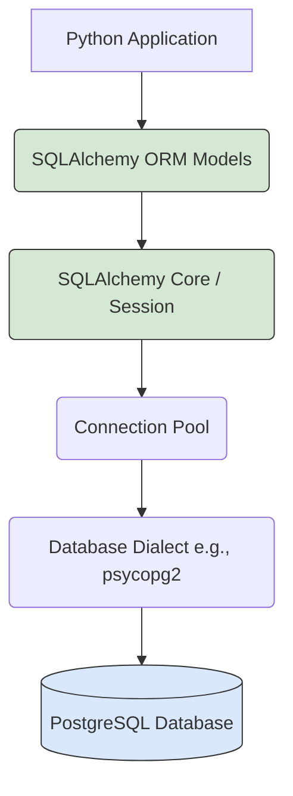

# Module 12: Database Programming for AI FDEs

Welcome to **Module 12**. AI systems are useless without state. You need to store user sessions, cache LLM responses, log interactions for fine-tuning, and manage RAG document metadata. Database programming in Python is a critical skill.

---

## 1. Detailed Theory

### Relational Databases (SQL)
- **SQLite**: A lightweight, serverless database stored in a single file. Perfect for local prototyping, testing, and small-scale agent memory.
- **PostgreSQL**: The enterprise standard. Robust, highly scalable, and supports vector extensions (`pgvector`) which is massive for AI engineering.

### Object-Relational Mapping (ORM)
An ORM allows you to interact with your database using Python classes and objects instead of writing raw SQL queries.
- **SQLAlchemy**: The undisputed king of Python ORMs. It translates Python code into optimized SQL.

### Connection Pooling
Opening a database connection is slow and expensive. A connection pool maintains a cache of active database connections, allowing your app (e.g., a FastAPI backend) to borrow a connection, query, and return it instantly.

---

## 2. Architecture Diagram: SQLAlchemy Architecture



---

## 3. Production Use Cases

1. **Agent Memory Store**: Storing conversation histories in PostgreSQL. When a user sends a message, the router queries the last 10 messages from the DB to provide context to the LLM.
2. **Metadata Filtering for RAG**: Vector DBs (like Pinecone) are expensive and often bad at exact-match filtering. FDEs often store document metadata in PostgreSQL (e.g., `author_id`, `date`) and the embeddings in a Vector DB. You query Postgres first to get valid Document IDs, then pass those IDs to the Vector DB for similarity search.
3. **Usage Tracking & Billing**: Storing every token generated by an AI model in a relational table mapped to an `organization_id` to generate monthly invoices.

---

## 4. Real Company Examples

- **Reddit / Yelp**: Rely heavily on SQLAlchemy to manage massive, highly concurrent database transactions seamlessly through Python.
- **Supabase**: An open-source Firebase alternative built on PostgreSQL. Many AI startups use Supabase + `pgvector` as their primary state and vector store, managed entirely via Python ORMs.

---

## 5. Coding Examples

### SQLAlchemy Basics (SQLite)

*Pre-requisite: `pip install sqlalchemy`*

```python
from sqlalchemy import create_engine, Column, Integer, String
from sqlalchemy.orm import declarative_base, sessionmaker

# 1. Setup Engine and Base
# echo=True prints the generated SQL to the console
engine = create_engine('sqlite:///ai_memory.db', echo=False)
Base = declarative_base()

# 2. Define the Model (Table schema)
class UserPrompt(Base):
    __tablename__ = 'prompts'
    id = Column(Integer, primary_key=True)
    user_id = Column(String)
    prompt_text = Column(String)
    tokens_used = Column(Integer)

# 3. Create tables in the DB
Base.metadata.create_all(engine)

# 4. Create a Session Maker
Session = sessionmaker(bind=engine)

# --- Usage ---
def log_prompt(user, text, tokens):
    # Context manager ensures session is closed
    with Session() as session:
        # Create an object
        new_prompt = UserPrompt(user_id=user, prompt_text=text, tokens_used=tokens)
        
        # Add and Commit to DB
        session.add(new_prompt)
        session.commit()
        print(f"Saved prompt to DB for user {user}.")

def get_high_token_prompts(threshold: int):
    with Session() as session:
        # Querying using Python, not SQL!
        results = session.query(UserPrompt).filter(UserPrompt.tokens_used > threshold).all()
        for r in results:
            print(f"User {r.user_id} used {r.tokens_used} tokens for: '{r.prompt_text}'")

# Execute
log_prompt("usr_01", "Explain Quantum Physics", 850)
log_prompt("usr_02", "Hello", 10)
get_high_token_prompts(500)
```

---

## 6. Hands-on Labs

**Lab: The Local Agent Memory**
**Objective**: Build a persistent SQLite database for an AI agent.
**Instructions**:
1. Use SQLAlchemy to create a `ChatHistory` model with `id`, `session_id` (String), `role` (String: 'user' or 'assistant'), and `content` (String).
2. Create the SQLite database (`sqlite:///chat.db`).
3. Write a function `add_message(session_id, role, content)` that saves a record.
4. Write a function `get_context(session_id)` that queries and returns all messages for a specific session, ordered by `id`.

---

## 7. Assignments

**Assignment: The Document Metadata Store**
You are managing documents for RAG.
1. Create a `Document` model: `id` (Integer), `title` (String), `content_hash` (String), `is_processed` (Boolean).
2. Write a script that inserts 3 mock documents (set `is_processed=False`).
3. Write an "Update" function: Query all documents where `is_processed == False`. Iterate over them, print "Simulating Embedding Generation...", set `doc.is_processed = True`, and call `session.commit()`.

---

## 8. Interview Questions

1. **What is an ORM and why use it over raw SQL?**
   *Answer Hint: Object-Relational Mapping. It abstracts SQL syntax, allowing developers to interact with the database using Python objects. It prevents SQL Injection attacks automatically and makes the codebase database-agnostic (easily switch from SQLite to Postgres).*
2. **What is Connection Pooling?**
   *Answer Hint: Opening a TCP connection to a database takes time. A pool keeps a set of connections open in the background. When an app needs the DB, it borrows a connection from the pool and returns it instantly after use, massively increasing throughput.*
3. **What is the N+1 query problem in ORMs?**
   *Answer Hint: A performance killer. Occurs when you query a list of objects (1 query), and then loop through the list, triggering a new sub-query for a related object on every iteration (N queries). Solved using `joinedload` (Eager Loading).*

---

## 9. Best Practices (FDE Standards)

- **Alembic for Migrations**: Never manually use `Base.metadata.create_all()` in production. Always use Alembic (SQLAlchemy's migration tool) to generate version-controlled migration scripts (`.sql` files) so you can safely alter tables in production without dropping data.
- **Never store Secrets in code**: Database URIs (containing passwords) must always be loaded via environment variables: `create_engine(os.getenv("DATABASE_URL"))`.
- **Async Databases**: When using FastAPI (`async`), use the async driver for SQLAlchemy (`asyncpg` for Postgres) and `AsyncSession`. Do not use blocking database calls inside an async web server.

---

## 10. Common Mistakes

- **Forgetting to Commit**: Calling `session.add(obj)` without calling `session.commit()`. The transaction will remain pending and eventually rollback when the session closes.
- **Leaking Sessions**: Opening a `Session()` and never closing it. Eventually, the connection pool will run out of available connections, and your app will hang indefinitely. Always use `with Session() as session:` or `try...finally: session.close()`.

---

## 11. End-to-End Project: User Management Service

**Scenario**: You are building the backend for a multi-tenant AI platform. You need a robust data model to track Users and their API Key usage.

**Code:**
```python
from sqlalchemy import create_engine, Column, Integer, String, ForeignKey, DateTime
from sqlalchemy.orm import declarative_base, sessionmaker, relationship
from datetime import datetime

engine = create_engine('sqlite:///enterprise_platform.db', echo=False)
Base = declarative_base()

# --- Models ---
class Tenant(Base):
    __tablename__ = 'tenants'
    id = Column(Integer, primary_key=True)
    company_name = Column(String, unique=True, nullable=False)
    
    # Relationship to Users (One-to-Many)
    users = relationship("User", back_populates="tenant")

class User(Base):
    __tablename__ = 'users'
    id = Column(Integer, primary_key=True)
    email = Column(String, unique=True, nullable=False)
    created_at = Column(DateTime, default=datetime.utcnow)
    
    # Foreign Key linking to Tenant
    tenant_id = Column(Integer, ForeignKey('tenants.id'))
    
    # Relationship back to Tenant
    tenant = relationship("Tenant", back_populates="users")

Base.metadata.create_all(engine)
Session = sessionmaker(bind=engine)

# --- Service Logic ---
def setup_mock_data():
    with Session() as session:
        # Create Tenant
        acme_corp = Tenant(company_name="Acme Corp AI")
        session.add(acme_corp)
        session.commit() # Commit to get the auto-generated ID
        
        # Create Users for that tenant
        user1 = User(email="ceo@acmecorp.com", tenant_id=acme_corp.id)
        user2 = User(email="dev@acmecorp.com", tenant_id=acme_corp.id)
        session.add_all([user1, user2])
        session.commit()
        print("Mock data generated.")

def get_users_for_tenant(company_name: str):
    with Session() as session:
        # Complex querying made easy by ORM relationships
        tenant = session.query(Tenant).filter_by(company_name=company_name).first()
        if not tenant:
            print("Tenant not found.")
            return
            
        print(f"--- Users in {tenant.company_name} ---")
        for u in tenant.users:
            print(f"- {u.email} (Joined: {u.created_at})")

if __name__ == "__main__":
    setup_mock_data()
    get_users_for_tenant("Acme Corp AI")
```
