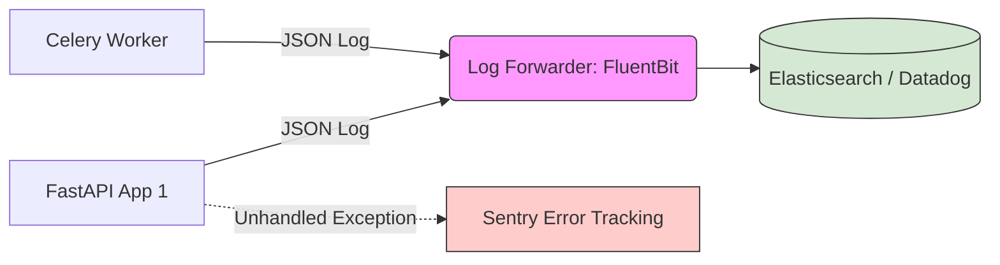

# Module 15: Logging and Debugging for AI FDEs

Welcome to **Module 15**. `print()` statements are for beginners. When your AI application is running on a remote Kubernetes cluster inside a Docker container, you cannot see `print()` outputs easily, and you certainly can't filter them. Proper logging and debugging are the only ways to achieve observability in distributed systems.

---

## 1. Detailed Theory

### The Logging Module
Python's built-in `logging` module provides a standard, hierarchical logging system. 
- **Levels**: `DEBUG` (Detailed info), `INFO` (General events), `WARNING` (Something unexpected, but still working), `ERROR` (A function failed), `CRITICAL` (System crashing).

### Structured Logging (JSON Logs)
Standard text logs (`[INFO] 2023-10-01: User logged in`) are hard for machines to parse. **Structured Logging** outputs logs as JSON (`{"level": "INFO", "event": "login", "user_id": 123}`). This is mandatory in modern cloud environments because log aggregators (Datadog, Splunk, ELK) index JSON automatically.

### Error Tracking
Capturing unhandled exceptions and sending them to an external monitoring service (like Sentry) with the full stack trace, local variables, and user context.

### Debugging (pdb)
The Python Debugger. Allows you to pause code execution, step through line-by-line, and inspect memory interactively. `breakpoint()` is the modern way to trigger it.

---

## 2. Architecture Diagram: Centralized Logging Pipeline



---

## 3. Production Use Cases

1. **LLM Cost Tracking (Structured Logs)**: Emitting a JSON log after every OpenAI call: `{"action": "llm_call", "model": "gpt-4", "tokens": 1500, "cost": 0.045}`. Datadog parses this and builds a live dashboard of your AI costs.
2. **Alerting on Degradation (Warning)**: Logging a `WARNING` when a Vector DB search takes longer than 2 seconds. If >100 warnings fire in 5 minutes, PagerDuty alerts the on-call engineer.
3. **Sentry Context**: When a user's prompt causes an API crash, Sentry captures the exact prompt text as context, allowing FDEs to replicate the bug instantly.

---

## 4. Real Company Examples

- **Palantir / Databricks**: Use heavily customized structured logging. Every single log event contains a `trace_id` so that an FDE can track a single user request as it bounces between 15 different microservices.
- **Sentry**: An entire billion-dollar company built around capturing Python exceptions and aggregating them intelligently.

---

## 5. Coding Examples

### The Built-in Logging Module
```python
import logging
import sys

# Setup standard logging (Usually done once in main.py)
logging.basicConfig(
    level=logging.INFO, # Hide DEBUG logs in production
    format="%(asctime)s | %(levelname)s | %(name)s | %(message)s",
    handlers=[
        logging.StreamHandler(sys.stdout),
        logging.FileHandler("agent.log")
    ]
)

# Get a logger for this specific file
logger = logging.getLogger(__name__)

def process_data(data):
    logger.info("Starting data processing")
    try:
        # Simulate bug
        result = data['user_id']
        logger.debug(f"Processed user {result}") # Won't show if level=INFO
    except KeyError as e:
        # exc_info=True automatically attaches the full stack trace!
        logger.error("Failed to extract user_id", exc_info=True)

process_data({"wrong_key": 123})
```

### Debugging with `breakpoint()`
```python
def calculate_metrics(tokens, users):
    print("Calculating...")
    # Code pauses execution here in the terminal!
    # You can type 'tokens', 'users', 'n' (next line), 'c' (continue)
    breakpoint() 
    average = tokens / users
    return average

# calculate_metrics(1000, 0) # This would throw a ZeroDivisionError, debug it!
```

---

## 6. Hands-on Labs

**Lab: The JSON Logger**
**Objective**: Create machine-readable logs.
*Pre-requisite: `pip install structlog`*
**Instructions**:
1. Import `structlog`.
2. Configure it: `logger = structlog.get_logger()`.
3. Log an event with kwargs: `logger.info("api_call", provider="openai", latency_ms=450, success=True)`.
4. Run the script and observe the JSON output in the console.

---

## 7. Assignments

**Assignment: The Logging Decorator**
Write a decorator `@log_execution` that automatically logs whenever a function starts and finishes.
1. The decorator should use the standard `logging` module.
2. Log `INFO: Executing <function_name>...` before calling the function.
3. Call the function.
4. Log `INFO: <function_name> completed.`
5. Apply this decorator to a mock function `def run_agent(): time.sleep(1)`.

---

## 8. Interview Questions

1. **Why shouldn't you use `print()` for production code?**
   *Answer Hint: Print writes to standard output without formatting, timestamps, or severity levels. It cannot be easily redirected to files or log aggregators, and it cannot be dynamically turned off (like changing log level from DEBUG to INFO).*
2. **What is `exc_info=True` in the logging module?**
   *Answer Hint: When used in `logger.error()`, it captures the active exception traceback and appends it to the log message. Crucial for debugging crashes.*
3. **What is a Correlation ID (or Trace ID)?**
   *Answer Hint: A unique string (UUID) generated when a request hits the edge router. It is passed along to every microservice and included in every log. It allows engineers to filter logs and see the exact path a single request took across the entire distributed system.*

---

## 9. Best Practices (FDE Standards)

- **Never log PII or Secrets**: NEVER log passwords, API keys, or raw user emails. If you must log a user identifier, use an internal UUID. Log aggregators are not highly secure vaults.
- **Log at the correct level**: 
  - `DEBUG`: "Variable X is 5" (Only on dev machines).
  - `INFO`: "Agent finished processing task" (Routine).
  - `WARNING`: "Retrying API call after failure" (Self-healing occurred).
  - `ERROR`: "Failed to save to database" (Intervention may be needed).
- **Use `structlog`**: For any greenfield enterprise project, use the `structlog` library instead of the standard `logging` module to enforce JSON structured logging easily.

---

## 10. Common Mistakes

- **String Interpolation in Logs**: 
  *Bad:* `logger.info(f"User {user_id} logged in")`
  *Good:* `logger.info("User %s logged in", user_id)`
  *Why?* If the log level is higher than INFO, the bad example still executes the string formatting (wasting CPU). The good example delays string formatting until the logger decides it actually needs to print the message.

---

## 11. End-to-End Project: Enterprise Structured Logger

**Scenario**: You are setting up the core telemetry module for a new RAG platform. You need a logger that outputs JSON and automatically injects a correlation ID into every log message.

**Code:**
```python
import logging
import json
import uuid
from datetime import datetime

# 1. Custom JSON Formatter
class JSONFormatter(logging.Formatter):
    def format(self, record):
        log_obj = {
            "timestamp": datetime.utcnow().isoformat() + "Z",
            "level": record.levelname,
            "logger": record.name,
            "message": record.getMessage(),
            # Extract correlation_id if it was passed in the 'extra' dict
            "correlation_id": getattr(record, 'correlation_id', None)
        }
        
        # If there's an exception, add the traceback
        if record.exc_info:
            log_obj["exception"] = self.formatException(record.exc_info)
            
        return json.dumps(log_obj)

# 2. Setup the Logger
def get_enterprise_logger(name: str):
    logger = logging.getLogger(name)
    logger.setLevel(logging.INFO)
    
    # Prevent duplicate logs if getting the logger multiple times
    if not logger.handlers:
        console_handler = logging.StreamHandler()
        console_handler.setFormatter(JSONFormatter())
        logger.addHandler(console_handler)
        
    return logger

# 3. Usage in Application
logger = get_enterprise_logger("RAG_Service")

def process_query(user_query: str):
    # Generate a unique ID for this entire request lifecycle
    request_id = str(uuid.uuid4())
    
    # We pass the extra dictionary to inject data into the JSON
    logger.info("Received query", extra={"correlation_id": request_id})
    
    try:
        if "DROP TABLE" in user_query:
            raise ValueError("Malicious query detected!")
            
        logger.info("Query processed successfully", extra={"correlation_id": request_id})
        
    except ValueError as e:
        logger.error(f"Security event: {e}", exc_info=True, extra={"correlation_id": request_id})

if __name__ == "__main__":
    process_query("What is the company policy?")
    process_query("DROP TABLE users;")
```
