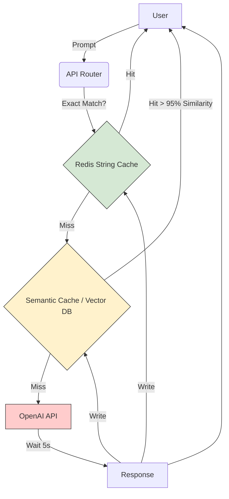

# Module 17: Performance Optimization for AI FDEs

Welcome to **Module 17**. AI applications are notoriously resource-intensive. When you deploy a RAG system to 10,000 enterprise employees, inefficient code translates directly to massive AWS bills, database deadlocks, and slow LLM response times. Optimization is about knowing *where* the bottleneck is, and *how* to fix it.

---

## 1. Detailed Theory

### Profiling (Finding the Bottleneck)
Don't guess what is slow. Measure it.
- **cProfile**: Built-in C-extension for profiling Python scripts. Tells you exactly how many times a function was called and how much time was spent inside it.
- **Line Profiler**: Tells you how much time was spent on *each individual line* of a function.

### Memory Optimization
- **Generators**: (Covered in Module 10). Use them to avoid loading massive datasets into RAM.
- **`__slots__`**: When instantiating millions of Python objects (like in a Knowledge Graph), Python creates a memory-heavy `__dict__` for every object. Defining `__slots__ = ['attr1']` in the class prevents this, saving up to 50% RAM.

### Caching
Storing the result of an expensive operation so future requests are instantaneous.
- **In-Memory**: `functools.lru_cache` (Least Recently Used). Perfect for single-node caching.
- **Distributed**: Redis. Essential for multi-node deployments (Kubernetes) so all workers share the same cache.
- **Semantic Caching**: AI-specific caching (e.g., RedisVL or GPTCache) that checks if an incoming prompt is *semantically similar* (via embeddings) to a cached prompt, rather than an exact string match.

---

## 2. Architecture Diagram: Multi-Layer AI Caching



---

## 3. Production Use Cases

1. **LRU Cache for Configs**: Loading a JSON configuration file from an AWS S3 bucket takes 200ms. Wrapping the fetch function in `@lru_cache` means the first request takes 200ms, and the next 100,000 requests take 0ms.
2. **Semantic Caching**: An enterprise support bot gets asked "How do I reset my password?" and "I forgot my password, how to reset?" 500 times a day. Instead of hitting the expensive LLM 500 times, Semantic Caching answers 499 of them instantly for free.
3. **Profiling Vector Math**: Discovering via `cProfile` that a custom cosine similarity Python loop is taking 2 seconds, and replacing it with `numpy.dot()` (which drops down to optimized C code) to execute in 0.01 seconds.

---

## 4. Real Company Examples

- **OpenAI**: Relies heavily on caching layers globally via Cloudflare to intercept exact-match prompts before they even hit their expensive GPU clusters.
- **LangChain**: Integrates directly with `RedisCache` and `GPTCache` to provide out-of-the-box LLM optimization for developers.

---

## 5. Coding Examples

### Using `lru_cache` (In-Memory)
```python
import time
from functools import lru_cache

# The cache stores the last 128 unique calls in memory
@lru_cache(maxsize=128)
def expensive_database_lookup(user_id: int):
    print(f"Executing slow DB query for {user_id}...")
    time.sleep(2) # Simulate slow query
    return {"user_id": user_id, "role": "admin"}

print("First call:")
print(expensive_database_lookup(101)) # Takes 2 seconds

print("\nSecond call (Exact same arguments):")
print(expensive_database_lookup(101)) # Instant! (Prints no DB log)

# print(expensive_database_lookup.cache_info()) # View cache hit/miss stats
```

### Memory Optimization with `__slots__`
```python
import sys

class NormalNode:
    def __init__(self, node_id, data):
        self.node_id = node_id
        self.data = data

class SlottedNode:
    # Restricts attributes, disables dynamic __dict__
    __slots__ = ['node_id', 'data'] 
    
    def __init__(self, node_id, data):
        self.node_id = node_id
        self.data = data

normal_obj = NormalNode(1, "test")
slotted_obj = SlottedNode(1, "test")

# Slotted objects use significantly less memory per instance!
# (Noticeable when creating millions of nodes for a graph DB)
```

---

## 6. Hands-on Labs

**Lab: The Profiler**
**Objective**: Identify slow code.
**Instructions**:
1. Write a script with two functions: `fast_func()` that uses a list comprehension `[x*2 for x in range(1000000)]`, and `slow_func()` that uses a standard `for` loop with `.append()`.
2. Write a `main()` that calls both.
3. Run the script from the terminal using cProfile:
   `python -m cProfile -s time your_script.py`
4. Look at the output table to see exactly which function took more cumulative time (`cumtime`).

---

## 7. Assignments

**Assignment: Mock Semantic Cache**
1. Create a class `SemanticCache`.
2. Use a dictionary to store `{"prompt": "response"}`.
3. When `get(prompt)` is called, don't just check exact matches. Check if the incoming prompt is *a substring* of a cached prompt, or vice-versa (e.g., "reset password" is a substring of "how to reset password").
4. If there is a "semantic" hit, return it. Otherwise, return `None`.

---

## 8. Interview Questions

1. **When should you NOT use `@lru_cache`?**
   *Answer Hint: Do not use it for functions that return dynamic data that changes frequently (like fetching a stock price), or for functions that rely on external state (not purely deterministic based on inputs). Also, in a multi-server setup (like K8s), `lru_cache` is specific to each pod; you need Redis for a global cache.*
2. **What is the difference between CPU-bound and I/O-bound profiling?**
   *Answer Hint: cProfile is great for CPU-bound tasks (math, parsing). But if a script is slow because of network latency (I/O), cProfile just shows it spending all its time inside socket methods. You need network monitoring or APM tools (like Datadog) to profile I/O.*
3. **How does NumPy achieve such high performance in Python?**
   *Answer Hint: Python is an interpreted language. NumPy is written in C. When you call a NumPy array operation, it bypasses the Python interpreter loop and the GIL, executing highly optimized, vectorized C code directly on the CPU.*

---

## 9. Best Practices (FDE Standards)

- **Vectorize, don't Loop**: If you are doing math on arrays (like calculating embedding similarities), NEVER use a Python `for` loop. Always use NumPy arrays and vectorized operations. A Python loop over 100,000 items takes 100x longer than NumPy.
- **Profile before Optimizing**: "Premature optimization is the root of all evil." Don't waste 3 days writing a complex cache for a function that only takes 10ms to run. Use `cProfile` to find the *actual* bottleneck first.

---

## 10. Common Mistakes

- **Caching Mutable Objects**:
  ```python
  @lru_cache
  def get_config(env):
      return {"timeout": 30}
      
  config = get_config("prod")
  config["timeout"] = 60 # BUG! You just mutated the object inside the cache!
  ```
  *Fix: Always return immutable objects (like tuples) from cached functions, or use `copy.deepcopy()` before mutating.*

---

## 11. End-to-End Project: Redis-backed API Cache

**Scenario**: You have an AI microservice. You want to implement a simulated external cache (mocking Redis) using a decorator, so that frequent prompts bypass the LLM entirely.

**Code:**
```python
import time
from functools import wraps

# --- Mock Redis Cache ---
class MockRedis:
    def __init__(self):
        self.store = {}
        
    def get(self, key):
        return self.store.get(key)
        
    def set(self, key, value):
        self.store[key] = value

redis_client = MockRedis()

# --- Custom Caching Decorator ---
def redis_cache(ttl_seconds=60):
    """Decorator that intercepts function calls and checks Redis first."""
    def decorator(func):
        @wraps(func)
        def wrapper(prompt: str):
            # Create a unique cache key based on the function name and argument
            cache_key = f"{func.__name__}:{prompt}"
            
            # 1. Check Cache
            cached_result = redis_client.get(cache_key)
            if cached_result:
                print("[CACHE HIT] Fetched from Redis instantly!")
                return cached_result
                
            # 2. Cache Miss - Execute real function
            print("[CACHE MISS] Executing heavy compute...")
            result = func(prompt)
            
            # 3. Save to Cache
            redis_client.set(cache_key, result)
            return result
            
        return wrapper
    return decorator

# --- Application ---

@redis_cache(ttl_seconds=3600)
def generate_ai_response(prompt: str):
    time.sleep(2) # Simulating OpenAI API latency
    return f"Response to: {prompt}"

def main():
    print("--- User 1 requests report ---")
    generate_ai_response("Q3 Financials") # Takes 2 seconds
    
    print("\n--- User 2 requests same report ---")
    generate_ai_response("Q3 Financials") # Instant!
    
    print("\n--- User 3 requests different report ---")
    generate_ai_response("Q4 Forecast") # Takes 2 seconds

if __name__ == "__main__":
    main()
```
